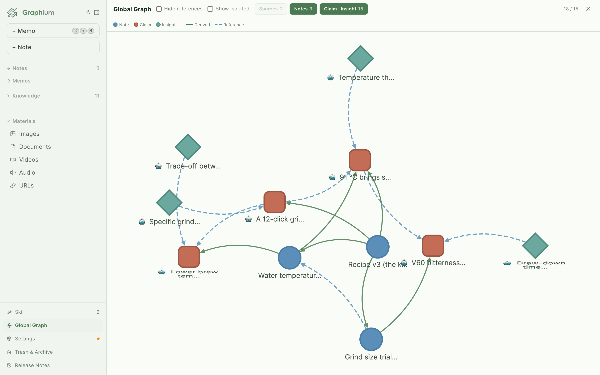
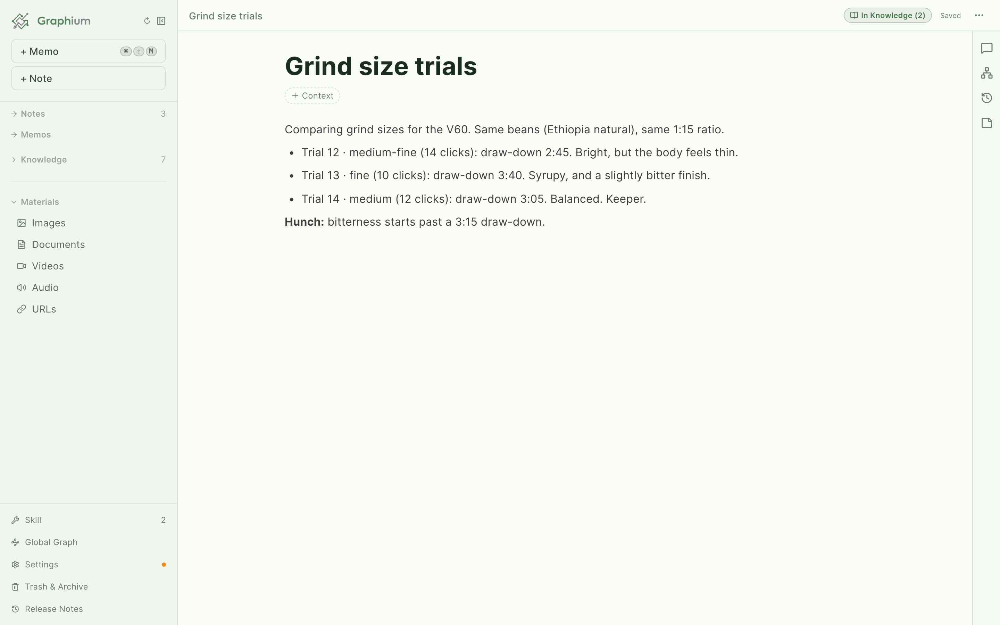
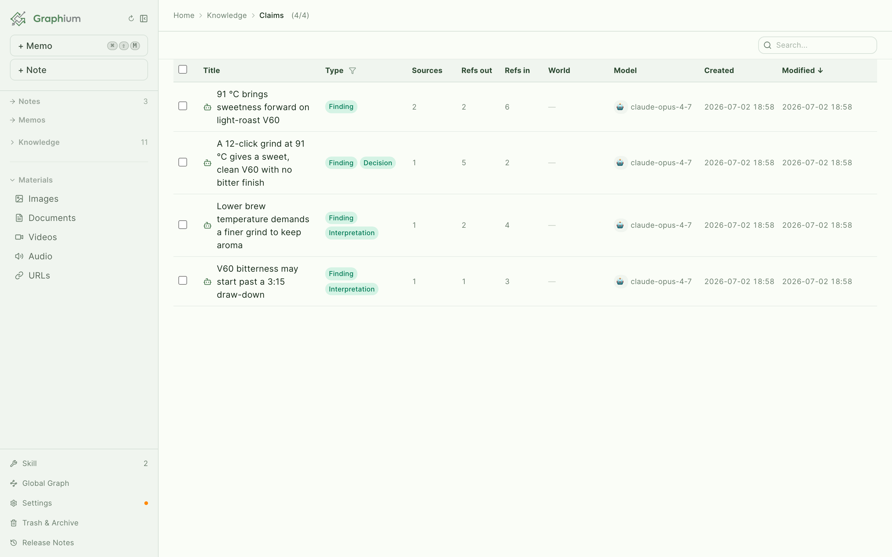
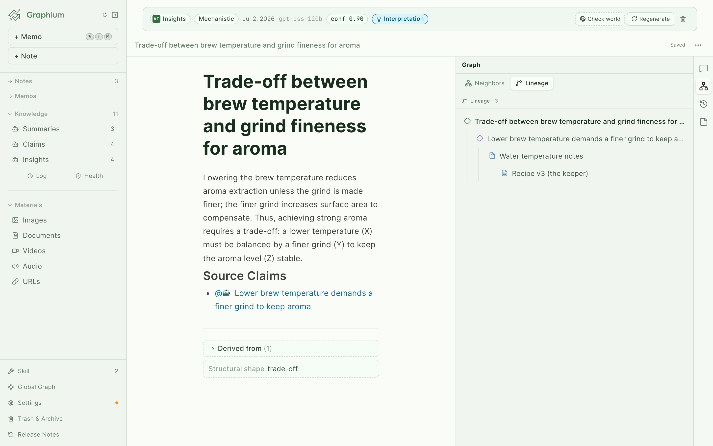
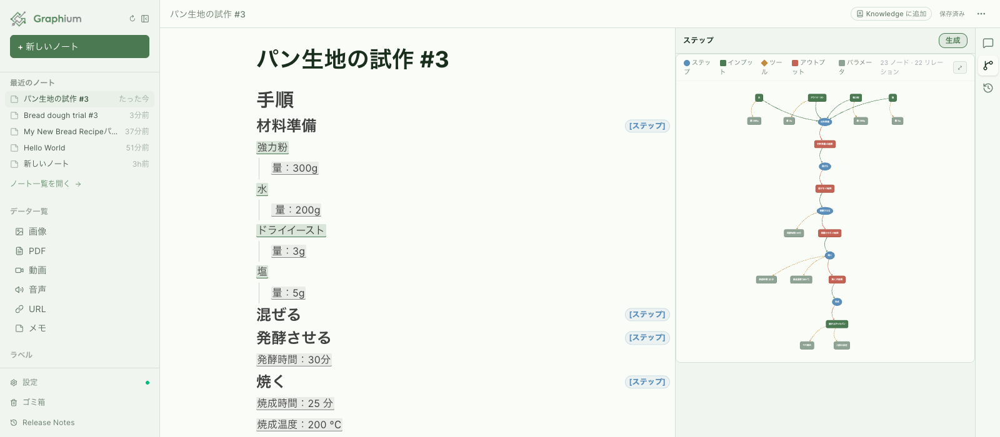
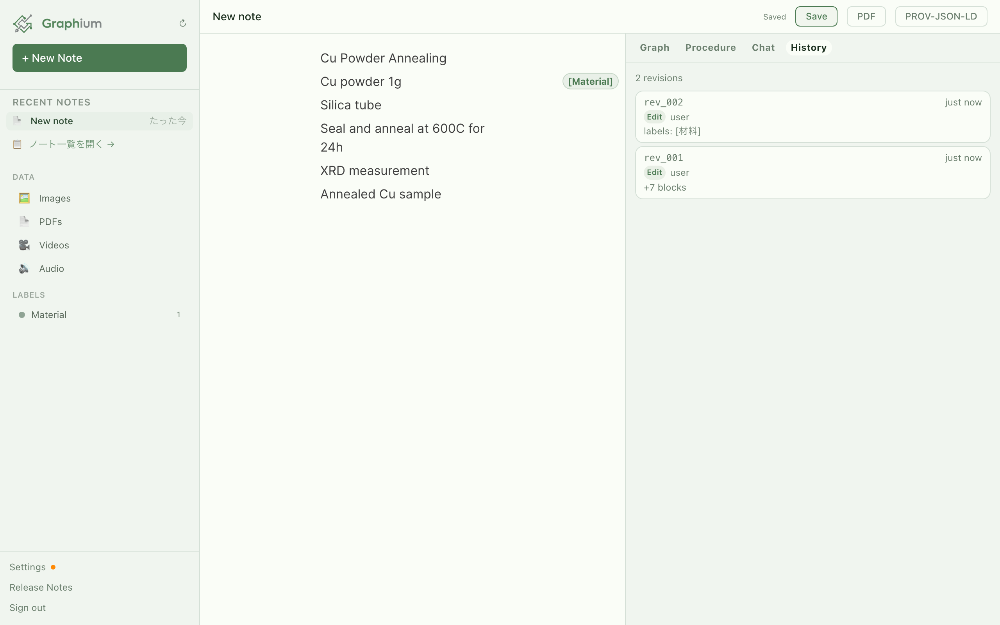
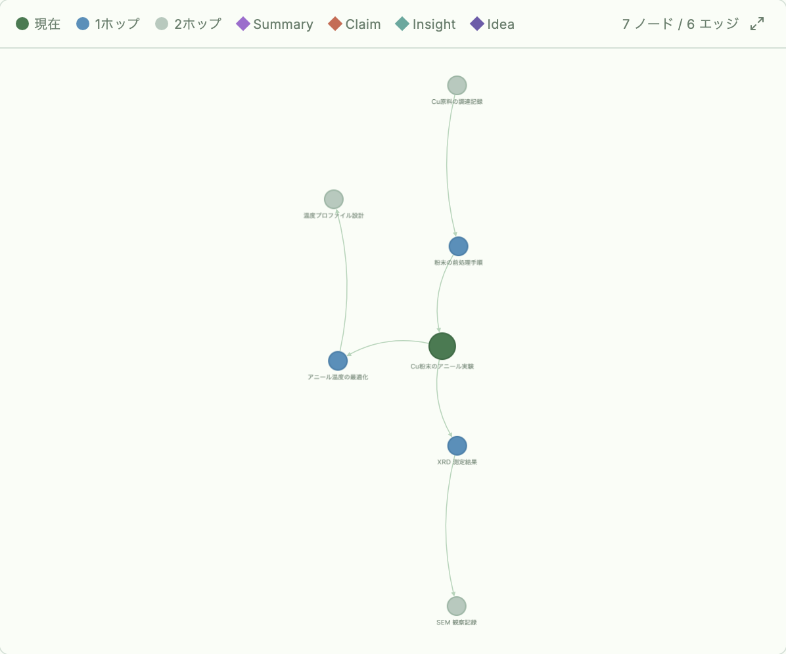

<p align="center">
  
</p>
<h1 align="center">Graphium</h1>
<p align="center">
  <b>AI 時代のひらめきノート。</b>
</p>
<p align="center">
  書けば書くほど、点と点が繋がって「ひらめき」になる。<br />
  あなたが書いた一文も、AI が手渡した一文も、その出どころのノートまで辿れる。辿れるからこそ、安心して広げられます。
</p>
<p align="center">
  <a href="README.md">English</a> | <b>日本語</b>
</p>

<p align="center">
  <a href="https://kumagallium.github.io/Graphium/"></a>
  <a href="https://github.com/kumagallium/Graphium/releases/latest"></a>
</p>

<p align="center">
  <a href="https://github.com/kumagallium/Graphium/releases/latest"></a>
  <a href="https://github.com/kumagallium/Graphium/releases"></a>
  <a href="https://github.com/kumagallium/Graphium/actions/workflows/test.yml"></a>
  <a href="LICENSE"></a>
  <a href="https://github.com/kumagallium/Graphium/stargazers"></a>
  
</p>

<p align="center">
  <a href="https://kumagallium.github.io/Graphium/"></a>
</p>

Graphium は、[Zettelkasten](https://ja.wikipedia.org/wiki/%E3%83%84%E3%82%A7%E3%83%86%E3%83%AB%E3%82%AB%E3%82%B9%E3%83%86%E3%83%B3) スタイルの小さなノート術と、W3C の来歴標準 [PROV-DM](https://www.w3.org/TR/prov-dm/) を組み合わせた、個人開発のオープンソースプロジェクトです。AI が手渡してくれた一文も含めて、すべての主張をその根拠となるノートまで辿れる状態を目指しています。

## 仕組み — 書く、広げる、辿る

### 1. 書く
思いつきをそのまま書き、`@` 参照でノート同士を繋ぎます。ここまでは、ふつうのノートと同じ気軽さです。

<p align="center"></p>

### 2. AI と広げる
あなたの AI（Claude のサブスクや API キー）を繋ぐと、AI がノートの群れから「知見」や「洞察」を拾い上げます。自分では気づかなかった繋がりが見えてきます。

<p align="center"></p>

### 3. 起源まで辿る
AI が手渡した一文も、あなたが書いた一文も、出どころのノートまでワンクリックで遡れます。辿れるからこそ、安心して広げられます。

<p align="center"></p>

## 試行錯誤するすべての人へ

語彙は汎用的です。実験室でも、台所でも、工房でも、コードベースでも、教室でも。

- **研究者** — 来歴付きの実験ログ。ステップ・材料・結果が繋がったまま残ります。
- **料理人・つくる人** — 今回のパンが上手くいった理由を覚えているレシピ。上手くいかなかった 4 回も一緒に。
- **エンジニア** — 次のポストモーテムまで生き残る調査ノート。
- **学生・書き手** — 授業・本・会話を繋ぐ「第二の脳」。戻ってきたとき、自分で説明してくれます。

### インストール前に読むもの

- 📘 [**CONCEPT**](docs/CONCEPT.ja.md)（[English](docs/CONCEPT.md)）: 設計思想（なぜ来歴か、二つの脳、砂時計）
- 🏗️ [**ARCHITECTURE**](docs/ARCHITECTURE.md): レイヤー、配布形態、Wiki パイプライン、既知の継ぎ目（英語）
- 🗂️ [**DATA_MODEL**](docs/DATA_MODEL.md): JSON 形式、スキーマ、互換性ルール（英語）

## 必要な分だけ使う

Graphium は **段階的開示（progressive disclosure）** を設計の中心に据えています。ラベル付けは任意で、しかも独立した 2 つの層から成ります。

| レベル | やること | 得られるもの |
|--------|---------|-------------|
| **ノートだけ** | `@` 参照でノートを書いてリンクする | ファイルシステム上のリンクされたノート群（Web 版はブラウザ IndexedDB） |
| **ブロックレベルの構造** | 見出しブロックに `[ステップ]`（または Phase の `[計画]` / `[結果]`）を付ける | 来歴グラフの骨格。何が、どの順で起きたか |
| **インラインの詳細** | ブロック内のテキスト範囲を `[インプット]` / `[ツール]` / `[パラメータ]` / `[アウトプット]` でハイライト | 完全な来歴グラフ。何を使い、どんな条件で、何ができたか |

`#` のブロックレベル層とインラインハイライト層は、同じ内容を **2 回なぞる別々の層** であり、全か無かのラベルではありません。ラベルなしで書き始め、後から `#` だけ付け、必要な箇所にだけインラインの詳細を載せる、という使い方ができます。**来歴層は、あなたがラベルを付けた範囲だけで立ち上がります**。このグラデーションこそが設計の中核です。

設計の根拠は [docs/CONCEPT.ja.md §6](docs/CONCEPT.ja.md#6-段階的な開示必要な分だけ使う) を参照してください。

## すぐに試す

**[→ ブラウザでプレビュー（GitHub Pages）](https://kumagallium.github.io/Graphium/)**

ブラウザ版は **プレビュー** です。エディタの感触と PROV-DM ラベリングをお試しいただけます。ノートはこのブラウザの IndexedDB に保存されるため、お試しには十分ですが、AI 機能（Knowledge Layer・AI チャット）や永続的な保存、複数端末同期がほしい場合はデスクトップアプリか Docker セルフホストをご利用ください。

### デスクトップアプリ

デスクトップアプリをダウンロードすると、ノートはあなたのファイルシステム上に JSON ファイルとして保存されます。保存先を Google Drive / iCloud / Dropbox の同期フォルダに指定すれば、追加の OAuth 連携なしでクラウド同期できます。

| プラットフォーム | ファイル | 確認方法 |
|----------------|---------|---------|
| **macOS** (Apple Silicon — M1/M2/M3/M4) | `Graphium_x.x.x_aarch64.dmg` | Apple メニュー → このMacについて → 「Apple M...」|
| **Windows** (x64) | `Graphium_x.x.x_x64-setup.exe`（または `Graphium_x.x.x_x64_en-US.msi`） | 設定 → システム → バージョン情報 → システムの種類「x64 ベース」|

**[→ Releases からダウンロード](https://github.com/kumagallium/Graphium/releases/latest)**

> **Windows での初回起動時の警告について**
> Windows 版はまだコード署名していないため、初回起動時に SmartScreen が「Windows によって PC が保護されました」と警告します。「**詳細情報** → **実行**」で起動できます。コード署名はロードマップに含まれています。

> **その他のプラットフォーム**
> Linux / Intel macOS 向けデスクトップ版は提供していません。これらをお使いの場合は、[GitHub Pages のブラウザ版](https://kumagallium.github.io/Graphium/)（インストール不要）をご利用いただくか、下記の [Docker セットアップ](#option-2-run-with-docker--editor-only) でセルフホストしてください。これらのプラットフォームへの対応はロードマップに含まれています。テスト協力者を歓迎します ([Issues](https://github.com/kumagallium/Graphium/issues))。

### モバイル（停止中）

モバイル向けのクイックキャプチャ（PWA、＋ボタン、カメラからのメディア取り込みなど）は試作しましたが、デスクトップ版と Knowledge Layer の作り込みを優先するため、現在は **停止中** です。ブラウザ版そのものは iOS / Android のホーム画面に追加できますが、モバイル専用の機能（タイムラインビュー、クイックキャプチャ）は積極的にメンテナンスしていません。

再開や手伝いに興味があれば [Issues](https://github.com/kumagallium/Graphium/issues) をご覧ください。

## ナレッジ層

LLM を接続すると、Graphium はノートの上に **もう一層** を作ります。あなたが書いた内容から自動生成される、編集可能なナレッジ層です。*LLM で拡張された Zettelkasten* と捉えてください。AI がノートを読み取り、安定したアイデアを抽出し、相互にリンクし、元のブロックへ引用を張ります。エディタの他の要素と同じ PROV-DM 来歴を保ったまま。

ナレッジ層には 4 つのドキュメント種別があり、それぞれ役割が異なります。

| 種別 | 役割 |
|------|------|
| **要約 (Summaries)** | 1 つのノートに対する内部向け要約 |
| **知見 (Claims)** | 複数ノート横断の発見。要素を抽出しつつ文脈は残す。`level`（principle / finding / bridge）と `status`（candidate / verified）で品質を表現 |
| **洞察 (Insights)** | 文脈を消した「ひとつの主張」+ 引用。プロジェクトを跨いで持ち運べる単位 |
| **発想 (Ideas)** | 複数の洞察を編んで生まれる新しい考え。Cmd-K Composer フローで作る — 編みたい洞察を選び、引用ノートを書き、その文脈で LLM に問う |

| 機能 | 内容 |
|------|------|
| **パイプライン** | Ingest → Atomize → Cross-update → Lint。すべてコンパニオンサーバ上で動作し、ノート保存をトリガーに動きます。発想はパイプライン段ではなく、Cmd-K Composer フローで別途作ります |
| **ノートから Ingest** | AI が知識価値のあるセクションを抽出し、ナレッジページに書き込みます。元ブロックへの引用付き |
| **URL・チャットから Ingest** | URL を貼ったり、AI チャットの応答を保存すると、同じ来歴でナレッジページに変換されます |
| **Cross-update** | あるナレッジページが変わると、依存するページがフラグ付けまたは書き直されます |
| **Lint** | 孤立した洞察、壊れた引用、冗長な知見を検出します |
| **編集の保護** | 手動で編集したセクションは再 Ingest 時にスキップされます。修正が AI に上書きされません |
| **AI チャット用 Retriever** | AI 応答にナレッジコンテキストが注入されます。アシスタントは先週書いた内容を、毎回ノートを読み直さずに覚えています |
| **回答の自動ラベル付け** | AI 回答は PROV-DM 構造が付いた状態で挿入されます。Activity の見出しに `[ステップ]` ラベル、Entity には `[インプット]` / `[ツール]` / `[パラメータ]` / `[アウトプット]` のインラインハイライト、連続する手順には `informed_by` リンクが自動で付きます。チャットそのものから来歴グラフが立ち上がります |

ナレッジページはノートと同じストレージ（Web は IndexedDB、Tauri / Docker はファイルシステム）に保存され、手動で自由に編集できます。ナレッジの編集はすべて PROV-DM のリビジョンとして記録されるため、**いつ** 生成され、**どのエージェント**（人 or AI）が書き、**どこから** 派生したかを常に追跡できます。

ナレッジ層は **オプトイン** です。**⚙ 設定 → AI Setup** で LLM を設定すると有効になります。LLM を設定しない場合、Graphium は通常のリンクノートエディタとして動作します。

## Composer（⌘K）

書いたものを探す動作と、次に書くことを尋ねる動作を、ひとつのパレットにまとめました。Graphium のどこからでも `⌘K`（または `Ctrl+K`）で開きます。

| 入力 | 動作 |
|------|------|
| タイトル・見出しの一部 | 該当ノートにジャンプ（Wiki エントリも表示） |
| `#ラベル` | コンテキストラベルでフィルタ — `#procedure` / `#step` / `#手順` はすべて同じものを指す |
| `@作者` | 誰が書いたかでフィルタ — 人間はユーザー名、AI はモデル名 |
| 空 | 直近のノート + *発見カード* — 開いているノートと直近 1 週間の Wiki アクティビティ（ingest / cross-update / regenerate / merge）から導出された即時プロンプト |
| `Cmd+Enter` | 入力をジャンプではなく AI アシスタントに送信 |

エディタ・AI ナレッジレイヤー・あなたの過去の作業を、ひとつの動作で結びつける入り口です。

## テンプレート

`/template` スラッシュコマンドで再利用可能な雛形を呼び出せます。

- **Plan テンプレート** — H1 タイトル、背景 / 目的、リファレンステーブル（項目 × 条件）、期待する成果。テーブルの各行はそのまま派生ノートになります。
- **Run テンプレート** — 個別記録用の雛形。ブロックは最初からラベル付けされており（Activity は `[ステップ]`、Entity はインラインの `[インプット]` / `[ツール]` / `[パラメータ]` / `[アウトプット]`）、連続する手順は `informed_by` で繋がっています。「ちゃんとラベルが付いたノート」の見本として活用できます。

語彙は汎用的で、実験ノート、料理、製造、プロジェクト管理など幅広く使えます。ユーザー定義のテンプレートはプログラム的に登録可能（`registerUserTemplate()`）。

## 読みやすさ

ディスレクシア（識字障害）に配慮した字形のほうが読みやすい人がいます。Graphium には **[Atkinson Hyperlegible Next](https://www.brailleinstitute.org/freefont/)** と **[Lexend](https://www.lexend.com/)** が Inter と並ぶ標準選択肢として組み込まれており、**⚙ 設定 → 一般** から切り替えられます。エディタの他の挙動は変わらないので、自分の目に合うものを選んでください。

## 相互運用性

Graphium はプロヴェナンスを **[PROV-JSON-LD](https://www.w3.org/submissions/2024/SUBM-prov-jsonld-20240825/)** としてエクスポートします。これは Linked Data 上に構築された W3C 標準であり、独自形式ではありません。PROV-DM や JSON-LD を理解するあらゆるツールが Graphium の出力を利用できます。プロヴェナンスデータは設計上ポータブルです。

## 使い方

### 方法 1: オンラインで使う（セットアップ不要）

**https://kumagallium.github.io/Graphium/** にアクセスして書き始めるだけ。ノートはこのブラウザの IndexedDB に保存されます。

> **複数の端末で同じノートを使いたい場合**: [デスクトップアプリ](#デスクトップアプリ)を使い、保存先を Google Drive / iCloud / Dropbox の同期フォルダに指定してください。

### 方法 2: Docker で起動 — エディタのみ

Graphium をスタンドアロンのエディタとして起動します。AI や外部サービスは不要で、ノートエディタだけが動作します。

```bash
git clone https://github.com/kumagallium/Graphium.git
cd Graphium
docker compose -f docker-compose.standalone.yml up -d
```

**http://localhost:5174/Graphium/** を開いて書き始められます。

### 方法 3: Docker で起動 — AI バックエンド付き

ビルトイン AI バックエンド付きで Graphium を起動します。AI アシスタント・ナレッジ層・MCP サーバーへの直接接続はすべて単体で動作し、外部サービスは不要です。

```bash
git clone https://github.com/kumagallium/Graphium.git
cd Graphium
docker compose up -d
```

| URL | 内容 |
|-----|------|
| http://localhost:5174/Graphium/ | Graphium エディタ（AI セットアップ含む） |

> **上級者向け:** この compose ファイルには、多数の MCP サーバーを一元管理するためのオプションの [Crucible Registry](https://github.com/kumagallium/Crucible)（[UI](http://localhost:8081)）も同梱されています。必須ではありません — 下の「MCP ツールの追加」を参照してください。

#### AI モデルの設定

1. **http://localhost:5174/Graphium/** を開く
2. **⚙ 設定 → AI セットアップ** から LLM モデルと API キーを追加
3. AI アシスタント機能を利用開始

#### MCP ツールの追加（オプション）

Graphium は MCP サーバーに直接接続します — レジストリは不要です。**⚙ 設定 → AI セットアップ → MCP サーバー** を開いてソースを追加してください。すべてのエントリが 1 つのリストに並び、それぞれ有効/無効の切り替え・編集・削除ができます:

- **ローカル** — Claude Desktop と同じ方式で、Graphium がサーバーを起動・管理します。コマンドと引数（例: `npx` / `-y @modelcontextprotocol/server-filesystem ~/notes`）を入力すると、Graphium が stdio 経由でプロセスを起動します。プロセスを自分で起動・停止する必要はありません。デスクトップアプリまたはセルフホストのバックエンドが必要です（ブラウザはローカルプロセスを起動できません）。
- **リモート** — 稼働中のサーバーにエンドポイント URL（例: `http://localhost:8100/sse`）で接続します。必要に応じて API キーも指定できます。
- **レジストリから** — [Crucible Registry](https://github.com/kumagallium/Crucible) の URL を入力して MCP サーバーの一覧を取得し、使いたいものを選ぶと、それぞれが個別のリモートエントリになります。レジストリ URL は記憶されるので、あとから再閲覧できます。オプションであり、Crucible はあくまで発見用のソースで、依存関係ではありません。

いちばん手早いのは **JSON 貼り付け** です。サーバーの README にある `mcpServers` ブロック（Claude Desktop / Cursor 形式）をそのままコピーすると、Graphium がインポートします — ローカル（`command`/`args`/`env`）もリモート（`url`/`type`/`headers`）も、1 件でも複数件でもまとめて取り込めます。

`.env` の編集は不要 — すべてブラウザから設定できます。

> **セルフホスト時のストレージ**
> Docker（または任意の Node.js バックエンド）で動かすと、ノートはサーバーのファイルシステム `/app/data` に保存され、同じ URL に接続するすべてのブラウザ・端末で共有されます。フロントエンドが起動時に自動検知します。
> - **クラウドバックアップ**: `volumes: - "~/Google Drive/Graphium:/app/data"` のように同期フォルダを `/app/data` にマウントすれば、OS が複製を担当します。
> - **リモート VPS**: [rclone](https://rclone.org/) などで `/app/data` を S3 / B2 等にバックアップ。
> - **認証**: `GRAPHIUM_AUTH_TOKEN=<secret>` を設定すると、すべてのストレージリクエストに `X-Graphium-Token` ヘッダーが必要になります。同じ値を **⚙ 設定 → サーバーストレージ** で入力してください。未設定だと URL に到達できる人が誰でも読み書きできます — `localhost` 限定なら問題ありませんが、公開デプロイでは必須です。

> **注意:** Docker モードでは、すべてのサービスが API キー認証なしで動作し、ローカルマシン（`localhost`）からのみアクセス可能です。

#### 最新バージョンへの更新

```bash
./update.sh
```

または手動で：

```bash
git pull                      # 最新の Graphium コードを取得
docker compose pull           # 最新のバックエンドイメージを取得
docker compose up -d --build  # Graphium をリビルドして全サービスを再起動
```

### 方法 4: 開発用に起動

```bash
git clone https://github.com/kumagallium/Graphium.git
cd Graphium
pnpm install
pnpm dev --port 5174   # → http://localhost:5174/Graphium/
```

ノートはブラウザの IndexedDB に保存されます。AI 機能を使うにはバックエンドサーバーが必要です。`pnpm dev` でフロントエンドとバックエンドが同時に起動します。**⚙ 設定 → AI セットアップ** から LLM モデルを追加してください。

## 機能一覧

- **ブロックレベルのコンテキストラベル** — `[ステップ]`（PROV *Activity*）、Phase 用の `[計画]` / `[結果]`
- **インラインのエンティティハイライト** — ブロック内のテキスト範囲を `[インプット]` / `[ツール]` / `[パラメータ]` / `[アウトプット]` としてハイライト。前 3 つは PROV-DM の *Entity* ノード（内部的に `material` / `tool` サブタイプ）になり、`[パラメータ]` は親 Activity または親 Entity に *Property* として紐づく。同一の指示対象を指す複数のハイライトは同じ `entityId` を共有し、グラフ上で 1 ノードに集約される
- **メディアのインラインラベル** — 画像 / 動画 / 音声 / PDF ブロックも、サイドストア経由で同じ `[インプット]` / `[ツール]` / `[パラメータ]` / `[アウトプット]` ラベルを持てる（BlockNote のインラインスタイルが効かないメディアブロック向け）
- **ブロック間リンク** — 来歴セマンティクス付き（`informed_by` / `derived_from` / `used`）
- **マルチページタブエディタ** — スコープ派生対応
- **リファレンステーブル** — 関連ノートを表形式で管理、サイドピークプレビュー付き
- **PROV-JSON-LD エクスポート** — W3C 準拠のページ単位来歴エクスポート
- **来歴グラフ可視化** — Cytoscape.js + ELK レイアウト
- **ノート間ネットワークグラフ** — Cytoscape.js + fcose レイアウト
- **AI アシスタント** — AI 応答から来歴メタデータ付きのノートを派生
- **AI 自動ラベル付け** — AI 回答に PROV-DM コンテキストラベルと `informed_by` チェーンが自動で付与される
- **ナレッジ層** — 編集可能な AI ナレッジ層（*要約* / *知見* / *洞察* / *発想* の 4 種別）、パイプライン（ingest → atomize → cross-update → lint）と再 Ingest 時の編集保護。発想は Cmd-K Composer フローで作成
- **Composer（⌘K）** — ノート検索（`#ラベル` / `@作者` フィルタ）、発見カード、AI への質問を 1 つのパレットに統合
- **Skill** — 再利用可能なプロンプトテンプレートを Graphium ドキュメント（`source: "skill"`）として保存。Ingest や対話で適用できる
- **共有とライブラリ** — ノートをコンテンツアドレス型の共有ストアに送り、他者が Library から閲覧・Fork できる。共有時は埋め込みメディアが `shared-blob:` 参照として書き出される
- **テンプレート** — `/template` スラッシュコマンドで Plan / Run の雛形を呼び出せる（拡張可能）
- **読みやすさ設定** — デフォルトは Inter。Atkinson Hyperlegible Next / Lexend を opt-in で切り替え可能（dyslexia 配慮）
- **ローカルファースト保存** — デスクトップ版・Docker 版はファイルシステム上の JSON、Web 版はブラウザ IndexedDB
- **Markdown エクスポート & バックアップ** — ノートメニューから Markdown 書き出し。設定 → ストレージから全ノートの Markdown zip / 生 .graphium.json バックアップをダウンロード（Web 版 IndexedDB ユーザーのデータ出口）
- **デスクトップアプリ** — Tauri v2 のネイティブアプリ。保存先を Drive / iCloud / Dropbox 同期フォルダに指定すれば、追加の OAuth なしでクラウド同期できる

### スクリーンショット

<table>
  <tr>
    <td colspan="2"><b>コンテキストラベル付きエディタと、書き進めるたびに右側で組み上がっていく来歴グラフ</b></td>
  </tr>
  <tr>
    <td colspan="2"></td>
  </tr>
  <tr>
    <td><b>ドキュメントのプロヴェナンス履歴</b></td>
    <td><b>ノート間ネットワークグラフ</b></td>
  </tr>
  <tr>
    <td></td>
    <td></td>
  </tr>
</table>

## PROV-DM 準拠

Graphium は [W3C PROV Data Model (PROV-DM)](https://www.w3.org/TR/prov-dm/) に準拠した **2 層の来歴モデル** を実装しています。

### 第 1 層: 世界の来歴（ノートが描いている対象についての来歴）

ラベル付けは独立した 2 つの層から成り、両者を組み合わせて 1 つの PROV-DM グラフを生成します。

#### ブロックレベル — 骨格

見出しブロックは `#` メニューからタグ付けできます。

| UI 表示 | 内部キー | PROV-DM 型 | 説明 |
|--------|---------|-----------|------|
| `[ステップ]` | `procedure` | `prov:Activity` | プロセス内のステップ。H2 の見出し境界が `scopeStack` で暗黙的に Activity を作る |
| `[計画]` | `plan` | グルーピング | プロセスの「計画」フェーズ |
| `[結果]` | `result` | グルーピング | プロセスの「結果」フェーズ |

#### インラインハイライト — 詳細

ブロック内のテキスト範囲は次のいずれかとしてハイライトできます。

| UI 表示 | 内部キー | PROV-DM マッピング |
|--------|---------|-------------------|
| `[インプット]` | `material` | `prov:Entity`（`material` サブタイプ。プロセスで変換される物質・データ） |
| `[ツール]` | `tool` | `prov:Entity`（`tool` サブタイプ。装置・器具） |
| `[パラメータ]` | `attribute` | 親 Activity または親 Entity に紐づく *Property*（条件・設定値） |
| `[アウトプット]` | `output` | `prov:Entity`（Activity が生成した成果物） |

同一ブロック内の複数ハイライトが同じ `entityId` を持つ場合、グラフ上では 1 つの Entity ノードに集約されます。これが「同じ指示対象を指す参照」の重複排除キーです。画像 / 動画 / 音声 / PDF ブロックは、`mediaInlineLabels` のサイドストア経由で同じラベルを持てます（BlockNote のインラインスタイルがメディアには効かないため）。

生成される関係: `prov:used`（Usage）、`prov:wasGeneratedBy`（Generation）、`prov:wasInformedBy`（前手順リンク経由）

ブロックレベル層とインライン層は独立しています。ノートはブロックレベルだけ・インラインだけ・両方・どちらもなし、いずれも可能です。**ラベルを付けた範囲だけがグラフに現れます**。

### 第2層: ドキュメントプロヴェナンス — 編集履歴

保存ごとにリビジョンチェーンが PROV-DM として記録されます：

| 概念 | PROV-DM マッピング |
|------|-------------------|
| エディタ（人間または AI） | `prov:Agent` |
| 編集操作 | `prov:Activity`（`startTime` / `endTime` 付き） |
| ドキュメントリビジョン | `prov:Entity`（`prov:generatedAtTime` 付き） |
| エディタ → 編集 | `prov:Association` |
| 編集 → リビジョン | `prov:Generation` |
| リビジョン → 前リビジョン | `prov:Derivation` |

ドキュメントプロヴェナンスはコンテンツプロヴェナンスとは別に `prov:Bundle` としてエクスポートされます。

### PROV-JSON-LD エクスポート

ページ単位のエクスポートは [W3C PROV-JSON-LD 仕様](https://www.w3.org/submissions/2024/SUBM-prov-jsonld-20240825/)に準拠しています：

- [openprovenance コンテキスト](https://openprovenance.org/prov-jsonld/context.jsonld)を使用
- プレフィックスなしの `@type` 値（`Entity`、`Activity`、`Agent`）
- 関係を独立オブジェクトとして表現（`Usage`、`Generation`、`Derivation`、`Association`）
- 標準プロパティ名（`startTime`、`endTime`、`entity`、`activity`、`agent`）

Graphium 固有の拡張は `graphium:` 名前空間（`https://graphium.app/ns#`）を使用します。`graphium:entityType`、`graphium:attributes`、`graphium:editType`、`graphium:summary`、`graphium:contentHash` が含まれます。

## アーキテクチャ（概要）

Graphium は [BlockNote.js](https://www.blocknotejs.org/) ベースの TypeScript / React アプリで、3 つの形態で配布しています。Web PWA（ノートは IndexedDB）、[Tauri v2](https://tauri.app/) のデスクトップアプリ（ノートは JSON ファイルとしてファイルシステムに保存）、そして [Docker](https://www.docker.com/) によるセルフホスト（Node.js のコンパニオンサーバ付き）。コンパニオンサーバは [Hono](https://hono.dev/) の上で動き、ナレッジ層のパイプライン（ingest → atomize → synthesize → cross-update → lint）を担います。

| コンポーネント | 技術 |
|--------------|------|
| エディタ | TypeScript / React / BlockNote.js |
| AI ランタイム | Vercel AI SDK |
| デフォルト LLM | `gpt-oss-120b`（[Sakura AI Engine](https://platform.sakura.ad.jp/ai-engine) 経由、OpenAI 互換） |
| オプションの LLM | Anthropic Claude / OpenAI / Google / 任意の OpenAI 互換エンドポイント |
| コンパニオンサーバ | Node.js / Hono |
| ストレージ | IndexedDB（Web）/ ファイルシステム（Tauri / Docker） |
| デスクトップ | Tauri v2（macOS Apple Silicon + Windows x64。Linux / Intel macOS は今後のロードマップ） |
| グラフ可視化 | Cytoscape.js |
| ビルド・パッケージ管理 | Vite / pnpm |

レイヤー詳細・Wiki パイプラインのトリガーフロー・配布形態・認証モデル・既知の継ぎ目は [docs/ARCHITECTURE.md](docs/ARCHITECTURE.md) を、JSON 形式と互換性ルールは [docs/DATA_MODEL.md](docs/DATA_MODEL.md) を参照してください（いずれも英語）。

### MCP ツール

AI アシスタントは [MCP](https://modelcontextprotocol.io/) ツールを呼び出せます。**⚙ 設定 → AI セットアップ → MCP サーバー** の 1 つのリストでまとめて管理します。**ローカル** サーバー（Claude Desktop 方式で Graphium が stdio 経由で起動。デスクトップアプリまたはセルフホストのバックエンドが必要）と **リモート** サーバー（URL で接続）を追加でき、追加方法は README の JSON 貼り付け・フォーム入力・[Crucible Registry](https://github.com/kumagallium/Crucible) を閲覧してサーバーを選ぶ、のいずれでも構いません。Crucible はあくまで発見用のソースで、依存関係ではありません。

## エディタの外から書く

Graphium のノートは Graphium 内で書く必要はありません。同梱の [`save-to-graphium`](scripts/claude-code-skill/save-to-graphium/SKILL.md) スキルを使うと、[Claude Code](https://claude.com/claude-code)（CLI または VS Code 拡張）の会話を要約して Graphium のノートとして保存できます。ノートには `agent: "claude-code"`、モデル名、OS ユーザー名が PROV-DM のエージェントメタデータとして記録されるので、AI との議論も手書きノートと同じ来歴の流れに乗ります。

```bash
ln -s "$(pwd)/scripts/claude-code-skill/save-to-graphium" ~/.claude/skills/save-to-graphium
```

シンボリックリンクを張れば、あとは Claude Code に「これを Graphium に保存して」と頼むだけ。次回 Graphium 起動時にサイドバーに現れ、リンクを張ったり、ラベルを付けたり、Knowledge Layer に流し込んだりできます。

## 言語と国際化

Graphium は**英語**（デフォルト）と**日本語**をサポートしています。言語はサイドバーの **⚙ 設定** から切り替えられます。

コンテキストラベル、メニュー、ツールチップ、パネル UI など、すべてのユーザー向けテキストが完全に国際化されています。コンテキストラベルはアクティブなロケールに応じて表示されます（例: 英語では `[Step]`、日本語では `[ステップ]`）。内部データ形式は後方互換性のため安定しています。

| 要素 | 状態 |
|------|------|
| コンテキストラベル | 完全ローカライズ済み（英語 / 日本語） |
| UI テキスト | 完全ローカライズ済み |
| ラベル入力 | 両言語のエイリアスを受け付け（例: `[step]`、`[材料]`） |
| README / ドキュメント | 英語 / 日本語 |

追加言語のコントリビューションを歓迎します。

## 開発

```bash
pnpm install        # 依存関係のインストール
pnpm dev            # フロントエンド + バックエンド開発サーバー
pnpm dev:client     # フロントエンドのみ
pnpm dev:server     # バックエンドのみ
pnpm test           # テスト実行（vitest）
pnpm storybook      # コンポーネントカタログ（http://localhost:6006）
pnpm build          # プロダクションビルド（フロントエンド）
```

### Knowledge Layer のベンチマーク（`pnpm bench:*`）

Wiki パイプライン（ingest → atomize → synthesize）の品質は `bench/` 配下の経験的
ベンチマークで継続的にチェックしています。corpus・ground-truth・probe は repo に
チェックインされており、各 Phase は事前に「どのメトリクスが改善するか」を宣言したうえで、
delta が条件を満たしたときだけ merge されます。

```bash
pnpm bench:run                     # ベンチを実行し bench/baseline.json を生成
pnpm bench:report                  # bench/baseline.json を Markdown 表で表示
pnpm bench:compare main            # main の baseline.json と差分を取る
```

| 環境変数 | デフォルト | 用途 |
|---|---|---|
| `BENCH_API_KEY` / `SAKURA_AI_API_KEY` | `""` | ベンチ用 LLM の API キー（production default: gpt-oss-120b on Sakura AI Engine）。未設定のときは決定的な heuristic で動く **dry-run** モードに切り替わるので CI smoke test には十分。実際の merge 判断には live モードを使う。 |
| `BENCH_MODEL_ID` | `gpt-oss-120b` | ベンチ用モデル ID。 |
| `BENCH_API_BASE` | `https://api.ai.sakura.ad.jp/v1` | API エンドポイント。OpenAI 互換ならどこでも可。 |
| `BENCH_PROFILE` | `baseline` | 出力に書き込まれる profile 名（`baseline`、`with-alpha` など）。 |
| `BENCH_MODE` | 自動 | `live` か `dry-run` を強制するときに指定。 |
| `BENCH_N` | live=3 / dry-run=1 | 1 回の実行で取る独立サンプル数。代表値は median。分布は `aggregate.distribution` と `runs[]` に保存され、PR でばらつきも可視化できる。 |

メトリクスの定義、corpus 構成、probe リスト、CI 統合は
[docs/BENCHMARK.md](docs/BENCHMARK.md) を参照してください。

## プロジェクト構成

以下のツリーは、よく触るディレクトリだけをピックアップした **抜粋ビュー** です。すべての feature と「X を変えたい時にどこを見るか」のフルマップは [ARCHITECTURE.md §8](docs/ARCHITECTURE.md#8-source-map) を参照してください（英語）。

```
src/
├── base/              # エディタコア（BlockNote ラッパー、マルチページ）
├── features/
│   ├── context-label/ # ブロック用 PROV-DM コンテキストラベル
│   ├── block-link/    # ブロック間プロヴェナンスリンク
│   ├── prov-generator/# PROV-JSON-LD 生成 & グラフ可視化
│   ├── prov-export/   # W3C PROV-JSON-LD ファイルエクスポート
│   ├── index-table/   # 関連ノートのインデックステーブル
│   ├── network-graph/ # ノート間派生ネットワーク（Cytoscape + fcose）
│   ├── ai-assistant/  # AI チャット & ノート派生、マーカーによる自動ラベル付け
│   ├── composer/      # ⌘K パレット: ノート検索 + 発見カード + AI 質問
│   ├── template/      # /template スラッシュコマンド（Plan / Run）
│   ├── wiki/          # ナレッジ層（要約 / 知見 / 洞察 / 発想）
│   ├── settings/      # 設定モーダル（一般設定 + AI セットアップ + 読みやすさフォント）
│   └── release-notes/ # リリースノート表示
├── lib/               # ユーティリティ（Google Auth、Drive API、Cytoscape セットアップ）
└── blocks/            # カスタム BlockNote ブロック
```

## ライセンス

[Apache License 2.0](LICENSE)
