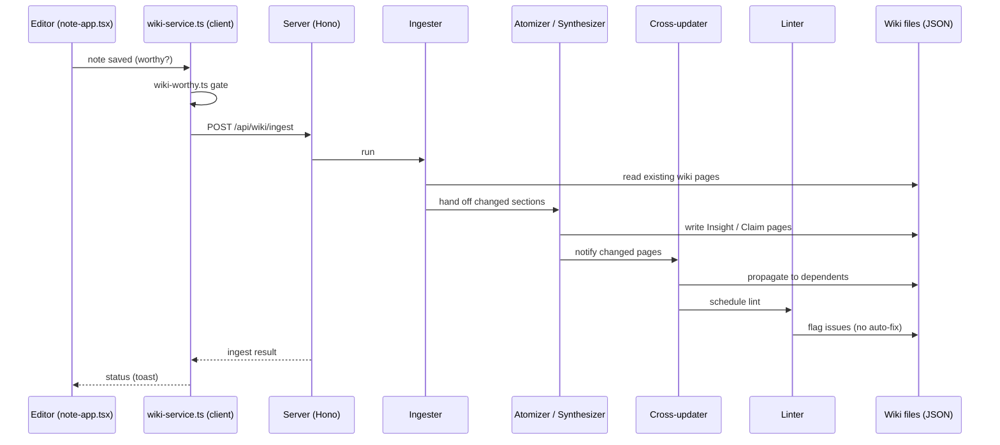
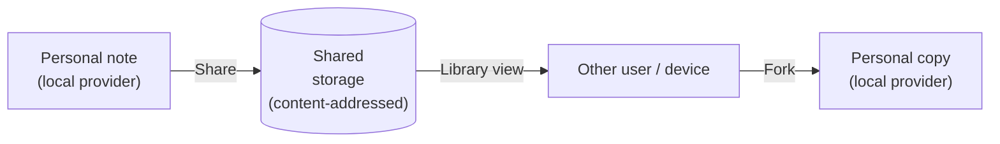

# Graphium — Architecture

This document maps the moving parts: how the editor, the provenance layer,
the AI Knowledge Layer, and the storage layer fit together, and where to
find each of them in the source tree. It is written for contributors and
for anyone who wants to know the shape of the system before reading code.

For the *why*, see [CONCEPT.md](./CONCEPT.md).
For the on-disk file formats, see [DATA_MODEL.md](./DATA_MODEL.md).

---

## 1. At a glance

Graphium is a TypeScript single-page app built on top of
[BlockNote.js](https://www.blocknotejs.org/), shipped as three
distributions that share the same source tree:

- **Web (PWA).** Runs entirely in the browser. Notes live in IndexedDB.
- **Desktop (Tauri v2).** Wraps the web app with a Rust shell so notes
  live as JSON files on the user's filesystem.
- **Self-hosted (Docker).** Runs the same web app plus a Node.js
  companion server that handles AI features (LLM proxy, embedding,
  ingest pipeline).

The companion server (`src/server/`) is built on
[Hono](https://hono.dev/) — a small, web-standard request/response
framework. Hono was chosen over Express because the same app can be
served from `@hono/node-server` (Tauri sidecar / Docker) or, in
principle, from edge runtimes; it is also lighter and better-typed. An
adapter for Vercel Serverless exists in the code (`api/[[...route]].ts`)
but Vercel is not an actively maintained deploy target today.

The server is required for the Knowledge Layer (ingest, embed, chat) and
optional for the editor itself; the editor works without it.

## 2. Layered view

Reading top to bottom: UI talks to feature modules, which read and write
through `src/lib/document-types.ts` and the `StorageProvider` abstraction.
AI features (Knowledge ingest, chat) talk to the Node server. The Node server
talks to LLM and embedding backends.

## 3. The four layers in detail

### 3.1 Editor layer (BlockNote + Graphium blocks)

- BlockNote.js gives Graphium its block model, slash menu, and rich-text
  rendering.
- Custom blocks live under `src/blocks/` (today: `bookmark`,
  `example-hello`, `pdf-viewer`). Inline content (entity / agent
  highlights) lives under `src/features/inline-label/`.
- Editor configuration is composed in `src/note-app.tsx`.

### 3.2 Provenance layer (PROV-DM)

Two distinct concerns share the word *provenance* in this codebase. They
are kept separate on purpose:

| Subsystem | Concern | Lives in |
|---|---|---|
| **World provenance** (`prov-generator`) | Provenance of *the things the note describes* — experiments, sources, decisions. Output: a PROV-DM graph. | `src/features/prov-generator/` |
| **Document provenance** (`document-provenance`) | Provenance of *the note itself* — who edited what, when, with which agent (*human* / *ai*). Output: an edit log. | `src/features/document-provenance/` |

If you read code that mentions "provenance," check which of these two is
meant. There is no shared abstraction between them today.

#### Labels feeding the world-provenance graph

Labels come in two passes that operate on the same blocks:

1. **Block-level (`#` context labels).** Tags a heading block as `[Step]`
   (PROV-DM *Activity*; internal key `procedure`) or as a phase
   `[Plan]` / `[Result]` (internal keys `plan` / `result`). Implemented
   in `src/features/context-label/`.
2. **Inline labels.** Highlights spans inside block text as `[Input]` /
   `[Tool]` / `[Parameter]` / `[Output]` (internal keys `material` /
   `tool` / `attribute` / `output`). The first three feed PROV-DM
   *Entity* nodes (with `material` / `tool` subtypes); `[Parameter]`
   becomes a *Property* on the parent Activity or Entity. Implemented in
   `src/features/inline-label/`.

The two passes are independent: a note can have only block-level labels,
only inline labels, both, or neither. The PROV generator merges both
sources when building the graph.

The generator (`src/features/prov-generator/generator.ts`) uses a
`scopeStack` that infers *Activity* containment from heading structure,
so users do not have to nest blocks manually.

Inside a Step (Activity), `[Plan]` / `[Result]` phase headings do **not**
create separate Activities — they only switch a *phase context* over the
inline Entities they contain. Each Entity gets a `graphium:phase`
attribute (`"plan"` or `"execution"`); plan-phase Entities are emitted
as separate nodes with an `_plan` suffix so they coexist with their
execution counterparts. When the same `(label, entityId)` pair appears
in both phases, the generator emits a `prov:wasDerivedFrom` edge from
the execution Entity to the plan Entity, expressing that the actual
outcome was derived from the planned intent. The shared Step Activity
that both Entities are `prov:used` by acts as the implicit activity of
the PROV-DM derivation’s full form.

#### Wiki Knowledge Layer in the PROV-JSON-LD export

When a note is exported as PROV-JSON-LD (`src/features/prov-export/`),
the export bundle also includes the Wiki Knowledge Layer (Claims /
Insights / Ideas) as additional `Entity` nodes, each with a
`prov:wasDerivedFrom` edge back to its source note(s) and a
`prov:wasAttributedTo` edge to the generating AI agent.

Each Wiki entity carries the *semantic types* from §3.3 so that external
PROV tools can see the hourglass structure of the knowledge layer:

| Attribute (`graphium:*`) | Meaning | Present when |
|---|---|---|
| `wikiKind` | `summary` / `claim` / `atom` / `synthesis` | always |
| `claimRole` | research-process role(s) of the Claim | `wikiKind = claim` |
| `claimLevel` | abstraction level (`principle` / `finding` / `bridge`) | `wikiKind = claim` |
| `procedureContext` | reproducibility scaffold (parameters, tools, validity range) | `wikiKind = claim` (procedure-bearing Claims only) |
| `atomType` | inferential character of the Insight (causal / mechanistic / observational / …) | `wikiKind = atom` |
| `synthesisMode` | reasoning mode of the Idea (deductive / abductive / analogical / dialectic) | `wikiKind = synthesis` |
| `hypothesisStatus` | verification status (speculative / tested / confirmed / refuted) | `wikiKind = synthesis` |
| `confidence` | self-rated confidence at generation (0.0–1.0) | optional |

This export contract is the closest external observers get to the
hourglass: the source note's PROV graph plus the Wiki entities derived
from it, with semantic types attached so the data is interpretable
without Graphium's internal vocabulary.

#### URL / PDF → PROV ingestion (the *prov-ingester*)

A complementary pipeline runs in the other direction: external papers /
recipes / lab protocols come *in* as a URL or PDF and are turned into a
draft note with PROV labels already on it. The pipeline is intentionally
small.

| Step | File | What it does |
|---|---|---|
| Fetch | `src/server/services/url-fetcher.ts` | Downloads a URL, extracts plain text (HTML / readable subset) |
| Prompt | `src/server/services/prov-ingester.ts` | Single open-set prompt for any procedural domain (cooking / lab / manufacturing / ML / …) — builds the system + user prompt for the LLM |
| Parse | same module | Validates the LLM JSON and strips invalid spans / roles |
| Translate | `src/features/url-to-prov/prov-note-builder.ts` | Lifts the parsed output into a `GraphiumDocument` with labels / inline highlights / `provLinks` already attached |

The prompt asks the LLM to emit *prose with inline-highlighted spans*
(Phase F format, 2026-05): paragraphs whose `content` is a list of spans,
where role-bearing spans (`material` / `tool` / `attribute` / `output`)
get inline highlights and plain narrative spans carry the connectors.
The vocabulary is open — there is no fixed list of allowed parameter
names. The prompt only enforces a few lightweight conventions
(`<key>: <value>` attribute spans, `snake_case` keys, "same concept →
same key inside one document").

When the LLM returns multiple procedures from one source (e.g., a paper
with several composition variants), `plan-execution-builder.ts` splits
the output into a **plan note** that groups them plus N **execution
notes** that each carry the actual PROV graph. The execution notes
back-reference the plan via `partOfPlanNoteId`
([DATA_MODEL.md §2](./DATA_MODEL.md#2-the-note-graphiumdocument)). The
current prompt returns one `ProvIngesterOutput` per call so the builder
typically runs with N = 1; the infrastructure is ready for a future
`procedureGroup` extension that returns multiple outputs at once.

Quality is tracked by a benchmark harness at
`tests/benchmark/material-science/`. It loads `(input.txt, gold.json)`
fixture pairs (gold is in MatPROV PROV-DM JSON-LD format), normalizes
both predicted spans and gold `@graph` items into five comparable sets
(Activities / Materials / Tools / Edges / Parameters), and reports
normalized exact-match precision / recall / F1 plus a token-F1
sub-metric. Parameter keys are normalized through a synonym map
(`temperature` ⇔ `temp` ⇔ `T`, `duration` ⇔ `time` ⇔ …) so open-set
output stays comparable to MatPROV-style canonical keys. The first
runner is the さくら AI engine OpenAI-compatible API. Run with
`pnpm test:benchmark`.

### 3.3 Knowledge layer

The Knowledge layer is a set of editable JSON documents that an LLM keeps
in sync with your notes. Each Knowledge document is a real
`GraphiumDocument` with `source: "ai"` set, so it opens in the same
editor. On disk the documents are still grouped under `data/wiki/` and the
TypeScript types use the historical `Wiki*` prefix (`WikiKind`,
`WikiMeta`) — UI labels and prose use "Knowledge / Claims / Insights /
Ideas" instead.

The pipeline (running on the Node server) has five stages:

| Stage | File | What it does |
|---|---|---|
| **Ingester** | `src/server/services/wiki-ingester.ts` | Reads new / changed notes, decides which Wiki pages to touch |
| **Atomizer** | `src/server/services/wiki-atomizer.ts` | Strips context, produces *Insight* pages with citations back to source notes |
| **Idea router** | `src/features/ai-assistant/synthesis-router.ts` | From input Insights' `atomType`, picks the candidate `synthesisMode`s (deductive / abductive / analogical / dialectic) the Synthesizer should consider. Exports `pickTopSynthesisModes` for the theme-driven path, and `pickTenpaiModes` for the "almost-ready ideas" hints shown in Settings → Maintenance (same heuristic, but judges *one piece away from a mode* instead of *mode satisfied*). |
| **Synthesizer** | `src/server/services/wiki-synthesizer.ts` + `src/server/services/synthesis-prompts/` | Weaves Insights across notes into *Idea* pages. The system prompt is composed from a shared `common.ts` plus one file per mode; the router restricts which modes the LLM sees. **Theme-driven (2026-05-23):** when the caller passes a `theme` (e.g. "home cooking"), a theme-lens section is injected at the top of the prompt and the output is re-cast in that theme's vocabulary and reader stance. Mode stays orthogonal — theme is *for whom*, mode is *how*. The discovery flow then calls the Synthesizer once per (cluster × top 1–2 modes) so a single click produces a small spread of variants. |
| **Cross-updater** | `src/server/services/wiki-cross-updater.ts` | When one Wiki page changes, propagates to dependent pages |
| **Linter** | `src/server/services/wiki-linter.ts` | Detects orphan Insights, broken citations, redundant Claims |

Trigger flow (client-pushed, not server-polled):

Notes:

- **Trigger:** the client pushes a save event into `wiki-service.ingestNote()`,
  which posts to the server. There is no server-side file watcher.
- **Worthiness gate:** `src/features/wiki/wiki-worthy.ts` decides whether a
  note is ingest-worthy at all (e.g., empty drafts are skipped).
- **Failure handling:** retries are not centralized today. Each stage
  surfaces its own errors back through the response.
- **Embeddings** (per Wiki section) are stored via
  `src/lib/embedding-store.ts` and used as the retrieval substrate for AI
  chat. The retriever is `src/features/wiki/retriever.ts`.
- **Auto-merge of redundant Claims.** When the linter / startup-merge
  flow detects two Claims that overlap, one is rewritten into the
  other and the absorbed Claim is **archived, not deleted**. Its file
  stays on disk and its index entry gains an `archivedAt` flag, so any
  note that cited it (or any Idea whose `derivedFromNotes` lists
  it) keeps resolving through `loadDoc`. The archived page is hidden
  from lists / search and is editable only after restore. See
  [DATA_MODEL.md §5.2](./DATA_MODEL.md#52-trash-and-archive-semantics)
  for the tri-state semantics.

**World-model grounding retriever (Phase 2 / PR 2B + 2C).** A separate
lane that scores a knowledge piece against external world knowledge.
Strictly **user-triggered** (banner button or list-view bulk action) and
never runs on file open. PR 2C dropped both domain partitioning and
subject tagging — Graphium is a general-purpose note editor, so a
single KB covers claims from any field (cooking, economics, software,
materials, etc.), and asking the LLM to pick a subject label per entry
hit the same boundary-case problem as domain selection without giving
the retriever or any UI filter something useful to operate on.

Two-layer retrieval:

| Layer | Source | Cost | Updated by |
|---|---|---|---|
| seed KB | `public/grounding-kb/seed.v1.json` (build-bundled, single file) | free | manual curation, PR review |
| cache KB | `appdata` key `grounding-kb-cache` (per-user, single key) | free on hit | LLM-judged results sediment here automatically |
| LLM judge | `POST /api/world-grounding/check` → `groundingModel` (Settings → AI) | one model call | called only on KB miss |

`src/features/world-grounding/index.ts → checkValidity` is the facade:
KB lookup first (cheap), miss → LLM judge → sediment back into the
cache layer if the result passes the sedimentation rules
(`kb-cache.ts → isValidForCaching`: 4-value verdict + non-empty
`generatedByModel` + non-empty `claim` / `keywords`). The next check
on a similar claim is served from the cache layer at no LLM cost.

The lane is strictly separate from `epistemicStatus` /
`hypothesisStatus` — `attachValidity` never writes those fields. See
[DATA_MODEL.md §3.7](./DATA_MODEL.md) for the contract and
sedimentation rules.

Settings → Grounding KB tab lists the merged seed + cache, filters by
verdict and free-text search, and lets the user delete individual
sedimented entries that the model produced (seed entries are read-only
from the UI; editing them requires changing `seed.v1.json` through a
PR).

**Idea modes (Phase 1.3).** The Synthesizer can produce four kinds of
Idea, distinguished by the type of reasoning that grounds the new
insight:

- `deductive` — independent claims combine into a strategy ("given A, B, C → D"). Most permissive; the default fallback.
- `abductive` — an observation plus a mechanism / rule → the best explanatory hypothesis. Where most genuine "aha" Ideas live.
- `analogical` — structural mapping between claims from different domains.
- `dialectic` — two claims that argue opposite directions of the same effect, resolved by a higher frame.

Induction is **not** an Idea mode in this system; "many similar claims → a
general rule" is what the Insights layer is for (PR-B4 relocated induction
to the Atomizer). The Synthesizer specializes in combining heterogeneous
elements into something new.

The idea router (`src/features/ai-assistant/synthesis-router.ts`)
inspects the `atomType` of each input Insight and proposes a candidate
mode set; the LLM picks one. The router only rules in / rules out modes
that can be decided from `atomType` alone — content judgments (e.g.,
whether two causal Insights actually argue *opposite* directions for
`dialectic`, or whether two mechanistic Insights span genuinely different
*domains* for `analogical`) are deferred to the LLM. Mode-specific
prompts live in `src/server/services/synthesis-prompts/` (one file per
mode plus a shared `common.ts`), and the router's candidate set decides
which of those files are concatenated into the system prompt for a given
run.

The relationship between Notes, Claims, Insights, and Ideas is described
philosophically in [CONCEPT.md §5](./CONCEPT.md#5-the-hourglass-where-portable-knowledge-is-born).

**Epistemic provenance (Phase η).** Every Claim and every Insight carries an
`epistemicStatus` (`speculation` / `interpretation` / `observation` /
`established`, low → high). The Ingester sets the Claim's status from the
note's linguistic surface (hedge markers → `speculation`, measurement language
without mechanism → `observation`, textbook framing → `established`). The
Atomizer then propagates the **lowest** status from a candidate Insight's
source Claims to the Insight itself — a structural rule, not a judgment call,
so a single `speculation` Claim cannot launder itself into an `established`
Insight by sharing a pattern with two `observation` Claims. The Synthesizer
honors the same contract at the Idea layer: whenever any input Insight carries
`epistemicStatus: "speculation"`, the resulting Idea's `hypothesisStatus` is
forced to `"speculative"` regardless of what the LLM produced. Together these
three rules let the knowledge layer absorb casual musings (the "maybe this
is true" half of a notebook) without contaminating the layers above.

**Toulmin extension (Phase γ).** The Knowledge Layer adds the three Toulmin
(1958) elements that were previously absent: **Rebuttal**, **Backing**, and
**Modal qualifier**.

- **Rebuttal** (`rebuttalConditions[]`) names the boundary conditions under
  which a Claim breaks down ("works except when temperature exceeds the
  decomposition point", "only holds while the user count stays below the
  inflection"). It is extracted at the Claim layer by the Ingester from the
  note's own "ただし〜" / "except when" phrasing, and the Atomizer **only**
  propagates it to the Insight layer when 2+ source Claims share a rebuttal
  on the same axis — a single Claim's boundary stays at the Claim layer.
- **Backing** (`backing[]`) grounds the Warrant (the inferential rule the
  Claim is leaning on) in a textbook principle, external paper, or another
  internal Claim. It stays at the Claim layer only — Insights are
  context-stripped, so the original Claim's Warrant no longer applies.
- **Modal qualifier** (`modalQualifier`) records the user's expressed
  certainty about a Claim (`necessarily` / `probably` / `possibly` /
  `rarely`), distinct from the system's `confidence` score and from
  `epistemicStatus`. Like backing, it is Claim-only — once the Insight
  factors out a recurring pattern, the original speaker's hedging no longer
  attaches.

Atom-side `rebuttalConditions` feed the Synthesis router: when ≥2 input
Insights carry rebuttals, `dialectic` is added to the candidate mode set
even if the `causal` ≥ 2 trigger is not met. The dialectic prompt then
instructs the LLM to read both Insights' rebuttals before writing the
synthesis and use the shared rebuttal axis as the regime separator. Toulmin
rebuttals are first-class candidates for the higher frame that dialectic
synthesis requires.

The schema mirror is on `NoteIndexEntry.{rebuttalConditions, backing,
modalQualifier}` and the on-disk version is now
`INDEX_SCHEMA_VERSION = 16`.

**Empirical quality control.** The Wiki pipeline's discovery quality is
regression-tested by `bench/` (corpus + ground-truth + adversarial probes +
metrics). Each roadmap phase declares which metrics it must improve;
`pnpm bench:compare main` is required on every PR that touches the
ingester / atomizer / synthesizer / router. See the README's "Knowledge
Layer benchmark" section and `docs/internal/benchmark.md` for the metric
definitions, corpus rationale, and merge rules.

### 3.4 Storage layer

A single interface (`src/lib/storage/types.ts`) abstracts where notes
live. Three providers ship today:

| Provider | Where notes live | Used in |
|---|---|---|
| **`local`** | Browser IndexedDB | Web (PWA) |
| **`filesystem`** | OPFS (browser) or native FS via Tauri | Desktop |
| **`server-fs`** | Filesystem on the Node server | Self-hosted (Docker) |

The provider is selected at runtime by `src/lib/storage/registry.ts` and
exposed via the `useStorage()` React hook.

A separate **shared storage** subsystem (`src/lib/storage/shared/`)
handles content addressed by hash for the Library / Fork features
(see §5).

## 4. Distribution targets

The same `src/` tree is built three different ways.

### 4.1 Web (PWA)

- Entry: `index.html` → `src/main.tsx`
- Storage: `local` provider (IndexedDB)
- AI features: optional, point at any reachable server URL
- Hosting: GitHub Pages today, Docker self-host for richer setups

### 4.2 Desktop (Tauri v2)

- Entry: `src-tauri/src/lib.rs` boots a webview that loads the same `src/`
  bundle
- Storage: `filesystem` provider, default path `~/Documents/Graphium/`
- Tauri commands (`list_note_files`, etc.) are defined in `lib.rs` and
  matched by TypeScript wrappers
- AI / Knowledge features run inside the app via a Node sidecar:
  `scripts/fetch-node.mjs` downloads Node 22 and renames it to
  `binaries/graphium-server-<triple>[.exe]` so Tauri can spawn it as a
  sidecar. `src/lib/sidecar.ts` resolves `sidecar/server.mjs` via
  `resolveResource()` and passes it as the first argument.
- LLM API keys are stored in the macOS Keychain (service
  `com.graphium.app`, account `<model-id>`) rather than on disk. The
  sidecar is started with `GRAPHIUM_USE_KEYCHAIN=1` on macOS, and the
  first read of an existing `models.json` migrates any plaintext
  `apiKey` field into the Keychain and rewrites the file without it.
  On non-Tauri deployments (Docker / dev), keys continue to live in
  `data/models.json` as before.
- Sidecar stdout/stderr is appended to `~/Library/Logs/Graphium/sidecar.log`
  on macOS (`<data_local_dir>/com.graphium.app/logs/sidecar.log` on other
  platforms). The file is rotated to `sidecar.log.1` once it exceeds
  5 MB, so old entries do not grow without bound.
- Shipped targets: macOS Apple Silicon (`aarch64-apple-darwin`) and
  Windows x64 (`x86_64-pc-windows-msvc`). Other targets are unverified.

### 4.3 Self-hosted (Docker)

- Entry: `docker-compose.yml` (or `docker-compose.standalone.yml` for the
  editor-only flavor)
- Server: `src/server/index.ts`, a Hono app on `@hono/node-server`
- Storage: `server-fs` provider; notes live on the host filesystem
- AI: ships with LLM and embedding endpoints wired up

## 5. Sharing and Library

Graphium has an opt-in sharing model that does **not** require a central
service. It is built on top of a content-addressed shared storage layer.

Key pieces:

- **`src/features/sharing/`** — Library view, Share / Unshare actions, Fork
- **`src/lib/storage/shared/`** — content-addressed blob layer (hashing in
  `hash.ts`, ID assignment in `id.ts`, local-folder backend in
  `local-folder.ts`)
- **Blob materialization** — when sharing a note that embeds media, the
  media is uploaded as `shared-blob:` references; on Fork, those blobs are
  re-materialized into the personal copy

Today the shared backend is a local folder. Other backends (cloud
buckets, S3, IPFS-style) can be added by implementing the same blob
interface.

## 6. The Node server (when present)

The server is built on [Hono](https://hono.dev/) and is intentionally
thin. It does three jobs:

1. **Run the Wiki pipeline** (`src/server/services/wiki-*`).
2. **Proxy LLM and embedding calls** so API keys never reach the browser.
   See `src/server/services/llm.ts`, `embedding.ts`.
3. **Expose REST endpoints** under `src/server/routes/` (`agent`, `wiki`,
   `prov`, `tools`, `models`, `profiles`, `storage`, `health`).

When running as PWA only, all of this is absent and the editor still
works.

### 6.1 Authentication and trust model (current state)

Today the server's trust model is **deliberately minimal**. The expected
deployment is one of:

- The Tauri sidecar — server talks only to `tauri://localhost` origins
  (CORS-enforced) and lives in the user's process tree.
- A self-hosted Docker behind the user's own boundary (VPN, LAN, or
  reverse proxy).

Tokens you may see in headers (`X-Graphium-Token`, `X-LLM-API-Key`,
`X-Registry-URL`) are passthrough to upstream LLM / Registry APIs, not
authentication for the Graphium server itself. There is no built-in user
auth, multi-tenant isolation, or audit log on the server today.

Operators exposing the server to the public internet should put it
behind their own auth proxy. A first-class auth model is on the roadmap
once team-shared storage stabilizes.

## 7. Build and runtime stack

| Concern | Choice |
|---|---|
| Bundler | Vite 6 (`vite.config.ts`) |
| Type checking | TypeScript via `tsc --noEmit` |
| Tests | Vitest (`pnpm vitest run`) |
| Component dev | Storybook (port 6006) |
| Package manager | pnpm (npm/yarn are not used) |
| State management | React Context + feature-local stores; no global state library |
| Server runtime | Node ≥ 20 via `@hono/node-server` |
| Native shell | Tauri v2 (Rust) for desktop |

## 8. Source map

Where to look first when you want to change X. This is a **curated map of
the high-traffic areas**, not an exhaustive listing — `src/features/`
holds many more directories than appear here. For the complete picture,
just `ls src/features/` and `ls src/lib/`. The table below covers what
people most often need to find.

| Want to change | Look in |
|---|---|
| Block types or editor behavior | `src/blocks/`, `src/note-app.tsx` |
| Slash menu / inline `@`-link / `#`-label UI | `src/features/block-link/`, `src/features/context-label/`, `src/features/inline-label/` |
| PROV-DM graph generation | `src/features/prov-generator/` |
| Per-note edit history | `src/features/document-provenance/` |
| AI chat & note derivation | `src/features/ai-assistant/` |
| ⌘K palette (note search + ask) | `src/features/composer/` |
| Knowledge UI and service | `src/features/wiki/` |
| Knowledge pipeline (ingest / atomize / synthesize) | `src/server/services/wiki-*.ts` |
| Inter-note network graph (Cytoscape) | `src/features/network-graph/` |
| Storage provider | `src/lib/storage/providers/`, `src/lib/storage/registry.ts` |
| Note JSON shape and migrations | `src/lib/document-types.ts`, `src/lib/document-migration.ts` |
| Index file (note list, schema version) | `src/features/navigation/index-file.ts` |
| Sharing / Library / Fork | `src/features/sharing/`, `src/lib/storage/shared/` |
| Settings UI (model, profile, fonts) | `src/features/settings/` |
| Slash-template commands (Plan / Run) | `src/features/template/` |
| Skill (prompt template) documents | `src/features/skill/` |
| Reference table (related notes) | `src/features/index-table/` |
| Export (PROV-JSON-LD, PDF, DOCX import) | `src/features/prov-export/`, `src/features/pdf-export/`, `src/features/docx-import/` |
| Onboarding flow | `src/features/onboarding/` |
| URL-to-PROV / PDF-to-PROV ingestion | `src/features/url-to-prov/`, `src/server/services/prov-ingester.ts` |
| Material-science benchmark harness | `tests/benchmark/material-science/` |
| Release notes UI | `src/features/release-notes/` |
| Tauri integration | `src-tauri/src/lib.rs`, `src/lib/menu-events.ts` |
| Landing page | `src/landing/` |

## 9. Compatibility and migrations

Graphium is OSS and shipped to real users, so a few invariants are
treated as load-bearing.

- **Note JSON (`GraphiumDocument`).** New fields go in as `optional`. Renames
  and removals require a migration in `src/lib/document-migration.ts`,
  applied at load time.
- **Index file.** `INDEX_SCHEMA_VERSION` in
  `src/features/navigation/index-file.ts` must be bumped on any
  `NoteIndexEntry` / `GraphiumIndex` shape change. The index is rebuilt
  on version mismatch.
- **Storage providers.** Changes to the `StorageProvider` interface
  (`src/lib/storage/types.ts`) require updates in all three providers
  (`local`, `filesystem`, `server-fs`). Optional methods are preferred
  for additive changes.
- **IndexedDB stores.** Schema changes require bumping the DB version
  and writing a `onupgradeneeded` migration in `local.ts`.
- **Tauri commands.** Commands added or renamed in `src-tauri/src/lib.rs`
  must be matched in TypeScript callers; the desktop and web builds share
  the same TS code.

The detailed expectations are written into the project's `CLAUDE.md`
"破壊的変更チェック" section. The data shapes themselves are documented
in [DATA_MODEL.md](./DATA_MODEL.md).

## 10. Known seams (technical debt I am tracking)

Areas where the current architecture works but has visible seams. Listed
so contributors do not mistake these for finished design.

- **Two "provenance" subsystems with no shared abstraction.** See §3.2.
  `prov-generator` (world model) and `document-provenance` (edit log)
  share a name and a directory neighborhood but no common interface. A
  third "provenance" concept (e.g. Wiki ingest provenance) would make
  this worse. A unifying domain layer is on the roadmap.
- **Wiki pipeline lacks an explicit orchestrator.** See §3.3. The five
  stages are independent services that read and write Wiki files
  directly. There is no event bus, no queue, and no centralized retry
  policy. This is fine at single-user scale but will need an orchestrator
  before adding more stages or supporting larger workloads.
- **Personal storage and shared storage are two separate abstractions.**
  `StorageProvider` (notes) and the content-addressed blob layer (`shared/`)
  have different shapes. Mostly intentional, but it means every feature
  that crosses the boundary (Share, Fork, materialize) has to bridge
  them by hand.
- **Tauri command signatures and TypeScript callers are synced manually.**
  No codegen between `src-tauri/src/lib.rs` and the TS wrappers. Mismatches
  surface only at runtime in the desktop build.
- **No first-class auth on the server.** See §6.1. Acceptable for the
  current deployment shapes (Tauri sidecar, self-hosted behind a proxy)
  but a known gap if the server is ever exposed publicly.

---

## See also

- [CONCEPT.md](./CONCEPT.md): the design philosophy
- [DATA_MODEL.md](./DATA_MODEL.md): on-disk file formats and schemas
- [README](../README.md): install and run
