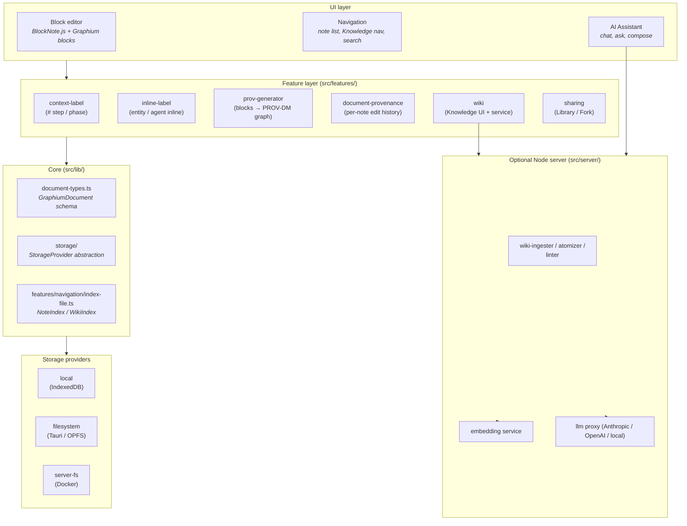
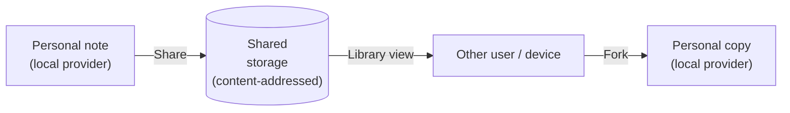
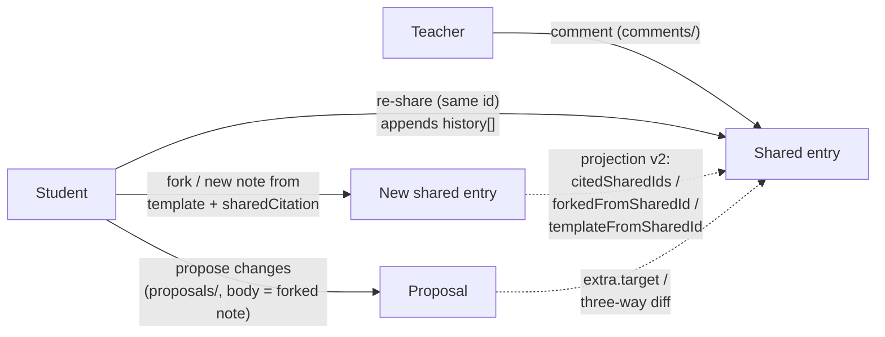

# Graphium — Architecture

This document maps the moving parts: how the editor, the provenance layer,
the AI Knowledge Layer, and the storage layer fit together, and where to
find each of them in the source tree. It is written for contributors and
for anyone who wants to know the shape of the system before reading code.

For the *why*, see [CONCEPT.md](./CONCEPT.md).
For the on-disk file formats, see [DATA_MODEL.md](./DATA_MODEL.md).

---

## 1. At a glance

Graphium is a TypeScript single-page app built on top of
[BlockNote.js](https://www.blocknotejs.org/), shipped as three
distributions that share the same source tree:

- **Web (PWA).** Runs entirely in the browser. Notes live in IndexedDB.
- **Desktop (Tauri v2).** Wraps the web app with a Rust shell so notes
  live as JSON files on the user's filesystem.
- **Self-hosted (Docker).** Runs the same web app plus a Node.js
  companion server that handles AI features (LLM proxy, embedding,
  ingest pipeline).

The companion server (`src/server/`) is built on
[Hono](https://hono.dev/) — a small, web-standard request/response
framework. Hono was chosen over Express because the same app can be
served from `@hono/node-server` (Tauri sidecar / Docker) or, in
principle, from edge runtimes; it is also lighter and better-typed. An
adapter for Vercel Serverless exists in the code (`api/[[...route]].ts`)
but Vercel is not an actively maintained deploy target today.

The server is required for the Knowledge Layer (ingest, embed, chat) and
optional for the editor itself; the editor works without it.

## 2. Layered view



Reading top to bottom: UI talks to feature modules, which read and write
through `src/lib/document-types.ts` and the `StorageProvider` abstraction.
AI features (Knowledge ingest, chat) talk to the Node server. The Node server
talks to LLM and embedding backends.

## 3. The four layers in detail

### 3.1 Editor layer (BlockNote + Graphium blocks)

- BlockNote.js gives Graphium its block model, slash menu, and rich-text
  rendering.
- Custom blocks live under `src/blocks/` (today: `bookmark`, `calc`,
  `callout`, `chart`, `columnList` / `column`, `dataTable`, `math`,
  `pdf-viewer`, `sharedCitation`, `step`). Inline content (entity /
  agent highlights) lives under `src/features/inline-label/`; inline math lives
  under `src/features/inline-math/`.
- `calc` is a Numi-style live calculation block: each line of `props.source` is
  an expression or a variable assignment, evaluated top-to-bottom with mathjs
  (unit-aware, so `5 g / (233.19 g/mol)` works — the target use case is batch /
  weighing calculations that would otherwise happen in a spreadsheet). Variables
  are scoped to the block; the last evaluation is persisted as a snapshot in
  `props.results` so the values a note recorded stay reproducible even if the
  evaluator changes. mathjs is dynamically imported on first evaluation
  (`src/blocks/calc/mathjs-loader.ts`).
- On top of mathjs, `src/blocks/calc/fit.ts` adds `polyfit` / `polyval` /
  `coeffs` / `r2` / `linspace` to the block's scope. The motivating case is
  instruments that sample the same sample at different points of an independent
  variable: in thermoelectrics, thermal conductivity is measured by laser flash
  and the Seebeck coefficient and electrical conductivity by a separate rig, so
  computing *ZT* requires fitting one quantity and re-evaluating it at the
  other's temperatures. `polyfit` returns a fit object rather than bare
  coefficients, so the normalisation, the coefficient of determination and the
  fitted range travel with it. The result line shows the degree and R²; the
  fitted range moves to `CalcLineResult.detail` and is read on hover, because
  the results column is capped at 45% of the block and clips long lines from
  the left. Three properties matter for correctness:
  - **Conditioning.** The fit is solved in a centred, scaled basis
    `u = (x - center) / scale` with `u` in `[-1, 1]`. Solving a degree-4 fit
    directly over, say, 300–800 K gives a Vandermonde system with a condition
    number around 10^12 and unusable coefficients. `coeffs()` expands the
    normalised coefficients back to powers of `x` (highest power first, matching
    `numpy.polyfit`) for reporting.
  - **Units.** The fit records the common unit of `x` and of `y`. `polyval`
    converts its argument into the fitted `x` unit — so a column in °C and a fit
    made in K agree instead of silently disagreeing — and re-attaches the `y`
    unit to its results, which is what keeps a derived *ZT* dimensionless.
    Columns whose units are mixed or absent are treated as plain numbers.
  - **Extrapolation.** Evaluating outside the fitted range returns values and
    flags the line with a warning (`CalcLineResult.warn`, rendered as a
    hoverable marker) rather than throwing, because throwing would take down
    every dependent line. Ranges rarely line up exactly at the ends, so this is
    the common case, not an edge case.
  Results flow into tables through the existing write-back path, so a fitted
  column behaves like any other computed column.
- `math` holds a LaTeX source string in `props.latex` and renders it with KaTeX.
  `inlineMath` is the same idea as a custom inline content spec, for formulas
  that sit inside a sentence. Clicking either one opens an editor: by default a
  MathLive `<math-field>`, where typing `x/y` builds a fraction and a symbol
  palette covers what you can't type — you do not need to know LaTeX to write a
  formula. A toggle switches to editing the LaTeX source directly, and the
  choice is remembered per device (`features/math/editor-mode.ts`). MathLive is
  ~800KB and is only needed while editing, so it is dynamically imported on
  first use (`features/math/mathlive-setup.ts`); its fonts are copied out of
  `node_modules` into `public/mathlive/fonts/` by a Vite plugin, because
  MathLive fetches them at runtime rather than through CSS. Conversion to and from Markdown (`$ … $`,
  `$$ … $$`) is centralized in `src/features/math/markdown-math.ts` — every
  Markdown → block path goes through `parseMarkdownToBlocksWithMath`, because
  BlockNote's own parser destroys LaTeX delimiters and eats `^` / `_` as
  emphasis markers.
- `step` is the one container block: it holds child blocks, and a procedure is
  written by putting its content inside a step rather than by labelling a
  heading. Nesting and reordering use BlockNote's own drag handle. The card's
  header carries a predecessor control that sets `informed_by` links between
  steps — ordering is a first-class property of a procedure, so it lives on
  the card rather than in a side panel. Its predecessor picker is two
  levels: steps first, then — for a step that has outputs — that step's
  individual outputs, so the writer states *which* output is being
  received rather than only that one step followed another.
- Pasting a table (HTML `<table>` or tab-separated text from a spreadsheet)
  with more than `DOC_TABLE_DEFAULT_MAX_ROWS` (200) data rows is intercepted
  in the paste handler and routed into the same data-import dialog as a
  dropped file, so the note-table stall cannot be reached from the clipboard
  either (`src/features/data-import/paste.ts`). Smaller pastes stay ordinary
  BlockNote tables.
- `dataTable` shows a delimited data asset (the same instrument `.txt` /
  `.dat` / `.csv` that data import turns into a table) *without* expanding it
  into the note. The block stores only a reference — the asset id plus the
  read settings, the same shape as `tableMeta.source` — and a caption; the
  rows stay in the asset and are parsed on display through the shared asset
  text cache (`src/features/data-import/asset-text.ts`, also used by charts).
  Only the visible rows are rendered (fixed-height virtual scrolling), sorting
  is view-only, and the table is read-only. This exists because a note table
  is one ProseMirror node per cell and every edit re-serializes the whole
  document, so a 2,000-row measurement pasted as a note table stalls the
  editor; the import dialog therefore defaults to a data table for every
  delimited import (instrument data is read and plotted, not edited by hand)
  and lets the writer pick the note-table form instead, warning above
  editor; the import dialog therefore defaults to a data table for every
  delimited import (instrument data is read and plotted, not edited by hand)
  and lets the writer pick the note-table form instead, warning above
  `DOC_TABLE_DEFAULT_MAX_ROWS` (200) rows and refusing above
  `DOC_TABLE_HARD_MAX_ROWS` (1,000), because a 2,000-row note table stalls
  the editor until it is force-quit. Re-importing from the source badge
  converts between the two forms. Calc blocks and charts read a data table
  by its caption exactly like a note table, and the expand button opens the
  same full-height view with virtual scrolling. Calc write-back (⇥) onto a
  data table does not touch the asset: the declared values are shown as an
  extra *computed column* on the right, marked with a calculator badge, so
  the formula stays visible in the calc block and the note still stores no
  rows. Charts and other calc blocks read computed columns like any other
  column. The reverse moves exist too: a note table can be turned into a
  data table (its rows leave the note as a CSV asset) and back again while it
  stays under the note-table row cap, and a data table can be written out with
  its computed columns as a new, derived asset.
- `chart` renders a table from the same note as a line / bar / scatter /
  histogram chart (Apache ECharts, SVG renderer, lazy-loaded on first
  paint so notes without charts pay nothing extra). The table stays the
  source of truth: the block stores only the referenced table's id, the
  column names, and how each series is drawn — its own type, color, line
  style and width, marker shape and size, bar width and stacking — and
  re-reads the table when the document changes. A series can also point
  at a **data asset** instead of a table in the note: the same delimited
  instrument file that data import turns into a table is read straight
  from the asset library, so a past measurement or a reference pattern
  can be overlaid on a figure in another note without pasting its table
  there. The block then keeps the asset's `fileId` and the way it was
  read (header row, end row, delimiter — the same import settings the
  table path stores in `tableMeta.source`) under `config.assetSources`,
  and the series refers to it as `asset:<fileId>`; the file body is
  fetched through the storage provider and cached per asset. Those
  references count as the asset being *used* by the note (media index
  v6), the same way an imported table's source file does. Series can
  also be **offset into rows** — each normalised to its own maximum and lifted by
  a fixed gap — which is how spectra get compared (an XRD measurement
  against reference patterns). Stacked that way, the comparison keeps one
  x-axis and one y-axis name instead of one per figure; the y ticks are
  hidden because the vertical position is arbitrary units by then, each
  row is named on the plot itself, and the tooltip converts the drawn
  value back to the measured one. Where that trades the y axis away, a
  block can instead be **split into a grid of panels** (up to 4 × 4), each
  series assigned to one, each panel keeping its own axes — the shape four
  different quantities against one variable need. Joining a direction
  presses those panels flush and shares that axis for real: the range is
  unified and only the outer panel carries ticks and a name. Nothing is
  inferred from the data; panels are independent until joined, which is
  also what decides whether an axis setting is per panel or shared. Axis
  names and ranges belong to a panel; the tick kind and styling belong to
  the figure, and so does the legend by default — series with the same
  name are one entry in one color across panels, or each panel can carry
  a legend of its own inside its frame (`legendScope`), with a per-panel
  corner override where the data runs through the default one. Panel
  rectangles are computed by a pure function (`chart-layout.ts`) rather
  than by ECharts' `containLabel`, which resolves per grid and would leave
  the plot areas misaligned. **Time-series tables** complement it on the input
  side: any standard table can be given a `datetime-auto` column (from
  the drag-handle menu, or ready-made from the slash menu), after which
  adding a row with the ordinary table controls stamps its first column
  with the current date/time. There is only one kind of table — behaviors
  like this are annotations on *columns*, kept in a side store
  (`page.tableMeta`) together with the table's optional caption. The
  timestamp is plain cell text — editable afterwards, and it survives
  Markdown export — so recurring observations (a headache diary, growth
  logs, time-series measurements) work without a database-style schema
  object.
- **The flow view is a node editor over the same document.** It is built on
  React Flow (`@xyflow/react`); step cards and material / tool / output
  entities are all nodes. A node shows only its name — plus a media
  thumbnail and a count of what it carries — while attributes and
  parameters live in a table panel under the graph, or beside it in full
  screen. Packing them into the nodes makes the graph unreadable, and
  MatPROV-style parameter nodes explode it. Edges come in three kinds:
  `used` (entity → step),
  `generates` (step → entity), and order-only `informed_by` drawn dashed —
  the last one is what a handoff degrades to when the note does not say
  which output was used. The exploration-oriented graphs (note graph,
  global graph, asset graph) stay on cytoscape (canvas), which
  scales better for large force-directed views;
  `provToCytoscapeElements` also still feeds printing, where the graph is
  rasterized to a PNG and appended to the printed note.
- **Layout is automatic until you disagree with it.** Every graph can be
  rearranged by hand — drag a node, or shift-drag the background to select
  a group and move it as one — and the arrangement is remembered per graph
  in appdata (`DATA_MODEL.md` §5.4), so it survives reopening the note and
  syncs to the user's other devices. Once an arrangement exists the
  automatic layout stops running for that graph; only nodes that appeared
  since the save are placed automatically, which is what keeps adding one
  material from scrambling a graph someone arranged deliberately. A reset
  control (the step flow reuses its existing "arrange" button) drops the
  arrangement and hands the graph back to fcose / ELK. The step flow's
  ELK pass can only run once React Flow has measured every card, so a
  layout that has been asked for is held until it can run rather than
  dropped by an unrelated re-render; applying it, grabbing a node, or
  adopting a saved arrangement are the only things that clear it, and
  while it waits it re-checks for a bounded number of frames instead of
  relying on a resize notification that may never come. Both graph
  libraries share one store and one set of gestures on purpose: the two
  panels sit next to each other, and a graph that behaves differently
  depending on which tab it is in reads as two unrelated tools.
- **Every graph edit is a document edit.** Steps can be added, renamed and
  deleted; entities renamed, removed and given attributes; dragging an
  entity onto a step makes it that step's input (and links `informed_by`,
  which fires the generator's entity unification so the output and the new
  input become one node), and dropping an entity's port on empty canvas
  grows the next step already wired. Each operation is translated into the
  corresponding block / link mutation
  (`src/features/network-graph/activity-graph-editor.tsx`) and the graph
  re-derives from the document — it is never edited as a data structure of
  its own, so the "graph is a pure projection of blocks + links" invariant
  holds in both directions.
- **The table is the only bridge from the graph, and the panel is the
  step's whole contents.** Everything a node carries is a row or a column
  of an ordinary table in the note. The panel next to the graph
  (`network-graph/flow-attribute-table.tsx`) stacks *all* of the selected
  step's tables — parameters, inputs, tools, outputs — one card per
  table, each headed by the note's label chip, and every edit writes back
  into the note's table block (`network-graph/table-row-edit.ts`).
  Selecting an entity shows the same panel with its row highlighted and
  its section scrolled into view, so there is exactly one place where
  things are added: "add <kind>" (or "add stage" on the parameter table) /
  "add column" on the section's table, and
  the empty first cell of a kind that has no table yet — sections always
  render as a table (dashed while it is only a placeholder), and typing
  into that cell creates the labeled table in the note carrying what was
  typed, so nothing is written until there is something to write. The
  parameter table's header row holds the keys and each data row one set of
  values; from the second data row on, rows are stages of the step (§3.2) and
  the panel numbers them for display only. Entities highlighted in prose
  remain readable and keep span-based editing — renaming rewrites the
  span text (keeping its `entityId`), removing deletes a dedicated row or
  strips the mark inside prose (DATA_MODEL §2.3) — and the panel lists
  them under "written in the prose", to be edited in place or moved into
  the kind's table with one click. Attributes that a prose entity carries
  (`purity: 99.999%` written next to a material) are shown as faint extra
  columns on that entity's row when the table has no column for them, so
  a parameter that is labelled in the prose is never invisible in the
  panel. The panel lists what the step is
  actually wired to, not only what its own blocks contain: an entity
  shared with another step (same-named tools merge into one Entity)
  appears in its section as a grayed row naming where it lives, whose
  "add to the table" gives this step its own row for the same entity.
- **Same-named steps are told apart by what differs.** A multi-sample
  study yields several steps with the same operation name (§3.2), so the
  step card carries the parameters whose values differ from its
  same-named siblings — and only those, since a value they all share
  distinguishes nothing (`computeStepDistinguishers`). A step with no
  same-named sibling shows nothing extra. A **Parameters** toggle in the
  flow toolbar expands every node — steps and entities alike — to list
  its parameters in full, for reading conditions rather than following
  the shape; the choice is remembered per device (`localStorage`) and is
  display-only, since editing stays in the panel. Expanding changes the
  cards' measured size, so the toggle re-runs the ELK layout once React
  Flow has re-measured.
- Every custom block must be registered in `src/blocks/registry.ts` so both
  the main editor and the SidePeek pick it up. The registry derives
  `KNOWN_BLOCK_TYPES`, taking BlockNote's own block types from
  `defaultBlockSpecs` at runtime so the set cannot drift from the schema when
  a BlockNote upgrade adds new built-ins. Blocks outside that set are
  stripped on load and then auto-saved — an unregistered block is data loss,
  and a container takes its children with it.
- Every custom block also needs a Markdown conversion, written beside the
  block in its own `to-markdown.ts` and registered in `src/blocks/markdown.ts`.
  Markdown export lowers custom blocks into standard ones before serializing,
  and every path that produces Markdown — single-note export, the backup zip,
  copying blocks, quoting a selection to the AI — goes through
  `blocksToMarkdown` so those paths cannot drift apart. Serializing a custom
  block directly would emit whatever its React view rendered, down to button
  labels and loading placeholders; a formula would come out as KaTeX's
  rendered glyphs instead of its LaTeX source. A block with no conversion
  falls back to its plain text, which for `content: "none"` blocks (chart,
  calc, PDF) is nothing at all, so it vanishes from the export.
  `registry.test.ts` fails when the two registries disagree.
- Features that annotate a *standard* block do not add a block type. They
  keep a side store keyed by block id (`mediaInlineLabels`, `blockAlignments`,
  `mediaOcr`), because extending BlockNote's own image / file blocks is
  far-reaching — and because the user should not have to choose a special
  block up front to get the behaviour later.
- Editor configuration is composed in `src/note-app.tsx`.

### 3.2 Provenance layer (PROV-DM)

Two distinct concerns share the word *provenance* in this codebase. They
are kept separate on purpose:

| Subsystem | Concern | Lives in |
|---|---|---|
| **World provenance** (`prov-generator`) | Provenance of *the things the note describes* — experiments, sources, decisions. Output: a PROV-DM graph. | `src/features/prov-generator/` |
| **Document provenance** (`document-provenance`) | Provenance of *the note itself* — who edited what, when, with which agent (*human* / *ai*). Output: an edit log. | `src/features/document-provenance/` |

If you read code that mentions "provenance," check which of these two is
meant. There is no shared abstraction between them today.

#### Labels feeding the world-provenance graph

Labels come in two passes that operate on the same blocks:

0. **The `step` container block.** A procedure is written as a `step` block,
   whose children are its content. The block *is* the PROV-DM *Activity* —
   it carries no label, and its title comes from the block's own inline
   content. This is the only way a procedure exists: notes written with the
   old heading-plus-label style are converted to `step` blocks on load by
   the v6 document migration (DATA_MODEL §2.1), preserving block ids so the
   generated graph is unchanged.
1. **Block-level (context labels).** The only block labels are entity
   markers on tables and media, applied from the drag-handle menu and
   offered **only inside a step** (an entity outside any step would have no
   Activity to bind to). The `#` affordance is gone entirely (free-form
   tags went with it; existing tags remain inert data). A **table
   block** may be tagged `[Input]` / `[Tool]` / `[Output]` to mark
   it as a *structured table* (header row = attribute keys, each data row =
   one Entity), or `[Parameter]` to mark it as a *parameter table* (header
   row = keys, each data row = one stage). A single data row's
   `key=value` pairs merge into the enclosing Step's `params` as before;
   two or more rows instead become chained stage child Activities, one
   per row (see [DATA_MODEL.md §2.3](./DATA_MODEL.md)). Implemented in
   `src/features/context-label/`.
2. **Inline labels.** Highlights spans inside block text as `[Input]` /
   `[Tool]` / `[Parameter]` / `[Output]` (internal keys `material` /
   `tool` / `attribute` / `output`). Offered **only inside a step**, for
   the same reason as block labels; existing highlights elsewhere stay
   visible and removable. The first three feed PROV-DM
   *Entity* nodes (with `material` / `tool` subtypes); `[Parameter]`
   becomes a *Property* on the parent Activity or Entity. Inline labels do
   not apply inside table cells (cells are atomic values — use a
   structured-table block label instead). Implemented in
   `src/features/inline-label/`.

The two passes are independent: a note can have only block-level labels,
only inline labels, both, or neither. The PROV generator merges both
sources when building the graph.

The generator (`src/features/prov-generator/generator.ts`) resolves
*Activity* containment two ways, so users never state which Entity belongs
to which Activity:

- **`step` containers.** A pre-pass walks the block tree and binds every
  descendant of a `step` to that step's Activity. The innermost enclosing
  step wins, so nested steps behave as expected.
- **Headings.** A `scopeStack` infers containment from heading structure
  for blocks that are not inside any step.

The two never overlap: headings inside a step are ordinary subheadings and
create no Activity of their own, which keeps a block from being bound twice.

Besides labels, a note can carry explicit **block-to-block links**
(`page.provLinks`, type `BlockLink` — `src/lib/block-link-types.ts`, created
from the block-link editor or by auto-link). All five PROV link types are
projected into the graph: `informed_by` desugars into a step handoff
(described in DATA_MODEL §2.3); `derived_from`, `reproduction_of`, `used`
and `generated` are projected directly right after, resolving each
endpoint block to whichever Entity/Activity node represents it (falling
back to a synthesized node when the block carries no label of its own),
so no link type is silently dropped. See
[DATA_MODEL.md §2.3](./DATA_MODEL.md#23-prov-dm-label-model) ("The other
four `provLinks` types") for the resolution and fallback rules, and the
warnings raised when an endpoint cannot be resolved as expected.

`[Plan]` / `[Result]` phases were withdrawn (plan-vs-actual comparison
pays off across runs of a protocol, which note-level splitting covers: a
plan note whose index table links to one execution note per run), and
the v6 migration strips any remaining phase labels on load — so loaded
documents never carry a phase and new graphs contain no `graphium:phase`
metadata. See DATA_MODEL §2.3 for the historical semantics that pre-v6
exports may still contain.

Beyond labelled blocks, images can have their text **read on-device**, with
no label required. Newly pasted images are read automatically (progress is
shown in a corner toast; images that were already in the note when it was
opened are left alone), and the user can also trigger a read from the image
block's drag-handle menu ("Read text from image"). Tesseract.js runs
entirely in the browser — the wasm core and language data are bundled with
the app, and the image itself never leaves the device. For a just-pasted
image the original `File` is handed straight to the recognizer instead of
being read back from the storage provider, and recognition jobs wait for
any in-progress drag gesture to finish before starting (on desktop, a large
IPC transfer racing a WebView drag session can wedge the window). Jobs are
serialised through a single worker; a job that has not returned after
120 s is treated as wedged — it fails, the worker and the queue are rebuilt,
and the next job starts fresh — so one stuck read cannot silently block every
later one (this guard lives in the shared recogniser, so paste-time,
toolbar, detail-panel and bulk reads all get it). The
result is stored in `page.mediaOcr[blockId]`. OCR results are deliberately **not** projected
into the procedure graph: the graph describes the procedure the user
wrote, and an automatic OCR pass is tooling provenance, not a step of that
procedure (an earlier release projected image → OCR → extracted-text
chains into the graph; this was withdrawn as noise — see
[DATA_MODEL.md §2.3](./DATA_MODEL.md)).

The extracted text is instead mirrored into the note index (`ocrText`), so a
note holding only a screenshot can be found by the words inside it; the note
list marks such a hit with an "image text" badge, and the asset gallery shows
the text on the image's detail panel.

It is mirrored a second time onto the material itself
(`MediaIndexEntry.ocrText`), so the image is findable as an image and not only
through the note it sits in — the `⌘K` Composer searches materials alongside
notes and lists matching assets under **Assets**, opening the material side
peek rather than jumping to a note (one image can be used by several notes, or
by none). The same palette also searches note bodies and the text of PDFs and
URLs through the lexical index described in §3.3, showing a highlighted
snippet under the title; the pure title / heading / label filter still runs
first, so results are unchanged when the index is empty or still loading. Media-index schema v5 introduced this mirror; the rebuild it forces
walks every note and recovers text read before the bump.

#### Wiki Knowledge Layer in the PROV-JSON-LD export

Export is a **per-note** action (it lives in the note's overflow menu),
so the bundle is scoped to that note: the note's own content-provenance
graph and edit-log, plus the Wiki Knowledge Layer entities **directly
derived from that note** (the Claims/Summaries whose `derivedFromNotes`
includes the note id, resolved via the always-loaded note index in
`features/prov-export/note-scope.ts`). Cross-note abstractions (Insights
/ Ideas, which derive from Claims across many notes) are intentionally
not pulled into a single note's export — otherwise the same Insight
would appear in every source note's bundle. A whole-workspace
provenance export, if needed, is a separate workspace-level action.

Each in-scope Wiki entity is added as an `Entity` node with a
`prov:wasAttributedTo` edge to the generating AI agent, plus a
`prov:wasDerivedFrom` edge for every recorded upstream source. Four
lineage lanes are emitted as derivations: `derivedFromNotes` (source
notes), `citedKnowledgeIds` (knowledge cited/examined via the Cmd-K
verb intake), `derivedFromClaims` (the Claims an Insight abstracts —
the *atomize* lane), and `derivedFromChats` (chat-derived sources; in
practice chat ingestion currently records a `chat:`-prefixed id in
`derivedFromNotes`, so this lane is usually empty but kept for contract
completeness). A Wiki entity with no recorded sources is emitted with
only the attribution edge.

These derivations are a *current-value snapshot* — they say where the
entity's knowledge comes from, not how it grew. The growth history is
exported separately: each in-scope Wiki entity whose document is loaded
also carries its own edit-log as a named `prov:Bundle`
(`graphium:documentProvenance/wiki/<wiki file id>` — keyed by the
internal id, not the title, because titles are not unique — referenced
from the entity via `graphium:provenanceBundle` as a node reference).
Node ids inside every bundle (revisions, activities, agents) are
prefixed with the bundle's `@id`, because the tracker numbers them
per-document (`rev_001`, `edit_001`, …) and unprefixed ids from
different bundles would merge into one node when the export is
flattened. Each Wiki entity also carries its internal id as
`graphium:noteId`, so `graphium:note/<id>` stubs referenced from
another wiki's growth bundle (e.g. the absorbed side of a dedup merge)
can be joined back to the entity. The bundle contains the revision
chain (`prov:wasDerivedFrom` between revisions, hash chain), one typed
`Activity` per operation (`graphium:editType`: `wiki_ingest` /
`wiki_merge` / `wiki_cross_update` / `wiki_dedup_merge` /
`wiki_regenerate` / `wiki_atomize` — see
[DATA_MODEL.md §2.4](./DATA_MODEL.md#24-document-provenance-edit-log)),
and a `Usage` edge per ingested source (`prov:used`), so external PROV
tools can reconstruct *when, by which operation, and from which sources*
each Knowledge entry grew. Per-block content diffs are stripped from
these bundles (they stay in the wiki file itself); only the growth
lineage is exported.

Every node referenced by these relations is also **declared** so the
export contains no dangling references: the AI agent is emitted as a
typed `prov:Agent` node (deduplicated per model), and each source id is
emitted as a typed `Entity` node. Source ids carrying an external-source
prefix (`pdf:` / `url:` / `document:` / `chat:` / `memo:`, see
[`network-graph/external-source.ts`](../src/features/network-graph/external-source.ts))
are resolved to a typed external-source Entity (`@id`
`graphium:<kind>/<key>`, with `graphium:sourceKind`) rather than being
concatenated into a malformed `graphium:note/<prefixed>` reference — so
the export stays consistent with the in-app lineage/graph views.

The document edit-log is attached as a named `prov:Bundle`. The
`@context` inlines the PROV term definitions locally (with the
openprovenance `prov-jsonld` context kept as the authoritative
resolver), so relation typing does not depend solely on a remote fetch.

Each Wiki entity carries the *semantic types* from §3.3 so that external
PROV tools can see the hourglass structure of the knowledge layer.
(Besides the semantic types below, every Wiki entity always carries the
housekeeping attributes `graphium:wikiStatus`, `graphium:generatedAt`,
and `graphium:generatedBy`.)

| Attribute (`graphium:*`) | Meaning | Present when |
|---|---|---|
| `wikiKind` | `summary` / `claim` / `atom` / `synthesis` | always |
| `claimRole` | research-process role(s) of the Claim | `wikiKind = claim` |
| `claimLevel` | abstraction level (`principle` / `finding` / `bridge`) | `wikiKind = claim` |
| `procedureContext` | reproducibility scaffold (parameters, tools, validity range) | `wikiKind = claim` (procedure-bearing Claims only) |
| `atomType` | inferential character of the Insight (causal / mechanistic / observational / …) | `wikiKind = atom` |
| `synthesisMode` | reasoning mode of the Idea (deductive / abductive / analogical / dialectic) | `wikiKind = synthesis` |
| `hypothesisStatus` | verification status (speculative / tested / confirmed / refuted) | `wikiKind = synthesis` |
| `confidence` | self-rated confidence at generation (0.0–1.0) | optional |

This export contract is the closest external observers get to the
hourglass: the source note's PROV graph plus the Wiki entities derived
from it, with semantic types attached so the data is interpretable
without Graphium's internal vocabulary.

#### URL / PDF → PROV ingestion (the *prov-ingester*)

A complementary pipeline runs in the other direction: external papers /
recipes / lab protocols come *in* as a URL or PDF and are turned into a
draft note with PROV labels already on it. The pipeline is intentionally
small.

| Step | File | What it does |
|---|---|---|
| Fetch | `src/server/services/url-fetcher.ts` | Downloads a URL, extracts plain text (HTML / readable subset) |
| Prompt | `src/server/services/prov-ingester.ts` | Single open-set prompt for any procedural domain (cooking / lab / manufacturing / ML / …) — builds the system + user prompt for the LLM |
| Parse | same module | Validates the LLM JSON and strips invalid spans / roles |
| Translate | `src/features/url-to-prov/prov-note-builder.ts` | Lifts the parsed output into a `GraphiumDocument` with labels / inline highlights / `provLinks` already attached |

The prompt asks the LLM to emit *prose with inline-highlighted spans*
(Phase F format, 2026-05): paragraphs whose `content` is a list of spans,
where role-bearing spans (`material` / `tool` / `attribute` / `output`)
get inline highlights and plain narrative spans carry the connectors.
The vocabulary is open — there is no fixed list of allowed parameter
names. The prompt only enforces a few lightweight conventions
(`<key>: <value>` attribute spans, `snake_case` keys, "same concept →
same key inside one document").

Three rules keep the emitted labels usable as graph nodes:

- **Step headings name the operation only.** Durations, temperatures and
  speeds live in `attribute` spans, never in the heading, and the parser
  strips a trailing parameter value from a procedure heading even when
  the model writes one (`stripParameterFromStepName`). A source that runs
  the same operation under three conditions therefore yields three steps
  with the *same* heading and different `stepId`s — they are told apart
  by their parameters and their products. Material / tool / output span
  text keeps its distinguishing parameter, because same-named entities
  merge (§ DATA_MODEL 2.3) and stripping it there would collapse parallel
  branches into one.
- **One run is one step.** A source that applies the same operation to
  several samples yields one step per run — same heading, different
  `stepId`, differently-named product — so the graph fans out into one
  branch per sample and converges again at the shared measurement step.
  That fan-out is how a multi-sample study is recorded in a single note
  (Graphium keeps one PROV graph per note, where MatPROV-style datasets
  use one document per sample). A merged step is detected after parsing —
  two different values for the same attribute key inside one step
  (`findMergedParallelSteps`) — and triggers the same one-shot rewrite
  the language mismatch uses.
- **Conditions of the operation bind to the step.** An attribute span
  attaches to the nearest entity in its paragraph by default, which is
  right for `purity: 99.999%` next to `Cu` and wrong for `rpm: 300` next
  to a ball mill. The prompt asks for `"attachTo": "activity"` on
  process conditions, which the note builder writes as the
  `entityId@activity` form of the inline-attribute binding
  (`src/features/inline-label/attribute-binding.ts`).
- **Existing labels are offered before new ones are coined.** The client
  collects the label vocabulary already in use — step names, material /
  tool / output names, and attribute *keys* — from the note index
  (`src/features/url-to-prov/label-vocabulary.ts`) and sends it with the
  ingest request; the prompt asks the model to reuse a listed name
  verbatim when the concept matches. The excerpt is capped (most frequent
  first, per-kind limits, a character budget) so the prompt does not grow
  with the size of the library. Matching is on concept, not string
  similarity: a genuinely different thing still gets a new name.

One source becomes **one note**. The prompt asks for a single connected
DAG per document, so a paper that describes several synthesis routes
(conventional sintering next to spark plasma sintering, say) comes out
as one note following the dominant chain, not as one note per route.
This is a deliberate trade: an imported paper is reference material, and
splitting it automatically would multiply notes faster than it adds
value. When a source does deserve one note per route, that structure is
built by hand: a plan note whose index table (`note-link` column, see
[DATA_MODEL.md §2.2 "Table annotations"](./DATA_MODEL.md#table-annotations-tablemeta))
links to one execution note per route, the same way a user records their
own runs.

`plan-execution-builder.ts` (next to the note builder) and the
`partOfPlanNoteId` field
([DATA_MODEL.md §2](./DATA_MODEL.md#2-the-note-graphiumdocument)) were
prepared for a multi-procedure prompt that I later shelved. Neither is
wired into the ingestion path today: the builder has no caller and the
field is never written.

Note the naming collision: this "plan note" (an ingestion output linked
to execution notes via `partOfPlanNoteId`) is a different concept from
the "plan note" defined by the reserved "計画"/"plan" folder
(`src/features/note-context/reserved-folders.ts`) — the latter is something a user
creates by hand as the parent of a set of operation notes. They may
converge in the future, but today they are independent.

Quality is tracked by a benchmark harness at
`tests/benchmark/material-science/`. It loads `(input.txt, gold.json)`
fixture pairs (gold is in MatPROV PROV-DM JSON-LD format), normalizes
both predicted spans and gold `@graph` items into five comparable sets
(Activities / Materials / Tools / Edges / Parameters), and reports
normalized exact-match precision / recall / F1 plus a token-F1
sub-metric. Parameter keys are normalized through a synonym map
(`temperature` ⇔ `temp` ⇔ `T`, `duration` ⇔ `time` ⇔ …) so open-set
output stays comparable to MatPROV-style canonical keys. The first
runner is the さくら AI engine OpenAI-compatible API. Run with
`pnpm test:benchmark`.

#### PDF → translated note (the *pdf-translator*)

A separate, simpler PDF path produces a **faithful full translation** of a
PDF into the UI display language, keeping the original structure — this is
*not* a summary and *not* the PROV/Knowledge re-structuring above. It is a
straight document translation.

| Step | File | What it does |
|---|---|---|
| Extract text | `src/features/wiki/pdf-text-extractor.ts` (`extractPdfPages`) | Client-side pdfjs extraction, returned **per page** (the unit of translation and figure placement) |
| Extract figures | `src/features/asset-browser/pdf-image-extractor.ts` (`extractEmbeddedPdfImages`) | Pulls embedded raster images grouped by page number, skipping decorative fragments (arrows, rules — by on-page display area) and information-free solid-color patches (panel backgrounds — by content); uploaded as media derived from the source PDF |
| Glossary | `POST /api/translate/glossary` | One pass over a text sample extracts key domain terms + target-language translations, so parallel page translations stay consistent |
| Translate | `src/server/services/translate.ts` + `POST /api/translate` | Per-page prompt (glossary injected): reconstruct structure from the flattened text, translate prose into the target language, keep math / code / citations / references verbatim — formulas are written as LaTeX in `$ … $` / `$$ … $$`, never `\[ … \]` — output Markdown |
| Build | `src/features/pdf-translate/translate-service.ts` | Per page: Markdown → BlockNote blocks (`parseMarkdownToBlocksWithMath`, so formulas land in `math` / `inlineMath` instead of collapsing into raw LaTeX text) followed by that page's figure blocks; assembles a `GraphiumDocument` linked to the source PDF |

Pages are translated **in parallel** (bounded concurrency) and reassembled
in page order; each page's extracted figures are inserted right after its
translated text. The note is saved via the normal
`handleCreateNoteFromDocument` path (recorded as an AI derivation). Known
limits: multi-column papers degrade because pdfjs flattens their layout, and
that same flattening means a formula reaches the model as one line of broken
text — it is rebuilt as LaTeX from context, so complex layouts (stacked
fractions, large matrices) can come back approximated; figure placement is
page-granular (end of each page, not at the exact caption); and very long PDFs
are truncated at a character cap.

### 3.3 Knowledge layer

The Knowledge layer is a set of editable JSON documents that an LLM keeps
in sync with your notes. Each Knowledge document is a real
`GraphiumDocument` with `source: "ai"` set, so it opens in the same
editor. On disk the documents are still grouped under `data/wiki/` and the
TypeScript types use the historical `Wiki*` prefix (`WikiKind`,
`WikiMeta`) — UI labels and prose use "Knowledge / Claims / Insights /
Ideas" instead.

The pipeline (running on the Node server, plus one client-side step) has
five stages. A sixth stage, the **Cross-updater**, proposed section-level
append/revise updates to existing Claim pages after another note was
ingested; it was removed 2026-09-17 because it silently dropped
proposals below confidence 0.7 and carried unexplained caps (30
candidates, 200-char previews). Page-to-page knowledge updates now go
through Topic rebuilding (the Topic assignment stage below) instead.

| Stage | File | What it does |
|---|---|---|
| **Ingester** | `src/server/services/wiki-ingester.ts` | Reads new / changed notes, decides which Wiki pages to touch (Claims). No longer proposes Topic names — Claims are not Topic material (see Topic router below; changed 2026-09-17) |
| **Topic router** | `src/server/services/wiki-topic-writer.ts` (prompt) / `src/features/wiki/topic-stage.ts` (`runSourceTopicStage`) | Reads the text of the ingested *source* (not the Claims derived from it) plus an index of existing Topics (title + one-line definition) and decides which existing Topic(s) to update and which new Topic(s) to create. No embedding similarity, no title-normalization matching, no count cap — the LLM alone judges "same concept or new" from the index, the same "index + judgment" approach used for merge-vs-create decisions on other Wiki pages. A source longer than one window (see "Reading long sources in windows" below) is routed once per window, not once for the whole text |
| **Atomizer** | `src/server/services/wiki-atomizer.ts` | Strips context, produces *Insight* pages with citations back to source notes. Input is Claims only — Topics never feed the hourglass. Discovery candidates that embedding-match an existing Insight (> 0.9 similarity) are only a *shortlist* — embedding is blind to negation/direction, so a second LLM judge (`judgeAtomDuplicates` / `resolveAtomDuplicates`, `POST /api/wiki/judge-atom-duplicates`) decides same / contradiction / different per pair before anything is reinforced. Contradictions keep both Insights and write each other's id into `wikiMeta.conflictsWith`, which the Linter surfaces as a `contradiction` issue |
| **Linter** | `src/server/services/wiki-linter.ts` | Detects orphan Insights, broken citations, redundant Claims, Topics (including near-duplicate Topic titles), and Insights (the same relation about the same Shape; merged only by an explicit click via `mergeAtomsExplicit`, never automatically), Topics with zero member Claims, and (LLM pass only) stale/superseded pages. No day-count or overlap-percentage threshold — stale requires naming a specific superseding page, redundant requires the same specific claim. The LLM pass also asks for `questions` — open research questions the corpus doesn't yet answer, separate from `issues` and never counted in `summary` — each with `why`, `affectedWikiIds` (filtered against real ids to guard against hallucination), and `needs: "internal" \| "external"`. `buildLinterUserMessage` cuts the LLM's input by structure, not by a numeric cutoff: it drops `kind: "summary"` pages entirely (a discontinued kind kept only for display) and sends Claims as title-only (a Claim's title already is the proposition, so its `bodyPreview` would be a duplicate) while Topics/Answers/Insights keep their preview. On failure (`POST /api/wiki/lint`'s try/catch), the route falls back to the Quick-only report and adds `lintError` (raw upstream error text) so the UI can say AI analysis failed instead of silently showing "no issues" |. On a Full check only, `lintWikis` (`wiki-service.ts`) formats the last 7 days of `wikiLog` via `formatRecentForLLM` and sends it as `recentLog`; the `/lint` route passes it through to `buildLinterUserMessage(wikis, recentLog)`, which appends it as a trailing "## Recent activity" section (cut by time, not by count) used only to prioritize which `questions` to surface |
| **Topic reviser** | `src/server/services/wiki-topic-writer.ts` | Rewrites a Topic page's body from its **current body** (empty for a brand-new Topic) plus **one new source's text** — an incremental (Karpathy-style) revision, not a from-scratch synthesis of member Claims. For a source that spans multiple windows, this is one revision call per window that touches the Topic, each folding into the body the previous window left — not one call for the whole source. Cites the source by id (`[[source:<id>]]`, resolved to the source's current title before rendering), and the caller always appends a References section listing every source touched so far. The legacy **Topic writer / Topic Namer** (`POST /api/wiki/compose-topic`, `/name-topics`), which built Topic bodies from member Claims, were removed 2026-09-17 together with the Claim→Topic assignment path (`matchTopicsByTitle`, `resolveTopicsForClaim`, `linkClaimAndTopic`, `buildTopicDocument`, `rebuildTopicDocument`) — Topics are now only ever created or revised by the Topic router/reviser above, reading source text directly |
| **Topic Consolidator** | `src/server/services/wiki-topic-writer.ts` (prompt) / `src/features/wiki/topic-stage.ts` (`consolidateExistingTopics`) | `POST /api/wiki/consolidate-topics`. Given only the titles of every existing Topic page (no bodies), the model proposes a suggested-title → canonical-title mapping; `planExistingTopicMerges` groups Topics by canonical title and picks a merge target, then `applyTopicMerges` executes the merge (see Topic Merger below). Powers "Organize topics" (Settings → Maintenance) and the Linter's redundant-Topic one-click Merge button |
| **Topic Merger** | `src/server/services/wiki-topic-writer.ts` (prompt) / `src/features/wiki/wiki-service.ts` (`mergeTopicBodies`) | `POST /api/wiki/merge-topics`. Merges two or more **new-format** Topic bodies into one in a single call, keeping every existing `[[source:<id>]]` citation verbatim and not inventing content beyond what the input bodies already say. Used by `applyTopicMerges` only when the merge target and every absorbed Topic are new-format; if any side is still old-format (Claim-derived), `applyTopicMerges` instead collects the full set of source ids (via member Claims for old-format sides) and rebuilds through `rebuildTopicFromSources`, migrating the result to new-format |

**Claims/Insights are an optional extension on top of this pipeline** (2026-09-17
decision): Topics are the always-on default, built directly from source text as
described above; Claim extraction (the Ingester) and, transitively, Insight
discovery (the Atomizer) sit behind the `features.claims` setting flag
(`src/features/settings/store.ts`, exposed as `isClaimsEnabled()`). When it's
off, the six client ingest entry points in `note-app.tsx` (note queue, media
url/pdf/docx, chat, Composer URL paste) call the same
`ingestNote` / `ingestFromUrl` / `ingestFromPdf` / `ingestFromDocx` /
`ingestFromChat` functions in `src/features/wiki/wiki-service.ts` with a new
`extractClaims: boolean` parameter set to `false`: these functions still do
their local extraction (note text / URL fetch / PDF or Word text) and return
it as `sourceText`, but skip the `POST /api/wiki/ingest` call entirely, so no
Claim page is created and the Topic router/reviser above run unchanged
from that `sourceText`. `features.claims` off also forces
`features.insights` off (Insights are built from Claims), gating the
Atomizer's ingest-time budget and the maintenance "Discover Insights from
Claims" action. Existing Claim/Insight pages are never deleted by this
setting; they stay readable, searchable, and (if any exist) visible in the
sidebar even while the extension is off.

Trigger flow (client-pushed, not server-polled). The diagram below assumes
`features.claims` is on; when it's off, the client skips the
`POST /api/wiki/ingest` call and the Ingester/Atomizer/Linter steps, but
still performs local text extraction and proceeds straight to
`route-topics` / `revise-topic` with that text:

```mermaid
sequenceDiagram
    participant E as Editor (note-app.tsx)
    participant W as wiki-service.ts (client)
    participant S as Server (Hono)
    participant I as Ingester
    participant A as Atomizer
    participant L as Linter
    participant TR as Topic router / reviser
    participant FS as Wiki files (JSON)

    E->>W: note saved (worthy?)
    W->>W: wiki-worthy.ts gate
    W->>S: POST /api/wiki/ingest
    S->>I: run
    I->>FS: read existing wiki pages
    I->>A: hand off changed sections
    A->>FS: write Insight / Claim pages
    A->>L: schedule lint
    L->>FS: flag issues (no auto-fix)
    S-->>W: ingest result (Claims; source text already in hand)
    opt source spans more than one window
        W->>S: POST /api/wiki/survey-source (first window only)
        S->>TR: run
        TR-->>S: short orientation survey
        S-->>W: survey text
    end
    loop each window of the source (a single iteration when the source fits in one window)
        W->>S: POST /api/wiki/route-topics (window text [+ survey] + existing Topic index)
        S->>TR: run
        TR-->>S: { update: [topicId...], create: [name...] }
        S-->>W: routing result
        loop each Topic to update/create for this window
            W->>S: POST /api/wiki/revise-topic (current body + window text [+ survey])
            S->>TR: run
            TR-->>S: next body (markdown, [[source:<id>]] citations)
            alt Topic is new (route said create)
                W->>FS: write the new Topic page immediately (so later windows can update it)
            else Topic already exists
                S-->>W: revised body (kept in memory, not saved yet)
            end
        end
    end
    W->>FS: write each Topic whose in-memory body still differs from what was last saved for it, once, after all windows (migrates a Claim-derived Topic to source format on first touch)
    W-->>E: status (toast: created/updated + unchecked-statement count)
```

Notes:

- **Trigger:** the client pushes a save event into `wiki-service.ingestNote()`,
  which posts to the server. There is no server-side file watcher.
- **Worthiness gate:** `src/features/wiki/wiki-worthy.ts` decides whether a
  note is ingest-worthy at all (e.g., empty drafts are skipped).
- **Topics read sources, not Claims (changed 2026-09-17).** A Topic page is
  no longer synthesized from its member Claims. Instead, each ingested
  *source* (a note, or an imported pdf/document/url/chat) is itself routed:
  the Topic router is shown the source's text plus an index of existing
  Topics (title + one-line definition) and returns which existing Topic(s)
  to update and which new Topic(s) to create — no embedding similarity, no
  title-normalization matching, no count cap. For each Topic touched, the
  Topic reviser then rewrites the page from its current body (empty for a
  new Topic) plus that one source's text — a full rewrite each time,
  not an append, in the style of an incrementally-revised wiki. Citations
  are `[[source:<id>]]` (the source id, not a Claim id), stored verbatim in
  `wikiMeta.topicMarkdown` (see [DATA_MODEL.md §3.1b](DATA_MODEL.md)) so the
  next revision and source-check both read the same text. Claims are no
  longer Topic material at all — the ingester doesn't even propose topic
  names for them anymore — but they still feed the hourglass exactly as
  before (Topics never did). **Existing Claim-derived Topics** (no
  `topicMarkdown`) are migrated the first time they're touched by the
  router: `runSourceTopicStage` collects every source id referenced by the
  Topic's member Claims, then rebuilds the page from an empty body by
  replaying those sources one at a time through the reviser
  (`rebuildTopicFromSources`, `src/features/wiki/topic-stage.ts`) before
  finally folding in the new source. A source that can no longer be read
  (trashed, never indexed) is skipped and counted, not silently dropped.
- **Reading long sources in windows (added 2026-09-18).** A source that
  fits in one 4,000-character window (400-character overlap, `WINDOW_SIZE`
  / `WINDOW_OVERLAP` in `src/features/wiki/source-windows.ts`) is routed
  and revised exactly as above — one call each, unchanged behavior. A
  longer source is split into overlapping windows (`splitIntoWindows`,
  boundary nudged to the nearest sentence end) and read window by window:
  a short orientation **survey** is generated once, from the first window
  only (`POST /api/wiki/survey-source`, `buildSourceSurveySystemPrompt` in
  `wiki-topic-writer.ts`); each subsequent window is then routed and
  revised with that survey prefixed to it
  (`buildWindowTextWithSurvey`) so the model keeps the document's overall
  context without re-reading everything already seen. The router can
  send different windows to different Topics, and the reviser folds each
  window into whichever body (in-memory, not yet saved) the source has
  produced so far for that Topic — so a Topic touched by two windows out
  of five gets two revision calls, not five, and the per-source call
  count does not multiply by the number of existing Topics. `previouslyCited`
  (the re-check flag described above) is only asserted on the first window,
  since it means "this Topic cited the source before this run" and would
  otherwise be true for every window of the same run. For a *new-format*
  Topic that already existed before this run, saving happens once, after
  every window of the source has been processed — the same "revise in
  memory, save once at the end" shape `rebuildTopicFromSources` already
  used. The exception is a *legacy-format* Topic selected as an update
  target mid-window: it is migrated in place by calling
  `rebuildTopicFromSources` synchronously, which saves it immediately
  (its own single-save shape, see above) — the remaining windows of the
  source never touch that Topic again. A Topic that
  this run *creates* is written to disk immediately (so a later window can
  route to it and see its body); if a later window then revises that same
  Topic again, the revision is saved a second time at the end alongside
  any other Topic this run touched more than once. An `AbortSignal` passed down from the ingest pipeline is
  checked between windows, so a stopped ingest keeps whatever windows
  already finished and saves that partial body rather than discarding it.
  `extractPdfText` no longer truncates a long PDF — it returns full text
  for the window reader to work through; only the *single-call* ingest
  paths that never route through windows (`capForSingleCall`, see
  §10) still cap what they send to the model in one call.
- **Merging Topics has four entry points**, all funneling into the same
  pure execution function `applyTopicMerges` (`src/features/wiki/topic-stage.ts`),
  which retargets member Claims (`retargetClaimTopicId`, kept for old-format
  compatibility only — new-format absorbed Topics have no members to retarget)
  and soft-deletes the absorbed Topic(s). The body is produced one of two ways,
  branching on format: if the merge target and every absorbed Topic are
  **new-format**, the bodies are merged directly by the Topic Merger
  (`mergeTopicBodies`, one `POST /api/wiki/merge-topics` call), preserving
  existing citations verbatim; if **any side is old-format**, `applyTopicMerges`
  collects the full set of source ids instead (via member Claims for
  old-format sides) and rebuilds the target from scratch through
  `rebuildTopicFromSources`, migrating it to new-format in the process. The
  four entry points: (1) **Topic banner** — a "similar topics" chip appears
  only when a local check finds a candidate (normalized-title match, or
  embedding similarity > 0.9 when an embedding model is configured); no LLM
  call. (2) **Topics list** — select 2+ Topics and pick which one to keep;
  also no LLM call (`mergeTopicsExplicit`, a thin wrapper around
  `applyTopicMerges` that takes an explicit keep/merge id pair instead of
  computing one). (3) **Lint** — the Linter's redundant-Topic finding
  (near-duplicate titles, local or LLM-detected) gets a one-click "Merge"
  button that calls the same explicit-pair path. (4) **Settings → Organize
  topics** — the only entry point that judges *which* existing Topics are the
  same concept via an LLM call (`consolidateExistingTopics` →
  `POST /api/wiki/consolidate-topics`, the Topic Consolidator); it only
  consolidates existing Topic pages now — Claims are never assigned or
  reassigned to Topics by this action (2026-09-17 change). In short:
  **deciding whether two Topics are the same concept** is a chat-model
  judgment (Organize topics, and the Lint / full-analysis redundant check);
  **moving members once the pair is known** is mechanical and model-free
  (banner, list, and the per-issue Merge button); **producing the merged
  body** is either one Topic Merger call (new-format-only) or a
  resource-from-scratch rebuild (any old-format side). The chat model
  (Settings → AI → Chat model, falls back to the default model when unset)
  is used — not the default model — for both the full Lint analysis
  (`POST /api/wiki/lint`) and Topic consolidation
  (`POST /api/wiki/consolidate-topics`); ingest-time Topic routing
  (`POST /api/wiki/route-topics`), revision (`POST /api/wiki/revise-topic`),
  and the Topic Merger (`POST /api/wiki/merge-topics`) keep using the
  default model.
- **"Rebuild from sources" is human-initiated, never automatic.** Beyond the
  incremental per-source revision above, a Topic page can also be rebuilt
  from scratch from its full source list (`rebuildTopicFromSources`,
  replaying each source through the reviser from an empty body) — the same
  routine that migrates an old-format Topic on first touch. Because this can
  mean one LLM call per source, it is never run silently: a pure planning
  function, `planTopicRebuild` (`src/features/wiki/topic-stage.ts`),
  computes the exact source list and a *lower-bound* AI-call count (one
  call per source id, without reading any source's text) *before*
  anything runs, and every entry point shows that count in a confirmation
  dialog the user must accept, phrased as "at least N calls." A source
  long enough to need windowing (see "Reading long sources in windows"
  below) costs a survey call plus one call per window, so the real count
  can run higher than what the dialog shows — `planTopicRebuild` does not
  read source text to find this out, since doing so would mean running
  PDF extraction / URL refetching for every source just to show a
  confirmation dialog. Three entry points: (1) the topic page's own
  "Regenerate" action (`WikiBanner`, one Topic); (2) the Lint view's
  dedicated "legacy-format Topics" section, which lists every Topic still
  awaiting migration and rebuilds them one by one on a single confirmation,
  reporting rebuilt/skipped-source/failed counts afterward; (3) the Lint
  view's per-issue "Rebuild from sources" fix action on a `missing-source`
  finding (below). Sources that can no longer be read (trashed, never
  indexed) are skipped and counted, never silently dropped.
- **Re-ingesting a source re-checks the Topics that already cite it.** The
  Topic router only sees one source at a time and can miss a Topic whose
  citation of that source has gone stale; `runSourceTopicStage` closes this
  gap mechanically by unioning the router's `update` list with every
  new-format Topic that already lists the re-ingested source id in its
  `derivedFromNotes` (via the existing-Topic index's `sourceIds`), and tells
  the reviser to re-check previously-cited claims against the updated text
  (a `previouslyCited` flag threaded through `revise-topic`).
- **Sources that disappear are handled without an LLM call.** If every
  source a new-format Topic cites turns out to be trashed or unindexed after
  a re-ingest, `detectAutoArchivable` (`src/server/services/wiki-linter.ts`)
  flags it with reason `"sources-gone"` and it is archived automatically
  (reversible, same as any other archive) — a Topic with an external-prefixed
  source (`pdf:`, `document:`, `url:`, `chat:`) is never auto-archived this
  way, and the check is skipped entirely when the valid-note-id index is
  still empty (e.g. right after startup), to avoid a false-positive sweep.
  If only *some* of a Topic's sources are missing, it's left alone and
  instead surfaced as a `missing-source` Lint issue (warning severity,
  `detectMissingSourceIssues`) so a person can decide whether to rebuild it
  from the remaining sources.
- **Note mode vs document mode.** For a short personal note the ingester
  harvests every distinct transferable insight the note carries as its own
  Claim, with no fixed cap — each tagged with proposed Topics. When the
  source is an **imported external document** — its
  `noteId` carries a `pdf:` / `document:` / `url:` / `chat:` prefix (the
  external-source convention) — the ingester switches to *document mode*: it
  harvests every distinct transferable insight the document argues as its own
  Claim, with no fixed cap, so a dense article is not collapsed into a single
  headline Claim. Memo-derived sources (`memo:` prefix) get a third mode,
  *memo mode*: a memo is a short captured fragment that usually carries
  exactly one spark, so the ingester is told to extract that one insight as a
  Claim even from a quote or anecdote — while still emitting zero Claims when
  the memo genuinely carries nothing transferable. All three modes are decided
  in `src/server/routes/wiki.ts` and change only the Claim guidance inside
  `buildIngesterSystemPrompt`. (A fourth wiki kind, Summary, used to be generated
  as a private per-note recap; generation stopped when Topics arrived, since
  Topics now carry that grouping role — existing Summary files remain
  readable, listed, searchable, and deletable, see
  [DATA_MODEL.md §3.1](./DATA_MODEL.md#31-kind-semantics) (kind semantics).)
- **Answer pages are created outside this pipeline, but maintained inside
  it (2026-09-18 onwards).** A `kind: "answer"` page is not *created* by the
  Ingester/Atomizer/Topic router — it's written directly by the client when
  the user clicks "Keep as knowledge" on an assistant message in the AI chat
  panel (`onSaveAsAnswer` in `src/features/ai-assistant/panel.tsx`,
  `src/note-app.tsx`). Before writing the page, the client calls
  `rewriteAnswerFromConversation` (`src/features/wiki/wiki-service.ts`),
  which hits `POST /api/wiki/rewrite-answer`
  (`src/server/routes/wiki.ts` → `buildAnswerRewriterSystemPrompt` /
  `buildAnswerRewriterUserMessage` in `src/server/services/wiki-topic-writer.ts`)
  with the trimmed conversation history and the answer's already-resolved
  sources, so a context-dependent reply ("about the first one…") is rewritten
  into a title and body that read standalone, with citations re-anchored to
  `[[source:<id>]]`. If the call fails, the model isn't configured, or the
  rewritten body drops citations the original had, the client falls back to
  the unedited answer text and the asked question as title — so saving never
  blocks on this step. It reuses the same document shape as a source Topic
  (§3.1b) — `buildSourceBackedWikiDocument` with `kind: "answer"` instead of
  `"topic"` — so it lives in the Knowledge layer, is searchable, and shows up
  in the sidebar and graph like any other Knowledge page, but the
  (possibly rewritten) title and citations come from this client-side step
  rather than from a Topic-router/reviser call at creation time. Once
  created, an Answer page IS maintained the same way as a Topic:
  it is included in the Topic Router's existing-page list (shown as
  `[answer]` so the LLM only routes a source to it when the source updates
  or contradicts the answer, not merely for topical overlap), is revised
  with `reviseTopicFromSource` (told to keep answering its question), is a
  Wiki Linter target (`WikiSnapshot.kind: "answer"`, same empty/
  missing-source/sources-gone rules as a Topic), can be rebuilt from sources
  via `rebuildTopicFromSources`/`planTopicRebuild` (kind preserved), and is
  covered by source check. See
  [DATA_MODEL.md §3.1c](./DATA_MODEL.md) for the field-level detail.
- **Failure handling:** retries are not centralized today. Each stage
  surfaces its own errors back through the response. AI-setup and
  authentication failures additionally carry a machine-readable `code`
  field (see §6, "Error responses") that the client maps to a localized
  message; the client also pre-checks model registration before firing
  any AI request (`ensureAgentConfigured()` in `src/lib/ai-error.ts`),
  so an unconfigured install gets a settings prompt instead of a raw 400.
  On top of that runtime guard, the UI hides AI entry points altogether
  while no model is registered: the sidebar Knowledge section (unless
  existing wiki data remains, which stays browsable), the Skills entry,
  the chat tab, the ⌘K composer, editor AI buttons, and per-asset AI
  actions (ingest / procedure extraction / translation / "ask AI") all
  disappear until a model is added in Settings → AI (gated by
  `aiUiEnabled` in `src/note-app.tsx`).
- **Retrieval for AI chat is hybrid.** Two substrates feed the
  cross-search behind the Internal / External grounding scopes
  (`src/features/wiki/retriever.ts`). The sidebar's standalone chat
  (§8, `src/features/standalone-chat/`) is a second entry point into the
  same `retrieveWikiContext` call the per-note chat panel uses — it
  usually has no open note to draw context from, so it defaults to
  searching across notes and Knowledge rather than any single document.
  The `⌘K` Composer's bare "Ask AI" row (`handleComposerAsk` in
  `src/note-app.tsx`) also creates a standalone chat rather than using
  the per-note chat panel, even when a note is open — if one is open at
  the time, it is attached as that conversation's single note citation,
  the same mechanism as an `@` attachment:
  - **Embeddings** (per Wiki section) stored via
    `src/lib/embedding-store.ts` — semantic similarity, needs an
    embedding model (OpenAI-compatible; absent or failing, this side is
    simply empty — failures are not silent, see the error-response
    section in §6).
  - **A lexical (BM25) index** over Wiki sections, note bodies, and asset
    text (`src/features/lexical-search/`, MiniSearch) — keyword match,
    model-independent, fully local. Tokenization is `Intl.Segmenter` for
    Japanese with CJK bigrams as insurance against segmentation drift,
    falling back to bigrams where the API is missing.

  The two Wiki rankings are fused by Reciprocal Rank Fusion (RRF) into the
  `<knowledge>` block; note bodies and asset text come from the lexical
  side only and go into a separate `<notes>` block with a lower budget,
  labeled as raw material. Fusion, count, and per-passage ordering are not
  affected by kind — inside `<knowledge>`, the same fused results are
  regrouped for display into per-`WikiKind` sections (`--- Topics ---`,
  `--- Claims ---`, `--- Insights ---` for Atom, `--- Summaries ---`, plus a
  legacy `--- Ideas (legacy) ---` section only when an old Synthesis
  page is actually hit), each carrying its own number markers
  `[#N | Kind | "title"]`. Both blocks share one running number sequence
  across all sections, so `citation-normalize.ts` resolves citations the
  same way regardless of where a passage came from (its regex tolerates the
  optional `| Kind` segment), and the chat panel jumps to a Wiki page, a
  note side peek, or an asset peek by the resolved reference. The number
  citation itself is also accepted in full-width brackets (`【#N】`, `【N】`,
  `［#N］`): models answering in Japanese emit those despite the ASCII-only
  instruction in the prompt, and only numbers present in the context are
  converted, so unrelated `[1]`-style footnotes are left alone.
  Alongside the fused passages, the prompt also carries a `<wiki-index>`
  block (`formatWikiIndexForLLM` in `src/features/wiki/wiki-service.ts`) —
  a full listing of every Wiki page, grouped by kind, so the model can spot
  and cite a page the retrieval budget didn't surface. This index lists
  titles only (no body preview) and excludes the legacy `summary` kind;
  on a 892-page corpus, adding previews back would have pushed the index
  alone past ~130k tokens. Passage-level detail still comes from the fused
  retrieval above, not the index.
  The lexical index is a rebuildable per-device cache in IndexedDB
  (`graphium-lexical-index`, keyed by storage scope) — it never writes to
  notes or to `note-index.json`. It follows `noteIndex` (notes and Wiki
  pages, minus trash / archive) and `mediaIndex` (image OCR, URL excerpt
  and description, PDF text extracted in the background) through one
  reconcile loop (`use-lexical-sync.ts`), so saves, deletes, archives and
  restores need no per-handler hooks. Settings → Storage shows the index
  status and offers a rebuild.
- **Shared library as a third lexical lane (desktop only).** When a shared
  root is configured and the "include shared library" setting is on
  (default on; Settings → Storage), entries left in place in the shared
  folder — notes, Wiki pages, references and data-manifests, but not
  templates or reports — are indexed under a third `LexicalSourceKind`,
  `"shared"` (`src/features/lexical-search/sources.ts →
  desiredSharedSources`, reconciled by `useSharedLibrarySync` in
  `src/features/sharing/shared-library-sync.ts`). The index stays
  per-device and local: nothing is written back to the shared folder, and
  `LEXICAL_FORMAT_VERSION` is unchanged — shared sources simply coexist
  with the existing note/asset documents in the same IndexedDB store.
  `src/features/sharing/shared-library-store.ts` is the single read path
  for the shared folder (Library view, the citation picker, the lexical
  sync loop and the embedding sync loop all go through it), and
  `readSharedEntryBody` verifies each entry's content hash before
  indexing — a mismatch indexes as empty content and is surfaced as a
  count in Settings → Storage rather than retried on every reconcile.
  In `wiki/retriever.ts`, shared hits are split by type: shared **Wiki
  pages** (`type: "knowledge"`) get an embedding built locally per member
  (`src/features/sharing/shared-embeddings.ts`, keyed by the entry id —
  no shared vector cache, since embedding models are not guaranteed to
  match across members) and join the `<knowledge>` block like any other
  Wiki page; everything else (shared notes, references, data-manifests)
  joins the `<notes>` block labeled `(shared)`, citing as `shared:<id>`
  and resolved by `openSharedEntry` in the chat panel. AI use of a shared
  passage is not recorded in PROV — only inserting a citation card is
  (existing `shared:<id>` `used`). The same shared entries also surface in
  the `⌘K` Composer's "Shared" section (`composer/search.ts →
  searchShared`), gated the same way (desktop + shared root + the
  setting).
- **No unattended merge or auto-link.** The post-ingest and startup
  checks run **Quick (local only)** — no LLM call — by default, and
  never merge or link pages on their own regardless of that setting:
  they only archive mechanically empty pages (reversible) and surface
  the rest (contradiction, suspected orphan/duplicate, and — when Full
  is enabled — gap/stale/redundant) as an Upkeep badge. Turning on
  `features.autoFullCheck` in Settings → AI (off on first launch, on by
  default for anyone who already had settings saved before this flag
  existed; `isAutoFullCheckEnabled()`, `src/features/settings/store.ts`)
  switches these same automatic checks to **Full (AI analysis)**
  (`localOnly=false` passed to `lintWikis`, `src/note-app.tsx`) — it only
  changes which pass runs automatically, not who acts on the result. A
  person can also start a **Full (AI analysis)** check directly from the
  Upkeep screen at any time, independent of this setting, and its
  Redundant/Stale results offer **Open** and **Archive** — Claims are
  not merged by the linter anymore (Topics keep their explicit
  **Merge** action). Archiving keeps the file on disk with an
  `archivedAt` flag, so any note that cited it (or any Idea whose
  `derivedFromNotes` lists it) keeps resolving through `loadDoc`; the
  archived page is hidden from lists / search and is editable only
  after restore. See
  [DATA_MODEL.md §5.2](./DATA_MODEL.md#52-trash-and-archive-semantics)
  for the tri-state semantics. Existing data may still contain
  Claims archived, and `wiki_dedup_merge` / orphan `cross-update`
  entries written, by the retired automatic flow; those are legacy
  records that new code no longer produces.
- **Insights are structural abstractions, not tidied Claims.** A Claim is a
  domain finding; the Insight (Atom) is the *transferable structure* behind it,
  produced by the atomizer (`buildAtomizerSystemPrompt`) in four steps:
  **decompose** the relationship (control → outcome), **classify the shape** in
  two levels — first the **family** (the axis: `functional-dependence` /
  `structural` / `conditional` / `dynamic-feedback` / `other`), then the **form**
  (the leaf inside that family: `monotonic-increase` / `monotonic-decrease` /
  `optimal-middle` / `threshold` / `trade-off` under functional-dependence;
  `composition-structure` under structural; `enabling-condition` under
  conditional; `reinforcing-loop` / `balancing-loop` (feedback cycles) under
  dynamic-feedback; `other`) — **abstract** the roles to their general
  category while keeping the shape, and optionally name a **transfer** (a
  different field where the same shape + role-structure holds). The fixed shape
  vocabulary is the key: the LLM *classifies* into it rather than inventing an
  axis, which is what keeps the abstraction from going vacuous (the failure mode
  of the retired meta-atom layer). Picking the family before the form is what
  makes "pick exactly one" a clean partition — each form belongs to exactly one
  family (`SHAPE_FORM_TO_FAMILY`), so the family is derived deterministically from
  the form and any LLM family/form mismatch self-heals to the form. A single
  Claim that instances a real shape is enough; the source-Claim count is a support
  signal, not a gate. The `shape` (form), `shapeFamily`, and the verified
  `transfer` are stored on the Atom's `WikiMeta`.
- **Transfer judge — adversarial verification of the analogy.** The transfer the
  atomizer proposes is a *candidate*. The `/atomize` route runs a skeptical judge
  (`buildTransferJudgeSystemPrompt`) asking whether the example genuinely
  instances the same shape + role-structure or is only topically similar; forced
  ("こじつけ") transfers are dropped while the principle itself is always kept. On
  a 24-Claim check this kept ~88% of transfers and correctly dropped the rest;
  the principle stays valid even when its transfer is discarded.
- **Fold judge — adversarial verification of the co-structure.** When an Atom
  folds 2+ Claims into one insight it asserts they share the same shape. The
  `/atomize` route runs a second skeptical judge (`buildFoldJudgeSystemPrompt`)
  that checks each cited Claim actually instances that shape and **restricts
  `derivedFromClaims` to the coherent subset** (narrowing `derivedFromConceptTitles`
  in lockstep). If none cohere the insight collapses to its single best-cited
  Claim — the principle is never deleted, only the over-broad fold is trimmed.
  Unlike the transfer judge it **fails open**: an unverifiable fold is the
  atomizer's honest best guess, so on judge error the Atom keeps its citations.
- **Readability re-lift (Claim → Insight pipeline, stages C+D).** The Atomizer
  reliably *generalizes* (finds the rule) but, asked to also strip jargon in the
  same pass, often leaves raw chemical formulas / acronyms in the wording. After
  generation the `/atomize` route runs a clarity pass (`buildReliftSystemPrompt`,
  domain-general — works for any field, not just materials):
  - **D — pass 1 (always):** an LLM edits *every* Insight to read naturally for a
    non-specialist — removing genuinely obscure terms, but **preferring a brief
    gloss of an established term over stacking several paraphrases** (which is
    what made early rewrites feel forced). It polishes *wording only* — the
    structural abstraction is already done by B. An already-natural Insight is
    returned unchanged.
  - **C — pass 2 (conditional):** `detectRung1Tokens` (code, no LLM) catches any
    chemical formula / acronym D left behind; only those Insights get a second D
    pass. The regex is a cheap residual check, not the primary gate.

  Nothing is silently dropped; a relift failure leaves the original Insight
  intact. Full path: **cluster (A) → decompose→shape(family→form)→abstract→transfer (B) →
  transfer judge → fold judge → readability rewrite (D, all) → residual check (C) →
  fix residuals (D)** — each an explicit, nameable step.
- **Reinforcement — how an existing Insight grows.** Discovery candidates
  are partitioned against existing Insights by embedding similarity
  (`partitionCandidatesByEmbedding`; fail-open when no embedding model is
  configured). A candidate that duplicates an existing Insight used to be
  dropped outright, losing the link between the new Claims and the
  abstraction they support. Instead the candidate's `derivedFromClaims`
  that the matched Insight does not yet cite are folded into it
  (`reinforceAtomWithClaims`), recorded as a `wiki_reinforce` activity
  with the new Claim ids as `used`. The Insight's body is deliberately
  not rewritten — regeneration stays the way text changes, and a later
  re-lift regenerates from the grown support set.

**World-model grounding retriever (Phase 2 / PR 2B + 2C).** A separate
lane that scores a knowledge piece against external world knowledge.
**User-triggered by default** (banner button or list-view bulk action),
never on file open; an opt-in setting ("Auto-ground new knowledge",
default OFF) adds a serialized, debounced background sweep that reacts to
new insights (`wikiMetas` changes) and grounds un-checked ones one at a
time (`useAutoGrounding`). PR 2C dropped both domain partitioning and
subject tagging — Graphium is a general-purpose note editor, so a
single KB covers claims from any field (cooking, economics, software,
materials, etc.), and asking the LLM to pick a subject label per entry
hit the same boundary-case problem as domain selection without giving
the retriever or any UI filter something useful to operate on.

Two-layer retrieval:

| Layer | Source | Cost | Updated by |
|---|---|---|---|
| seed KB | `public/grounding-kb/seed.v1.json` (build-bundled, single file) | free | manual curation, PR review |
| cache KB | `appdata` key `grounding-kb-cache` (per-user, single key) | free on hit | LLM-judged results sediment here automatically |
| LLM judge | `POST /api/world-grounding/check` → `groundingModel` (Settings → AI) | one model call | called only on KB miss |

`src/features/world-grounding/index.ts → checkValidity` is the facade:
KB lookup first (cheap), miss → LLM judge → sediment back into the
cache layer if the result passes the sedimentation rules
(`kb-cache.ts → isValidForCaching`: 4-value verdict + non-empty
`generatedByModel` + non-empty `claim` / `keywords`). The next check
on a similar claim is served from the cache layer at no LLM cost.

**Auto-upgrade of legacy entries.** A cache hit is served as-is only when
it is web-grounded (`KbEntry.grounded === true`) or a manual seed entry
(`generatedByModel === "manual-curated@v1"`). A *model-sedimented
parametric* entry (judged from memory before web evidence existed) is
treated as a miss and re-grounded once via the web path; on a successful
web-grounded sediment the old entry is removed (`removeFromKbCache`) so it
does not shadow the upgrade. If the re-ground fails (e.g. network down),
the old parametric verdict is kept rather than degrading to an error.

The LLM judge runs in one of two modes, picked per request in
`server/routes/world-grounding.ts`:

- **web-grounded** (whenever evidence can be retrieved): before judging,
  the route gathers evidence and then judges the claim *against that
  evidence* (`buildWebGroundedSystemPrompt`), pre-retrieval — the model
  never drives the search itself. Evidence comes from two layers:
  - **keyless built-in providers, always on** (`services/grounding-providers.ts`):
    Wikipedia full-text search (general) + OpenAlex (scholarly: DOI,
    citation count, abstract). No API key, no hard monthly cap (polite-pool
    style), URLs are verifiable — the default that works out of the box and
    fits the "is this claim known in the literature" question directly.
  - **a connected MCP search tool, on top** (`services/grounding-search.ts →
    findSearchTool` + `runGroundingSearch`): adds broad general-web coverage
    when the user has wired one up (e.g. Tavily / Brave). Optional.

  The verdict is grounded in real results rather than the model's memory;
  `null` means "searched and found no direct prior art — not a proof of
  novelty" (search cannot prove a negative). Output URLs are constrained to
  the URLs that actually appeared in the evidence
  (`parseWorldGroundingOutput` in `evidence` mode), so a model-invented URL
  is discarded by provenance, not by a domain list. No network existence
  check is needed — the URLs were retrieved seconds ago and may live on any
  domain.
- **parametric** (no evidence gathered — both layers empty/failed, e.g. the
  search APIs are down): the judge answers from its own knowledge and emits
  **no URLs at all** (`parseWorldGroundingOutput` in `none` mode strips every
  `url`; the prompt also instructs text-only citations). A recalled URL/DOI
  is almost always wrong — the high-entropy tail is fabricated and can
  *resolve to an unrelated paper* (observed: opus emitted an Acta Cryst DOI
  whose tail differed from the real one by three characters and resolved to a
  different article). The `ref` citation text is kept so the user can search
  for it; verifiable links come only from the web-grounded path. This is why
  the old hostname-whitelist + network-existence-check (which only proved a
  DOI *resolves*, not that it matches the citation) were removed entirely.

Web-grounded judgments are surfaced with `checkedBy: "web-search"` and
`KbEntry.grounded: true` (the real model id is still stored as
`generatedByModel` for the cache entry).

The lane is strictly separate from `epistemicStatus` /
`hypothesisStatus` — `attachValidity` never writes those fields. See
[DATA_MODEL.md §3.7](./DATA_MODEL.md) for the contract and
sedimentation rules.

Settings → Grounding data tab lists the merged seed + cache, filters by
verdict and free-text search, and lets the user delete individual
sedimented entries that the model produced (seed entries are read-only
from the UI; editing them requires changing `seed.v1.json` through a
PR).

**Source check — a client-driven verification lane, run manually or
auto-triggered opt-in.** Where world-model grounding asks whether a claim
holds up against outside knowledge, source check asks a narrower
question: does the *source the statement itself cites* actually say
this? It is neither part of ingest nor of lint — it is its own
client-driven pipeline (`src/features/source-check/`), run over
already-existing claims and topics rather than at creation time.
**Insights are never checked** — an insight generalizes across several
claims, so there is no single source text to hold it against.

- **A claim's statement is the whole claim; a topic's statements are its
  citing blocks, matched by exact text — not just by link.** For a claim
  the statement is its title + body and its sources are
  `derivedFromNotes`, unchanged from v1. For a topic
  (`extractTopicStatements` in
  `src/features/source-check/topic-statements.ts`), every body block
  *before* the `References` heading (`buildTopicReferenceBlocks`, §3.3
  above) that cites one or more of the topic's `derivedFromClaims`
  becomes its own statement — the block's plain text with the citation
  stripped — and its sources are the claims that block cites, addressed
  with a synthetic `claim:<wikiId>` id
  (`src/features/source-check/claim-source-id.ts`) that never appears in
  `derivedFromNotes` and is not added to the shared external-source
  prefix list, so lineage, graph, and PROV export readers are unaffected.
  A citation is recognized by the union of four exact-match rules against
  a title → claim-id map built from the `References` rows, never by
  guessing: (a) the block's `knowledgeLinks` entry of `type: "reference"`
  (the original, link-based form); (b) an inline text element that,
  trimmed and stripped of a leading `@`/`🤖`/whitespace, exactly matches a
  References title — needed because a topic body can carry the cited
  claim's title as **plain text with no link**, immediately following the
  sentence it supports; (c) the block's plain text ending in a References
  title, as a fallback for citations merged into a single text run; (d) an
  unresolved `[[claim:<id>]]` token whose id is in `derivedFromClaims`.
  Without rule (b), every topic sentence that cites its source as plain
  trailing text — the common real-world shape — was wrongly recorded as
  "not recorded". A block with no such citation is not checked at all. Two shapes of
  "cannot be checked" are recorded without an LLM call, not silently
  skipped: a claim adopted from a Cmd-K answer
  (`src/features/source-check/ai-answer.ts` detects
  `generatedBy.sessionId` starting with `verb-suggestion-`, since
  `buildVerbSuggestionDocument` in
  `src/features/composer/verb-suggestion-doc.ts` never stores the answer
  text itself, so diffing against the note where it was shown would
  wrongly read as "not in source") resolves straight to
  `missingReason: "ai-answer"`; a claim with an empty `derivedFromNotes`
  or a topic with no citing block resolves to `"not-recorded"`.
- **New-format topics (`wikiMeta.topicMarkdown` present, §3.1b of
  DATA_MODEL.md) are checked in one hop instead of two.**
  `extractSourceTopicStatements` (same file) reads `topicMarkdown`
  directly rather than the built blocks — a `[[source:<id>]]` token
  loses its brackets once it passes through `pushCitation` during block
  conversion, the same reason rule (d) above needs the raw text — and
  turns each non-heading line that carries at least one `[[source:<id>]]`
  citation into a statement, with the citation stripped and its ids used
  as-is. `buildSourceCheckStatements`
  (`src/features/source-check/build-statements.ts`) picks this extractor
  over `extractTopicStatements` whenever `topicMarkdown` is set, and,
  critically, does **not** wrap the resulting ids with `toClaimSourceId`
  — a new-format topic's citations already name a resource id (the same
  id space as `derivedFromNotes`), so `resolveSourceText` resolves them
  directly instead of through the synthetic `claim:` indirection.
- **Retrieving the original text depends on the source kind**
  (`resolveSourceText`, `src/features/source-check/resolve-source-text.ts`):
  a plain-note id re-reads the note's current body, split into per-block
  text so a verified quote can be traced back to one block; `pdf:` /
  `document:` ids re-read the asset's bytes and re-run the **same**
  extractor ingest uses (`pdf-text-extractor`, `mammoth.extractRawText`)
  rather than trusting any cached extraction; `claim:` ids (topic sources)
  re-read the cited claim's current title + body the same way a claim
  checks its own text, and resolve to `deleted` if the claim is trashed,
  archived, or gone; `memo:` ids read the capture text directly; `chat:`
  ids carry no reference key back to the conversation that produced them,
  so they resolve to `source-missing` / `no-reference` without attempting
  anything. **`url:` ids always re-fetch** through the existing
  `/api/wiki/fetch-url` path rather than reading a stored copy: the
  `resolveSourceText` contract has a `loadStoredUrlText` slot for a
  stored-original fast path, but the client wiring
  (`src/features/source-check/use-source-check.ts`) has no index from a URL back to the
  note that stored its fetched text (`sourceTextFileId` lives on the
  individual note, not mirrored into `mediaIndex`), so that slot is left
  unset and every `url:` source check re-fetches the URL fresh and
  compares against whatever came back at that moment. None of these
  readers impose their own size limit beyond what the underlying
  extractor already does — note and Word bodies are read in full; a
  PDF is read through the same `pdf-text-extractor` ingest uses, which
  truncates at `MAX_TEXT_CHARS` (80,000 characters), so source check
  sees exactly what ingest would have seen, truncation included.
- **One call judges one source against every statement that cites it,
  claims and topics combined.** `planSourceCheck`
  (`src/features/source-check/plan.ts`) groups the statements being
  checked (built by `buildSourceCheckStatements` /
  `src/features/source-check/build-statements.ts`) by source id — a
  claim's `derivedFromNotes` entry or a topic block's `claim:` id alike
  — so a source shared by several claims, several topic sentences, or
  both ends up in one group. `runSourceCheck`
  (`src/features/source-check/run.ts`) walks the resulting groups
  sequentially — no concurrency constant, matching the "no new numeric
  limits" rule above — resolving each source's text and then, if any text
  came back, sending it once to `POST /api/wiki/check-sources` with the
  full list of statements that depend on it, `${docId}#${statementId}` as
  each statement's unit id. This mirrors the unit ingest already uses
  (one source, every claim it produced, in one call).
- **A document's result is written only once every statement×source pair
  it has is processed.** If a run is interrupted — the caller aborts, or
  the API degrades partway — a claim, or a topic with even one unprocessed
  statement, is left out of the result entirely rather than being written
  with a partial `entries[]`; `runSourceCheck` reports whether the run was
  `interrupted` so the caller can retry.
- **Quote verification happens on the server before the client ever sees
  it.** `POST /api/wiki/check-sources`
  (`src/server/routes/wiki.ts` → `src/server/services/source-check.ts`)
  builds one prompt per source (the closing `</source-text>` delimiter is
  neutralized against injection from the source text itself), parses the
  model's JSON, and runs `applyQuoteVerification` against the exact source
  text before returning — a `quote` that cannot be found verbatim in the
  source downgrades `supported` / `contradicted` to `unclear` server-side,
  so the client never has to trust an unverified quote. The client then
  separately maps a verified quote to a `blockId`
  (`findBlockIdForQuote`, `src/features/source-check/quote-match.ts`) when
  it lands inside exactly one note block.
- **The quote's position in the source (`quoteLocation`) is resolved the
  same way, right after `blockId`, from the identical source text —
  never written by the model, and never fed back into the verdict.**
  `resolveQuoteLocation` (same file) normalizes the source text (NFKC,
  whitespace-collapsed — the same rule `quoteAppearsInSource` uses
  server-side) while tracking, for every normalized character, which
  span of the *original* text it came from, so a match found in the
  normalized text can be mapped back to an exact offset range and
  re-verified against the untouched original before being trusted. For a
  `pdf` source it turns that offset into a page number using
  `extractPdfText`'s own `pageStarts` (an array of per-page character
  offsets returned alongside `text`, threaded through
  `resolveSourceText`'s `ResolvedSourceText.pageStarts`); for a
  `document` (Word) source it counts blank-line-separated paragraphs
  instead. Either way, a location is written only when every occurrence
  of the quote in the source resolves to the same page (or paragraph) —
  the same text appearing twice at different positions leaves
  `quoteLocation` unset rather than guessed, exactly like `blockId`.
- **Model and degrade.** The route resolves a model the same way chat and
  full lint do — the chat-synthesis model slot, not a dedicated
  `groundingModel` slot — and responds `{ result: null, code }` when no
  model is registered or the call fails. Unlike world-grounding, which can
  degrade a single item to a `checkedAt`-only record, `SourceCheckVerdict`
  has no "could not judge" value it would be safe to persist, so
  `runSourceCheck` treats a degrade as a reason to stop the whole run
  rather than write a wrong verdict.
- **Body-rewriting stages drop stale results.** `mergeIntoWikiDocument`,
  `rewriteAndMerge`, and `rebuildTopicDocument`
  (§3.3 above, `src/features/wiki/wiki-service.ts`) all replace
  `pages[0].blocks`, so each clears any existing `sourceCheck` rather than
  let a judgment outlive the text it was checked against — which also
  means a body-rewriting ingest makes the document eligible for automatic
  source check again (below), since "no result" is exactly the trigger
  condition. See [DATA_MODEL.md §3.8](./DATA_MODEL.md) for the
  `sourceCheck` schema, the verdict-aggregation and quote rules, and the
  `WikiMetaSummary` mirror.
- Each run logs to `wiki-log` under the `source-check` event type.
- **Automatic source check is opt-in and event-driven, off by default.**
  `useAutoSourceCheck`
  (`src/features/source-check/use-auto-source-check.ts`) mirrors
  `useAutoGrounding`'s shape: it reacts to changes in `wikiMetas` rather
  than polling, picks the first claim or topic whose
  `WikiMetaSummary.sourceCheckVerdict` mirror is absent
  (`pickNextUncheckedSource`), and checks it through the same `runOne`
  path a manual single check uses, one source call at a time. It never
  runs while a manual single or batch check is already running — `runOne`
  shares the same `runningRef` exclusion guard, so the hook only needs to
  skip its own scheduling while `busy`. A hard failure (the check call
  rejects) is remembered for the session so the hook does not hot-loop
  retrying the same id; a successful check naturally drops out of the
  pick list once `sourceCheckVerdict` is set. The toggle is
  `ExperimentalSettings.autoSourceCheck` (`src/features/settings/store.ts`),
  placed directly under the auto-grounding toggle in Settings → AI → World
  grounding, off by default like `autoGrounding`.
- **The upkeep view groups Check and Source check as tabs, and keeps a
  needs-review list instead of hiding anything.** `WikiLintView.tsx`
  renders `wikiLint.tabs.check` (the existing Quick/Full lint) and
  `wikiLint.tabs.sourceCheck` (`SourceCheckLintSection.tsx`, the
  target/scope/plan/run flow above) as two tabs under one "Knowledge
  upkeep" header (sidebar label "Upkeep"); both share the same centered
  start state. Claims and topics whose latest verdict is `contradicted`
  or `not-in-source` are **never removed from the Knowledge list
  automatically** — an AI verdict can be wrong, the app promises no hidden
  filters (see the FAQ), and a hidden claim would still silently feed
  topics and chat. Instead `buildNeedsReviewList`
  (`src/features/source-check/needs-review.ts`, a pure function over the
  same `WikiMetaSummary` mirror) orders them contradicted-first, then
  not-in-source, and `SourceCheckReviewList.tsx` renders that as a
  standing panel in the Source check tab with per-row **open**,
  **confirm** (dismiss), **archive**, and **re-check**, plus a checkbox
  multi-select **bulk archive**. Archiving here is the same reversible
  archive as everywhere else, so what disappears from the list is always
  a decision the user made, not one the verdict made for them. The
  Knowledge list itself gets an off-by-default **Needs review only**
  filter (`WikiListView.tsx`, backed by the same `isNeedsReviewVerdict`
  predicate) for claims and topics.

**Idea authoring (Cmd-K Composer).** Ideas are produced through the
Cmd-K Composer flow rather than a server-side pipeline. The user
selects the Insights they want to weave, builds a citation note, and
invokes the LLM with that as the search-space constraint. The neck of
the hourglass is human-driven; the server-side pipeline handles only
Notes → Claims → Insights.

The relationship between Notes, Claims, Insights, and Ideas is described
philosophically in [CONCEPT.md §5](./CONCEPT.md#5-the-hourglass-where-portable-knowledge-is-born).

**Epistemic provenance (Phase η).** Every Claim and every Insight carries an
`epistemicStatus` (`speculation` / `interpretation` / `observation` /
`established`, low → high). The Ingester sets the Claim's status from the
note's linguistic surface (hedge markers → `speculation`, measurement language
without mechanism → `observation`, textbook framing → `established`). The
Atomizer then propagates the **lowest** status from a candidate Insight's
source Claims to the Insight itself — a structural rule, not a judgment call,
so a single `speculation` Claim cannot launder itself into an `established`
Insight by sharing a pattern with two `observation` Claims. Together these
rules let the knowledge layer absorb casual musings (the "maybe this is
true" half of a notebook) without contaminating the layers above.

**Toulmin extension (Phase γ).** The Knowledge Layer adds the three Toulmin
(1958) elements that were previously absent: **Rebuttal**, **Backing**, and
**Modal qualifier**.

- **Rebuttal** (`rebuttalConditions[]`) names the boundary conditions under
  which a Claim breaks down ("works except when temperature exceeds the
  decomposition point", "only holds while the user count stays below the
  inflection"). It is extracted at the Claim layer by the Ingester from the
  note's own "ただし〜" / "except when" phrasing, and the Atomizer **only**
  propagates it to the Insight layer when 2+ source Claims share a rebuttal
  on the same axis — a single Claim's boundary stays at the Claim layer.
- **Backing** (`backing[]`) grounds the Warrant (the inferential rule the
  Claim is leaning on) in a textbook principle, external paper, or another
  internal Claim. It stays at the Claim layer only — Insights are
  context-stripped, so the original Claim's Warrant no longer applies.
- **Modal qualifier** (`modalQualifier`) records the user's expressed
  certainty about a Claim (`necessarily` / `probably` / `possibly` /
  `rarely`), distinct from the system's `confidence` score and from
  `epistemicStatus`. Like backing, it is Claim-only — once the Insight
  factors out a recurring pattern, the original speaker's hedging no longer
  attaches.

The schema mirror is on `NoteIndexEntry.{rebuttalConditions, backing,
modalQualifier}` and the on-disk version is now
`INDEX_SCHEMA_VERSION = 16`.

**Empirical quality control.** The Wiki pipeline's discovery quality is
regression-tested by `bench/` (corpus + ground-truth + adversarial probes +
metrics). Each roadmap phase declares which metrics it must improve;
`pnpm bench:compare main` is required on every PR that touches the
ingester / atomizer / linter. See the README's "Knowledge
Layer benchmark" section and `docs/internal/benchmark.md` for the metric
definitions, corpus rationale, and merge rules.

### 3.4 Storage layer

A single interface (`src/lib/storage/types.ts`) abstracts where notes
live. Three providers ship today:

| Provider | Where notes live | Used in |
|---|---|---|
| **`local`** | Browser IndexedDB | Web (PWA) |
| **`filesystem`** | OPFS (browser) or native FS via Tauri | Desktop |
| **`server-fs`** | Filesystem on the Node server | Self-hosted (Docker) |

The provider is selected at runtime by `src/lib/storage/registry.ts` and
exposed via the `useStorage()` React hook.

Uploading a material goes through one funnel (`handleUploadAsset` in
`src/hooks/use-file-manager.ts`), which hashes the bytes before handing them
to the provider and reuses an existing material when the hash already
appears in the media index. Materials are meant to be one artefact used from
many notes — the notes that use one are tracked on the entry itself — so a
second copy of the same bytes only splits its OCR text, its annotations and
its usage list in two. Materials registered before hashing existed get their
hash filled in by a background pass after sign-in, one at a time, so an
interrupted run simply resumes. Details in `src/features/asset-browser/dedupe.ts`.

A separate **shared storage** subsystem (`src/lib/storage/shared/`)
handles content addressed by hash for the Library / Fork features
(see §5).

## 4. Distribution targets

The same `src/` tree is built four different ways.

### 4.1 Web (PWA)

- Entry: `index.html` → `src/main.tsx`
- Storage: `local` provider (IndexedDB)
- AI features: optional, point at any reachable server URL
- Hosting: GitHub Pages today, Docker self-host for richer setups
- The Pages artifact also carries the landing page (`/Graphium/`) and the
  VitePress user manual (`/Graphium/manual/`, authored in `manual/`,
  built by `pnpm manual:build` and copied into `dist/manual` by
  `deploy.yml`)

### 4.2 Desktop (Tauri v2)

- Entry: `src-tauri/src/lib.rs` boots a webview that loads the same `src/`
  bundle
- The window opens at 1200×700 logical pixels, centered, and remembers its
  size and position between launches (`tauri-plugin-window-state`, desktop
  only). The initial height is deliberately conservative: Windows ships
  with 150% display scaling by default, so a 1920×1080 laptop exposes only
  1280×720 logical pixels to the webview — a taller default window would
  open with its bottom edge below the screen.
- The window that opens first is a splash (`public/splash.html`, label
  `splash`). `main` is created with `visible: false` and revealed by the
  `app_ready` command, which `main.tsx` calls right after `render()` — the
  bundle is over
  6 MB and the webview needs a second or three to parse it, which would
  otherwise show as a blank window. The sidecar is not waited on: it
  starts in parallel (about a second) and the sidebar reports its
  progress, so an install that never uses AI is not held up. Two
  safeguards keep the app from ending up windowless — Rust reveals `main`
  after 8 seconds regardless, and closing the splash by hand reveals it
  too. Do **not** wait for `requestAnimationFrame` before calling
  `app_ready`: a window that is not visible runs no animation frames, so
  the callback never fires and the 8-second fallback becomes the startup
  time for every user (v0.45.1 shipped with exactly that bug, at 20
  seconds). `tauri-plugin-window-state` runs without `StateFlags::VISIBLE`,
  since a restored `visible: true` would otherwise show `main` before the
  frontend is ready.
- Storage: `filesystem` provider, default path `~/Documents/Graphium/`
- Tauri commands (`list_note_files`, etc.) are defined in `lib.rs` and
  matched by TypeScript wrappers
- Folder intake does not use `<input webkitdirectory>` on the desktop.
  WebKit builds that file list by asking the OS whether each entry is an
  alias file (`URLByResolvingAliasFileAtURL` → `getattrlist`), which costs
  a network round trip per file on an AFP or SMB share. A sample taken
  during a stalled import of a NAS folder spent 65% of the WebContent main
  thread inside that one call, with the receptacle still showing "looking
  through the folder" because `change` had not fired yet — the import loop
  had not started, so `set_background_work_active` (below) was not holding
  either. `scan_directory` instead walks the tree in Rust
  (`walk_intake_directory`) — but the first version of that walk had the
  same shape of problem one layer down: it called `symlink_metadata`
  (`lstat`) on every entry to tell files, directories and symlinks apart,
  and a process sample showed that one call taking 90% of the walk's time.
  Over the same NAS share and the same 2,000–3,000 entries, a plain
  `readdir` took 12–32 seconds; adding the per-entry `lstat` took
  103–192 seconds. The walk now classifies entries with
  `DirEntry::file_type()` alone, which reuses the `d_type` `readdir`
  already returned (macOS falls back to one `fstatat` only when the type
  is `DT_UNKNOWN`; Windows already has the type from `FindNextFileW`, so
  neither platform pays a second round trip per entry) — `symlink_metadata`
  paid that trip on both platforms, and on Windows specifically it means
  opening, querying and closing the file (two to three round trips), not
  one. `ScannedFile` correspondingly carries no size: the only place the
  walk-time size was ever read (`tooLargeToHash` in `note-app.tsx`) always
  calls `getFile()` first anyway, so fetching the size up front would have
  reintroduced the per-entry `stat` the walk just removed. The walk
  returns paths, names and relative paths only, never following symlinks.
  It also filters as it goes: entries whose name starts with `.` are
  skipped and hidden folders (`.git`, `.obsidian`, …) are never descended
  into, and a file whose extension is not in the list the caller passes
  (`INTAKE_EXTENSIONS` in `classify.ts`, derived by running
  `classifyIntakeFiles` itself over every candidate extension so the two
  cannot drift apart) is neither returned nor added to the read allowlist
  — it is only counted per extension (`skippedByExt`), and those counts
  are carried through to the import report's skipped line. The cap —
  500,000 files — counts accepted files only. It used to be 50,000 counted
  over every file, so a folder of old data whose logs or `.git` objects
  outnumbered its notes hit the cap with little of value found; with a
  progress count and a stop button in place the cap is now only a guard
  on the memory the path list and allowlist can take. Scanned paths are
  prefixed with the chosen folder's name, matching `webkitRelativePath`
  in the browser, so that `commonRootOf` does not mistake a lone
  subfolder for the root and drop it. It is breadth-first on purpose:
  depth-first follows `read_dir`'s order, which no filesystem guarantees,
  so one large subfolder can spend the whole cap and leave sibling folders
  with nothing. Breadth-first only keeps a deep subtree from starving its
  siblings, though — a folder whose own direct children outnumber the cap
  still truncates mid-folder, and folders after it at that level are left
  with nothing just the same. Because a scan of a large or cold NAS folder
  can run for minutes, `scan_directory` emits an `intake-scan-progress`
  event — at most every 200ms — with the number of files and folders found
  so far, plus the number of files skipped for their type (a folder of
  nothing but logs would otherwise show no movement at all). It checks whether to send one after every entry rather than only
  when a file is added: a deep backup can run through a long stretch of
  folders with no files, and reporting files alone left the receptacle
  looking frozen on a real NAS share. A `cancel_scan` command lets the
  user stop a scan in progress; the walk checks the cancel flag between every entry so a cancel takes effect
  promptly rather than waiting for the current directory to finish. Both
  carry a scan ID that the caller mints per scan (`crypto.randomUUID()`)
  rather than sharing one flag process-wide, because `IntakeReceptacle`
  can be mounted three times at once — the note list's empty state, the
  asset gallery's empty state, and inside `IntakeModal`, which is an
  overlay and so coexists with whichever empty state sits under it — and a
  single shared flag let stopping one scan silently cancel the other, or
  let a scan started right after a stop swallow that stop's request on
  its own initialization. `scan_directory` and `cancel_scan` are two
  independent invokes with no ordering guarantee between them, so the
  per-ID cancel flag is registered before `canonicalize` runs rather than
  after: a cancel that arrives first is kept rather than lost, and one
  that arrives while `canonicalize` is still resolving is not overwritten
  once it returns. Each `IntakeReceptacle` instance also cancels its own
  scan on unmount, so a receptacle that leaves the screen mid-scan (modal
  closed, folder re-picked) doesn't leave an unreachable scan running to
  completion. `IntakeFile.getFile()` then reads one file at a time through
  `read_scanned_file` as the import loop reaches it, so nothing is read
  ahead of where the progress bar sits. That command returns raw bytes
  (`tauri::ipc::Response`) rather than the Base64 `read_media_file` uses:
  a folder walk can turn up a few hundred MB of video, and Base64 puts the
  original plus a ~1.33× string on both sides at once. It refuses any path
  the matching `scan_directory` call did not return, matched by exact
  string equality against the allowlist rather than by canonicalizing the
  requested path first — `canonicalize` (`realpath`) measured 25–226ms per
  file over the same NAS share, and `scan_directory` itself now
  canonicalizes only once, at the start of the walk, not per entry. On
  Unix the file is then opened with `O_NOFOLLOW`, so a symlink swapped in
  after the scan but before the read (a TOCTOU race) fails to open rather
  than silently following the link; Windows has no equivalent flag, so
  there the exact-string allowlist match is the primary defense — the
  allowlist only ever holds the literal absolute paths `scan_directory`
  found, so a crafted path containing `..` never matches an entry in it to
  begin with. The allowlist accumulates rather than replaces, since an
  import keeps reading in the background after the modal is closed and
  picking a second folder would otherwise strand the first one's unread
  files. The browser build keeps using webkitdirectory, and
  `src/features/intake/native-scan.ts` falls back to it if the native path
  fails. Drag and drop is deliberately left alone: reading paths from a
  drop would need `dragDropEnabled: true`, which takes HTML5 drag events
  away from the webview and breaks BlockNote's block drag handle (#288)
- Printing goes through the `print_webview` command rather than the
  webview itself: macOS' WKWebView silently drops JavaScript's
  `window.print()`, so the panel has to be opened from Rust (wry's print,
  which wraps `printOperationWithPrintInfo`). Other platforms fall back to
  evaluating `window.print()`, which WebView2 honours. Closing the panel
  raises no event the frontend can see, so `printAndWait` resolves as soon
  as the panel is open and the print tree is left in the DOM — it sits
  off-screen and is discarded at the start of the next print
- Long jobs that run inside the webview — the intake's import loop and the
  OCR queue that follows it — hold the `set_background_work_active` command
  on for as long as they run (`src/lib/background-work.ts`, reference
  counted, so overlapping jobs switch it on once and off once). On macOS,
  WKWebView treats a window that sits on another Space or behind another
  app as not visible: it drops the WebContent process to background
  priority (a single imported file then takes tens of seconds) and
  suspends it about ten minutes later, so an import started just before
  switching away stalls until the window is shown again. While the command
  is on, the webview's occlusion detection (`_windowOcclusionDetectionEnabled`,
  a private WKWebView setting that is skipped if a future macOS drops it)
  is turned off and an occlusion-change notification is posted so the
  visibility is re-evaluated at once rather than at the next occlusion
  change; the process also opts out of App Nap, still allowing idle system
  sleep. It is not left on permanently because a hidden window would keep
  running animations and timers at full speed. A minimized window is
  outside occlusion detection and is still throttled. The command is a
  no-op on other platforms. The Objective-C calls use `objc2` /
  `objc2-foundation` at the versions wry already pulls in
- Relaunching after an update goes through the `relaunch_via_launchd`
  command rather than the process plugin's `relaunch()`. `relaunch()`
  spawns the new binary from the current process, and on macOS a child
  inherits its parent's TCC responsible process — so the app the updater
  has just replaced hands down an identity that no longer resolves, and
  the first launch after an update is denied `~/Documents` with `EPERM`
  ("the notes folder will not open right after updating, but opening the
  app again fixes it"). The command hands the launch to `open` instead, so
  launchd becomes responsible and the replaced bundle's signature is
  evaluated afresh. `open` only focuses an app that is already running, so
  it waits for the current process to exit first; and the app closes its
  main window rather than calling `app.exit(0)`, keeping the normal
  shutdown path (frontend stops the sidecar, then `shutdown_ack`) intact.
  The same command backs the **Restart Graphium** button on the startup
  failure screen. Non-macOS and non-bundled runs fall back to `relaunch()`
- AI / Knowledge features run inside the app via a Node sidecar:
  `scripts/fetch-node.mjs` downloads Node 22 and renames it to
  `binaries/graphium-server-<triple>[.exe]` so Tauri can spawn it as a
  sidecar. `src/lib/sidecar.ts` resolves `sidecar/server.mjs` via
  `resolveResource()` and passes it as the first argument.
- LLM API keys are stored in the macOS Keychain (service
  `com.graphium.app`, account `<model-id>`) rather than on disk. The
  sidecar is started with `GRAPHIUM_USE_KEYCHAIN=1` on macOS, and the
  first read of an existing `models.json` migrates any plaintext
  `apiKey` field into the Keychain and rewrites the file without it.
  The Keychain path is macOS-specific (`security` CLI): on **Windows and
  Linux desktop**, and on non-Tauri deployments (Docker / dev), keys live
  in `models.json` as plaintext. See `SECURITY.md` §"Key storage & threat
  model" for the recommended mitigations (disk encryption, scoped/capped
  keys) until a platform credential store is wired up.
- The webview runs under a restrictive Content Security Policy
  (`app.security.csp` in `tauri.conf.json`): `script-src 'self'` so
  injected scripts from note content / imported URLs / AI output cannot
  execute, with `img-src`/`connect-src` allowing `https:` for arbitrary
  bookmark images and user-pasted URL previews. `devCsp` additionally
  allows the Vite dev server (`localhost:5174` + its HMR websocket).
- Two Tauri commands that touch the host are deliberately narrowed:
  `kill_pid` refuses any PID that is not Graphium's own sidecar
  (`node .../sidecar/server.mjs`), and file export goes through
  `save_bytes_with_dialog`, which opens a native save dialog in Rust and
  writes only to the path the user picks — JavaScript never supplies a
  filesystem path.
- Sidecar stdout/stderr is appended to `~/Library/Logs/Graphium/sidecar.log`
  on macOS (`<data_local_dir>/com.graphium.app/logs/sidecar.log` on other
  platforms). The file is rotated to `sidecar.log.1` once it exceeds
  5 MB, so old entries do not grow without bound.
- The sidecar carries an identity so a stale process is never reused. The
  app injects `GRAPHIUM_APP_VERSION` (its own build version) and
  `GRAPHIUM_PARENT_PID` (the app process id) when it spawns the sidecar, and
  `/api/health` echoes `version`, `pid` and `dataDir`. On startup
  `src/lib/sidecar.ts` reuses an already-running sidecar only when both
  `dataDir` and `version` match; a foreign `dataDir` (a stale worktree) or a
  mismatched `version` (a sidecar left over from before an auto-update) is
  sent `SIGTERM` and replaced. The sidecar additionally runs a watchdog that
  exits as soon as `GRAPHIUM_PARENT_PID` is gone, so it can never outlive the
  app and orphan port 3001 — an orphan would otherwise let a newer app reuse
  old code and return 404 for routes added after that build. On Windows —
  where killing a parent process does not kill its children, and a running
  `node.exe` locks its file so an installer cannot overwrite it — the app
  additionally assigns the sidecar to a Job Object with
  `JOB_OBJECT_LIMIT_KILL_ON_JOB_CLOSE` (`sidecar_job` in
  `src-tauri/src/lib.rs`), so the OS reaps it the moment the app exits, and
  the NSIS installer runs a pre-install hook
  (`src-tauri/windows/hooks.nsh`) that first kills the running app's whole
  process tree (`taskkill /F /T` — child-first kills would race the app's
  own sidecar auto-restart) and then stops any leftover orphan sidecar
  processes before copying files.
- The sidecar binds to loopback only (`127.0.0.1`; override with
  `GRAPHIUM_BIND_HOST`). Most of the local API is unauthenticated, so the
  server must never be reachable from other machines on the network. The
  Docker image sets `GRAPHIUM_BIND_HOST=0.0.0.0` instead, because inside a
  container the exposure boundary is the container port mapping.
- **Mobile capture inbox.** Media shot on a phone reaches the desktop
  through a folder the user already syncs (iCloud Drive, Dropbox,
  Syncthing — the desktop side of Graphium never talks to those services).
  Files land in `<inbox-root>/Inbox/`; four Tauri commands enumerate that
  directory (`inbox_list`, returning name/size/mtime), read one file as
  base64 (`inbox_read`), delete an imported file (`inbox_discard`) or move
  it aside into `<inbox-root>/Inbox/_imported/` (`inbox_mark_imported`).
  All four reject an empty root and any name containing a path separator
  or `..`, so the reachable surface is exactly one flat directory. The
  inbox is a staging area rather than a category: importing hands the
  bytes to the active storage provider, so the file becomes an ordinary
  asset in the media library and leaves the inbox. After a successful
  import the inbox-side file is **deleted by default** — the content
  already landed in the vault, so only a redundant copy is removed and no
  processed files pile up in the synced cloud folder; a toggle in the
  inbox's folder settings keeps processed files in `_imported/` instead.
  Failed items are always left in the inbox for retry. Imports are
  idempotent — the content SHA-256 is matched against captures already in
  the media index — and the origin survives as an optional `capture`
  record on the media entry. The web build has no filesystem to
  enumerate, so the inbox is desktop-only.
  Besides media, the inbox understands Graphium's own capture files:
  versioned JSON documents with the dedicated `.graphium.json` extension
  (`{"graphium": 1, "kind": "memo" | "url", ...}`) that the phone writes
  for memos and URL bookmarks. The importer recognizes them by extension
  *and* payload shape — never by extension alone, so a user-placed plain
  `.json` is not hijacked — and lands them as real entities through
  injected handlers: a memo becomes an entry in the capture store (its
  phone-side `createdAt` preserved), a URL becomes a URL-bookmark entry in
  the media index carrying the metadata the phone already fetched. A
  malformed or newer-versioned capture file falls through to the ordinary
  asset import, so no data is ever dropped.
- **Phone side: send queue.** The phone cannot write into the synced
  folder itself (iOS has no File System Access API), so captures taken in
  the mobile view enter a store-and-forward queue first
  (`src/features/mobile-capture/inbox/push/`): each file is persisted
  blob-and-all into IndexedDB the moment it is shot, renamed to
  `graphium-<YYYYMMDD-HHmmss>-<seq>.<ext>` (MIME-first extension), and
  survives auth expiry, upload failures and the PWA being killed. The
  mobile home is built around this queue: a fixed bottom capture bar
  (Write / URL / Photo / Video / Voice / Library) enqueues straight into
  it and the pending list stays pinned to the top of the content — the
  Send action sits at the right edge of the queue's heading row, and the
  header carries a connection chip — until it drains; there is no
  separate send sheet. Voice is the one capture button that does not hand
  off to a file picker: it records in-app (`MediaRecorder` behind
  `AudioRecorderSheet`, preferring `audio/mp4` so Safari can both record
  and replay it, falling back to Opus in WebM/Ogg named `.weba` / `.oga`
  so the extension alone still reads as audio). The HTML Media Capture
  `capture` attribute can only express a camera facing mode, and iOS
  Safari answers `accept="audio/*"` plus `capture` with the *video*
  recorder — so a device without `MediaRecorder` falls back to a plain
  file picker carrying no `capture` attribute at all. Written captures ride the same rail: the bar's
  Write (memo) and URL buttons reuse the existing input dialogs but
  serialize the result into a `.graphium.json` capture file (named
  `graphium-<stamp>-<seq>-<kind>.graphium.json`) and enqueue it next to
  the photos, instead of saving into this device's own stores —
  everything captured goes to the inbox. Queue rows show memo captures as
  a note icon with the first line of text and URL captures as a link icon
  with title and domain. The primary transport drains the queue serially to the
  user's own Google Drive `Graphium/Inbox/` via OAuth (GIS token model,
  `drive.file` scope only, no secret; ≤5 MB multipart, larger files
  resumable), from where Google Drive for desktop syncs it into the
  folder inbox above. Everything sent this way — media, memos, URL
  captures — is stored as ordinary files in the user's own cloud storage;
  transfers use TLS, but there is no end-to-end encryption. Because SPA
  tokens expire after about an hour, a token failure aborts the drain and
  leaves the remaining items queued for the next connect. Captures
  enqueue regardless of OAuth setup — the queue itself lives in this
  device's IndexedDB — and when no client ID resolves the queue shows
  setup guidance at send time; only when IndexedDB itself is unavailable
  does a capture drop back to this device's own media library. Avoiding
  OAuth altogether needs no Graphium code: the OS
  share sheet can save a capture into the synced `Graphium/Inbox`
  folder by hand (Photos → share → the Files/Drive app → the synced
  folder, the same on iOS and Android), and the desktop inbox imports
  those files exactly the same way.
- **Phone side: settings.** The capture-history home above is the only
  mobile experience — there is no opt-in step and no alternate home to
  fall back to. The phone never opens the full settings modal (the
  desktop's inbox-folder wording is meaningless there); instead a header
  gear opens a phone-only minimal settings sheet: storage (status,
  connect/change, disconnect, and the folded client-ID override),
  language and app version. Connecting goes through a storage picker
  (Google Drive selectable, OneDrive as a disabled coming-soon slot for
  P1.5) reachable from that sheet and from the queue's own Connect
  storage button; the provider that actually connected is remembered
  (`graphium-push-provider`) as the future branching point. The OAuth
  client ID resolves from the per-device override first, then from the ID
  bundled with the build, so pushing works out of the box; the override
  remains as the escape hatch for self-hosting or a dead bundled ID.
  Sending is available on both the web and desktop builds — only the
  receiving inbox is desktop-only, because only there is there a
  filesystem to enumerate.
- **Connecting storage is phone-only; the desktop only receives.** The
  OAuth token and the client-ID override both live in per-device
  `localStorage`, so connecting on the desktop would grant the desktop
  an upload token the phone never sees — and the desktop never uploads.
  On top of that, Google Identity Services authorizes through
  `window.open`, which the Tauri WebView cannot open at all. The desktop
  therefore offers no connect, disconnect or client-ID control. Its
  Settings → Storage → Mobile upload section carries exactly the
  desktop's own half of the job: the inbox root picker (same shape as
  the shared-folder pickers) and the "keep processed files in
  `_imported/`" toggle, plus a locally rendered QR code (`qrcode.react`,
  inline SVG — no network) that opens Graphium on the phone, where the
  storage connection is actually made. Both settings live in the same
  `localStorage` keys the inbox view's folder menu writes; the setters
  broadcast a `graphium-inbox-config-changed` event so either entry point
  reflects a change made in the other without a reload. The QR target is
  the serving origin plus `BASE_URL + app/` in the web build (so a
  self-hosted LAN deployment encodes an address the phone can reach) and
  the public app URL in the desktop build, whose `tauri://` origin is not
  reachable from anywhere else.
- Shipped targets: macOS Apple Silicon (`aarch64-apple-darwin`) and
  Windows x64 (`x86_64-pc-windows-msvc`). Other targets are unverified.

### 4.3 Self-hosted (Docker)

- Entry: `docker-compose.yml` (or `docker-compose.standalone.yml` for the
  editor-only flavor)
- Server: `src/server/index.ts`, a Hono app on `@hono/node-server`
- Storage: `server-fs` provider; notes live on the host filesystem
- AI: ships with LLM and embedding endpoints wired up

### 4.4 MCP server (stdio)

Graphium also ships as an [MCP](https://modelcontextprotocol.io) server, so
an outside agent (Claude Desktop, Claude Code, or anything else speaking MCP)
can read your vault and add notes to it.

- Entry: `src/mcp/index.ts`, bundled by `pnpm bundle:mcp` into
  `dist-mcp/graphium-mcp.mjs` (a single file, run with `node`)
- Transport: stdio — the client spawns the process
- Storage: **the vault files directly**, not a `StorageProvider`. It resolves
  the root from `GRAPHIUM_ROOT`, then the desktop app's `config.json`, then
  `~/Documents/Graphium` — the same order as the Claude Code skill in
  `scripts/claude-code-skill/save-to-graphium/`
- Requires no running Graphium: the app can be closed, or not installed at all

This target deliberately does **not** reuse the Node server (§6). The server
exists to hold API keys and talk to LLMs; the MCP server holds neither, because
the model calling it lives on the client side.

Tools (10):

| Tool | What it answers |
|---|---|
| `search_notes` | full-text search over titles, bodies, step names and labels; `kind` filters by `note`/`topic`/`answer`/`claim`/`insight`/`wiki` |
| `get_note` | one note as Markdown, plus its steps, labels, links, and — for a wiki doc — its knowledge-layer fields (topic membership, source claims/notes, conflicts) |
| `get_note_steps` | the procedure in order, with the materials, tools and conditions of each step |
| `find_notes_using` | which notes used this material / tool / condition / output |
| `list_entities` | what is labelled across the whole vault, most-shared first |
| `list_topics` | index of topics (title + one-line summary + member count) — read this before `get_topic` |
| `get_topic` | one topic's body plus its member claims and each claim's source notes (the 2-hop topic → claim → note) |
| `trace_lineage` | what a note was derived from, and what was derived from it — walks both the PROV layer and the knowledge layer, tagging which one each edge is |
| `create_note` | write a new note (never edits existing ones) |
| `save_answer` | write a new answer page (`WikiKind === "answer"`) into the knowledge layer — the MCP-side counterpart of the in-app "Keep as knowledge" action on a chat message (§3.1c). Unlike `create_note`, the page it creates is later revised by Graphium's own knowledge-layer maintenance (ingest, lint, source check) |

The knowledge layer (topic / claim / insight) is not reachable from `NoteIndexEntry` alone — `topicIds` / `derivedFromClaims` / `conflictsWith` are not mirrored into the index, so these tools read `doc.wikiMeta` directly after narrowing the candidate set by `wikiKind` (never a blanket read of every wiki doc).

Two design rules hold this target together:

- **Every result carries `noteId` and `blockId`.** An agent that cites Graphium
  must be able to point at the block it read, and the user must be able to open
  it. A summary you cannot trace back is not what this project is for.
- **No tool infers provenance.** `create_note` records the fact that a write
  happened — who, which client, which model — and nothing else. Reconstructing
  "the steps you probably took" from a conversation would produce a graph that
  looks like provenance but cannot be checked against anything, which is worse
  than having none.

`save_answer` (`src/mcp/save-answer.ts`) reuses `buildSourceBackedWikiDocument`
from `src/features/wiki/wiki-service.ts` directly rather than duplicating the
citation-resolution/block-building rules — that function's call path has no
browser-only dependency (`apiBase()`/`isTauri()` degrade safely when `window`
is undefined), confirmed by running it under Node. Only the References
section is corrected afterwards to match `create_note`'s existence rule
(non-existent `id`s stay plain text instead of becoming `@`-links), since
`buildSourceReferenceBlocks` normally assumes its `sources` already exist.
Document provenance is recorded with the same `recordRevision(..., "wiki_ingest", …)`
call `handleCreateWikiFile` makes in the app.

Search is rebuilt in-process on first use rather than read from the app: the
lexical index (§3.3) lives in IndexedDB and is unreachable from outside the
browser. Reading the whole vault costs ~160ms and the MiniSearch build brings
first search to ~600ms; later calls are ~2ms. The tokenizer is imported from
`src/features/lexical-search/tokenizer.ts` so that CJK segmentation matches the
app — otherwise a query would hit in Graphium and miss over MCP.

## 5. Sharing and Library

Graphium has an opt-in sharing model that does **not** require a central
service. It is built on top of a content-addressed shared storage layer.



Key pieces:

- **Share targets** — notes and Knowledge (wiki) pages share as full
  documents (a Knowledge page forks back into the wiki, with
  environment-bound lineage fields reset); single media files and
  references share as manifests. The shared copy leaves out the note's
  AI chats and edit history by default — sharing publishes the record,
  not the working process — and a Settings → Storage switch (mirrored as
  a checkbox in the bulk share dialog) puts them back for people who
  want the process shared too (DATA_MODEL.md §7.1)
- **`src/features/sharing/`** — Library view, Share / Unshare actions, Fork
- **`src/lib/storage/shared/`** — content-addressed blob layer (hashing in
  `hash.ts`, ID assignment in `id.ts`, local-folder backend in
  `local-folder.ts`)
- **Blob materialization** — when sharing a note that embeds media, the
  media is uploaded as `shared-blob:` references; on Fork, those blobs are
  re-materialized into the personal copy

The Library mirrors the personal side's left navigation: alongside
Notes / Knowledge / Assets it has **Labels** and **Processes** tabs
that reuse the personal `LabelGalleryView` / `ProcessGalleryView`
components as-is. Since a shared entry is a manifest, not a body,
these tabs are backed by a small local-only cache
(`src/features/sharing/shared-projection.ts`, DATA_MODEL.md §7.6) built
by riding the existing body-read path (the lexical sync lane) instead
of fetching notes just to list them. The Assets tab similarly surfaces
images and files embedded in shared notes (`SharedEntry.extra.blobs`)
as read-only rows — open the parent note, or copy the file into your
own materials.

**Templates** (`SharedEntry.type === "template"`) are a separate share
target from notes: a page is written out as a `PageTemplate` (not a
`GraphiumDocument`), so a template carries only blocks, labels, and
table behavior — no lineage, chats, or shared refs
(`src/features/sharing/share-template.ts`, DATA_MODEL.md §7.1/§7.4). The
Library's **Templates** tab lists them read-only (title / description /
author, no fork action — a template is a blank starting point, not a
record to copy) and offers "New note from template", which reads the
body, converts it back into blocks
(`src/features/template/from-page-template.ts`), re-materializes any
`shared-blob:` media the same way Fork does, and opens the result with
a `templateFrom` origin field instead of `forkedFrom`. The same
conversion also powers a "Team templates" section inside the `/template`
slash-command picker (`TemplatePickerModal`), which inserts the chosen
template at the cursor instead of opening a new note.

Each shared entry can be read two ways, mirroring how the personal side
opens a note: a click opens it in the **detail panel** (side peek, next to
the table — `SharedEntryDetail` in `SharedLibraryView.tsx`), a double-click
or the panel's "Open in full view" button opens `SharedNoteView.tsx`, a
full-page read-only view at `#shared-entry/<id>` with the same header
(breadcrumb, title, actions) and a right rail (Comments / Ask AI /
History / Process / Backlinks, same icon column as the personal note
view). Both views share the same body renderer (`SharedEntryBody.tsx`)
and the same meta/action/history building blocks
(`shared-entry-parts.tsx`) so there is one place that knows how to render
a shared entry, not two.

**Ask AI** (`SharedNoteChatPanel.tsx`, full view only — the detail panel
does not offer it) asks about the entry you are reading. It takes the
light path the material full view uses — `runAgent` called directly, not
the note editor's `chat-run-manager` — because there is no note to write
an answer back into, and adds conversation history, `session_id`, cross
search and Stop on top of it, so a shared entry can be discussed the way
a note can. The consequence of the light path is that **leaving the page
loses an answer still being generated**; background continuation is
addressed by chat id, which shared entries do not have. What the model
sees is two layers, the same shape `quoted-context.ts` uses for notes:
the shared body as Markdown (capped at 20,000 characters, re-sent with
every turn rather than accumulated in history) as background, and a
clicked paragraph, if any, as the subject. Only `pages[].blocks` is read
— a shared note's own `chats` and `documentProvenance` never reach the
model. Conversations are **never written to the shared folder**: they
live in local app data under `shared-chats:<sharedId>`
(DATA_MODEL.md §2.5), the same `ScopeChat[]` shape and the same
persistence hook the material view uses. Nothing is recorded in
provenance, and the answer offers no "insert" / "replace" / "derive a
note" actions — this is reading someone else's material, not editing
your own. The tab appears only when an AI model is configured and the
entry has a body to discuss (not for material manifests or comments);
whether the cross search reaches other shared entries follows the
existing Settings → Storage switch.

### 5.1 Teacher ⇄ student round trips

Feedback on a shared entry flows back through four independent paths,
all built on the primitives above. Three of them (comments, re-sharing,
reply notes) are ordinary shared entries used in a particular way; the
fourth, **proposals**, is a review round trip in the shape of a pull
request — an author-owned envelope that carries a whole body, plus a
diff view for reading it. No path ever lets one author write another
author's entry.



- **Comments** (`SharedEntryType: "comment"`, DATA_MODEL.md §7.1.1) —
  a lightweight, author-owned envelope attached to a target id (and
  optionally a paragraph). One reply level, no "resolved" flag: editing
  the target and re-sharing changes its `hash`, which automatically
  folds prior comments into "comments on an older version"
  (`splitByTargetVersion`). Comments never enter the vocabulary index,
  the projection cache, or blob GC — they are feedback, not shared
  material, and are not reflected in PROV in v1.
- **Re-sharing** (same id, new content) appends to `history[]`
  (DATA_MODEL.md §7.1) so a viewer can see *that* something changed and
  *how many times*, without diffing bodies. Library rows read the local
  `graphium-shared-seen` store (§7.7) to flag rows whose `hash` moved
  since last opened, and new comments since last opened, without either
  signal touching the shared folder itself.
- **Reply notes and forks** ("write a reply note with a citation card"
  and "fork/redo and re-share") are the pre-existing citation and fork
  mechanisms — nothing new here. What is new is that projection v2
  (DATA_MODEL.md §7.6) now carries `citedSharedIds` /
  `forkedFromSharedId` / `templateFromSharedId` in shared-id space, so
  `buildReverseLinks()` can answer "who points back at this entry" and
  the Library detail panel can render it, closing the loop without a
  round trip through the original author.
- **Proposals** (`SharedEntryType: "proposal"`, DATA_MODEL.md §7.1.2) —
  a reader who forked a note, filled it in, and wants the changes to
  land back in the original. The proposal is a full body written to
  `proposals/` under the proposer's own name, tied to the original by
  `extra.target`; the original is untouched, and its author decides
  whether to take anything in. Status (`open` / `adopted` / `stale` /
  `missing`) is derived from what both sides can see, never stored, and
  the "N proposals" count on the original comes from the envelopes
  themselves (`countProposalsByTarget`), so it is right even for entries
  whose body has not been read yet. Proposals stay out of the vocabulary
  index and the projection, and are not forkable.

#### Reading a proposal: the diff

The change list is computed by a pure function
(`src/features/sharing/proposal-diff.ts`, no React, no I/O) from three
documents: `base` (the version that was forked, fetched from
`extra.baseRef`), `mine` (the original's current shared body), and
`theirs` (the proposal). With a base, each item is attributed —
`theirs` (only the proposer changed it, so it is a candidate to take
in), `mine` (only the author did, shown for context), or `both`
(a conflict). Without a base every item is `unknown` and the UI says so
rather than guessing; showing a colour there would be a claim the data
cannot support.

Blocks are matched by id first, then by `type` + normalized text (so a
paragraph that was split and re-keyed still matches), and whatever is
left is an addition or a removal; a block whose content is unchanged
but whose position moved is reported as `moved`. Table blocks descend
one level further, to cells: rows are keyed by `tableRowIdentity` when
present and by their first cell otherwise, columns by their header
text, yielding `cellModified` / `rowAdded` / `rowRemoved` /
`columnAdded` / `columnRemoved` entries with the same attribution.
Display text comes from the same lightweight Markdown rendering the MCP
server uses (`src/mcp/note-text.ts`), so no DOM is needed.

What the diff deliberately does **not** compare:

| Not compared | Why |
|---|---|
| `sharedRef` / `forkedFrom` / `templateFrom` / `documentProvenance` / `chats` / `noteContexts` / `createdAt` / `modifiedAt` | Bookkeeping that differs by construction between a fork and its original; comparing it would report a change on every proposal. |
| The `url` of media blocks | A shared body carries `shared-blob:` references while a local one carries local URLs, so they never match. Other media props (`alt`, `caption`, `name`) *are* compared. |
| Pages after the first | Reported through `unsupported` instead, so the reader knows something was skipped. |
| Page-level annotations (`labels`, `provLinks`, `knowledgeLinks`, `tableMeta`) and column widths | Not part of the block comparison in this version; a proposal that only re-labels a step shows up as no change. |
| Inline link targets and character styling on their own | `blockToReadableText` reads text, not marks. |

The `" (forked)"` suffix a fork adds to the title is stripped once
before titles are compared, so the default fork name is not itself a
change.

The Library shows proposals on their own tab, and the full-page view of
a proposal gains a **Changes** rail tab holding this list, with each
item clickable to highlight the matching block in the body preview.
That view is read-only — it is where a proposer or a third party reads
a proposal. Taking changes in happens somewhere else.

#### Adopting a proposal

Adoption happens **only in the original author's own note editor**, and
only through their own editing pipeline; there is no path that writes
another author's shared body. The note editor grows a **Proposals** rail
tab (`NoteProposalsPanel`) whenever the note is shared and at least one
proposal points at it. Picking a proposal shows the same
`ProposalDiffPanel` in *selectable* mode: `by: "theirs"` items are
checked by default, `both` and `unknown` are left for the human to
decide, and `mine` items are shown for context with no checkbox and
with the verbs flipped to the author's direction (what the diff engine
calls a removal is something the author *added*).

Two details matter for correctness:

- **`mine` is the live note, not the shared copy.** The shared copy is
  whatever was published last; diffing against it would re-offer changes
  the author already took in. The panel calls back into the editor
  (`buildDocument()`) for the current body.
- **Table changes have two granularities.** Selecting the block change
  replaces the whole table; selecting cell changes edits cells in place
  and preserves `tableRowIdentity`. Picking both would be ambiguous, so
  the checkboxes are mutually exclusive (`proposal-selection.ts`), and
  the per-cell form is the default — a wholesale replace would drop rows
  the author added.

Applying is a pure function
(`applyProposalChanges` in `src/features/sharing/proposal-apply.ts`):
it takes `mine`, `theirs`, the diff and the selected ids, and returns a
new `GraphiumDocument` plus counts of what was applied and skipped
(`multiple-pages`, `not-found:<id>`, `table-unreadable:<id>`). It never
mutates `mine`. Labels and `provLinks` for adopted blocks are carried
over; `knowledgeLinks`, `noteLinks` (proposer-local ids) and
`highlights` (ranges that no longer line up) are not.

The editor-side sequence is fixed, and the order is the point:

1. take a version snapshot (so the author can get back)
2. `applyProposalChanges`
3. `editor.replaceBlocks(editor.document, next.pages[0].blocks)` — one
   call, so one undo step, and block ids survive
4. push `next.pages[0].labels` / `.provLinks` into the label and link
   stores (the save path reads the stores, not the document, so skipping
   this would silently revert the annotations on the next autosave)
5. `recordRevision(..., "proposal_adopt", { sources: ["shared:<id>"],
   force: true })`
6. `markDirty()` — the shared copy only changes when the author presses
   **Update shared copy**

That last step is what closes the loop: on the next share,
`shareGraphiumDocument` reads the adopted ids back out of the
provenance log (`collectAdoptedProposals`, before `stripPrivateHistory`
removes it) and writes them to `extra.adoptedProposals`, which is
exactly what `proposalStatus()` reads to show the proposer
"adopted". No new document field is introduced for this.

The Library's automatic refresh (`useSharedLibrarySync`, throttled to
once per 30s) picks up comments, proposals, and re-shares from other
users when the tab regains focus or visibility, without a manual reload.

Today the shared backend is a local folder. Other backends (cloud
buckets, S3, IPFS-style) can be added by implementing the same blob
interface.

## 6. The Node server (when present)

The server is built on [Hono](https://hono.dev/) and is intentionally
thin. It does four jobs:

1. **Run the Wiki pipeline** (`src/server/services/wiki-*`).
2. **Proxy LLM and embedding calls** so API keys never reach the browser.
   See `src/server/services/llm.ts`, `embedding.ts`.
3. **Expose REST endpoints** under `src/server/routes/` (`agent`, `wiki`,
   `prov`, `tools`, `models`, `profiles`, `storage`, `usage`, `health`).
4. **Record AI usage** for every LLM / embedding call so users can see
   per-feature token consumption and estimated cost. The recording layer
   is `src/server/services/llm-usage.ts`. Every call goes through either
   `runAgentLoop()` (which tags the event with a `feature` identifier
   like `"wiki.ingest"` or `"agent.chat"`) or `generateEmbeddings()`
   (feature `"embedding"`). The raw event log lives at
   `data/ai-usage-log.json`; events older than 90 days are folded into a
   monthly summary at `data/ai-usage-summary.json` on server start. The
   dashboard at Settings → Usage reads from `GET /api/usage`.

   Per-model pricing (`USD / 1M tokens`) is stored as `rate` on each
   registered model (`ModelConfig.rate` in `src/server/config/models.ts`).
   The rate at call time is snapshotted into the event so historical
   costs stay consistent when prices change. If a price was entered
   incorrectly, `POST /api/usage/recalculate` rewrites the last 90 days
   of raw events with the current per-model `rate`. Each event is matched
   to a registered model first by `modelConfigId`, then by
   `provider`+`modelId` (header-injected calls record a placeholder
   `modelConfigId`, so model name is the reliable key). Events with no
   matching priced model are left untouched, and the monthly summary is
   not affected. The Usage tab exposes this as a "Recalculate cost"
   button.

**Error responses.** AI routes answer failures as JSON
`{ error, code? }`. `error` is always an English, human-readable string
(the server does not know the UI locale). `code` is an optional
machine-readable identifier for AI-setup / authentication failures —
`NO_MODEL_REGISTERED`, `SUBSCRIPTION_AUTH_EXPIRED`, `INVALID_API_KEY`,
`API_KEY_FORBIDDEN`, `EMBEDDING_MODEL_UNSUPPORTED` — defined in
`src/lib/ai-error-codes.ts` (shared by server and client). The client
maps known codes to localized messages via `localizeAiError()`
(`src/lib/ai-error.ts`) and falls back to the raw `error` string for
unknown or missing codes, so mixed old/new client-server pairs degrade
gracefully. Auth errors (401) from any LLM call are normalized in one
place — `runAgentLoop()` / `describeAuthError()` in
`src/server/services/agent-loop.ts` — because every AI feature funnels
through that loop.

Embedding calls are the one place where an error has no natural surface:
they run fire-and-forget behind saves and searches, and the callers keep
working on degraded fallbacks (text-only sections, lexical-only
retrieval, fail-open dedup). So embedding failures are funneled through
`notifyEmbeddingFailure()` (`src/lib/ai-error.ts`), which shows each
distinct cause once per session as a toast pointing at the Embedding
model setting (Settings → AI, where a Test embedding button verifies the
connection). The fallback behavior itself is unchanged — the funnel is
notification, not control flow.

When running as PWA only, all of this is absent and the editor still
works.

### 6.1 Authentication and trust model (current state)

Today the server's trust model is **deliberately minimal**. The expected
deployment is one of:

- The Tauri sidecar — server talks only to `tauri://localhost` origins
  (CORS-enforced) and lives in the user's process tree.
- A self-hosted Docker behind the user's own boundary (VPN, LAN, or
  reverse proxy).

Tokens you may see in headers (`X-Graphium-Token`, `X-LLM-API-Key`,
`X-MCP-Servers`, `X-Registry-URL`/`X-Registry-Key`) are passthrough to
upstream LLM / MCP / Registry APIs, not authentication for the Graphium
server itself. `X-MCP-Servers` carries the user's directly-registered MCP servers; the
`agent` route resolves each into a connection. Two transports:

- **stdio (local)** — the server spawns the configured `command`/`args`
  as a child process and speaks MCP over its stdio, the same model as
  Claude Desktop. Only works where the backend can spawn processes
  (Tauri sidecar, Docker, dev) — not in a pure browser.
- **remote (HTTP/SSE)** — connects to an already-running server by URL,
  with an optional per-server bearer token.

Crucible is a **discovery source, not a connection**. The settings UI
calls `/api/tools` (with `X-Registry-URL`/`X-Registry-Key`) to list a
registry's MCP servers — each carrying a resolved `mcp_url`/`transport`
— and the user picks individual servers, which are stored as ordinary
remote entries with concrete URLs. The registry URL is remembered in
`savedRegistries` for re-browsing only; it is never auto-connected. The
legacy client `registryUrl` migrates into `savedRegistries` on load. One
exception stays server-side: an env default (`CRUCIBLE_API_URL`) is still
auto-expanded by the `agent` route via `fetchRegistryServers()` so a
self-hosted/Docker deployment gets its registry tools (and skills) with
zero per-user setup.

Clients are kept in a per-`id` connection pool and reused across
requests; editing a server's config re-signs the entry and transparently
reconnects. **Security note:** stdio servers run arbitrary local commands
the user configured — the same trust model as Claude Desktop. On a
self-hosted/Docker backend, anyone who can reach the API and set
`X-MCP-Servers` can run commands inside that backend; keep it behind the
user's own boundary. There is no built-in user
auth, multi-tenant isolation, or audit log on the server today.

Operators exposing the server to the public internet should put it
behind their own auth proxy. A first-class auth model is on the roadmap
once team-shared storage stabilizes.

## 7. Build and runtime stack

| Concern | Choice |
|---|---|
| Bundler | Vite 6 (`vite.config.ts`) |
| Type checking | TypeScript via `tsc --noEmit` |
| Tests | Vitest (`pnpm vitest run`) |
| Component dev | Storybook (port 6006) |
| Package manager | pnpm (npm/yarn are not used) |
| State management | React Context + feature-local stores; no global state library |
| Server runtime | Node ≥ 20 via `@hono/node-server` |
| Native shell | Tauri v2 (Rust) for desktop |
| Full-text search | MiniSearch (MIT, zero dependencies) as the BM25 core of `features/lexical-search/`; tokenization by the platform's `Intl.Segmenter` — no dictionary shipped, no WASM |
| Printing / PDF | The platform's own print pipeline, no PDF library. A print-only tree is built in `features/pdf-export/print-note.ts` and everything else is hidden by the print section of `app.css`, so the output keeps selectable text and the user gets a preview before saving. The web build calls `window.print()`; the desktop build opens the panel from Rust (`print_webview`, see §4). |

## 8. Source map

Where to look first when you want to change X. This is a **curated map of
the high-traffic areas**, not an exhaustive listing — `src/features/`
holds many more directories than appear here. For the complete picture,
just `ls src/features/` and `ls src/lib/`. The table below covers what
people most often need to find.

| Want to change | Look in |
|---|---|
| Block types or editor behavior | `src/blocks/`, `src/note-app.tsx` |
| Slash menu / inline `@`-link / label UI | `src/features/block-link/`, `src/features/context-label/`, `src/features/inline-label/` |
| PROV-DM graph generation | `src/features/prov-generator/` |
| Per-note edit history | `src/features/document-provenance/` |
| AI chat & note derivation | `src/features/ai-assistant/` |
| Standalone chat (sidebar, not attached to a note) | `src/features/standalone-chat/` |
| ⌘K palette (note search + ask) | `src/features/composer/` |
| Lexical (BM25) index over notes / Wiki / assets | `src/features/lexical-search/` |
| ⌘F in-document find (highlight matches) | `src/features/document-search/` |
| Knowledge UI and service | `src/features/wiki/` |
| Knowledge pipeline (ingest / atomize / synthesize) | `src/server/services/wiki-*.ts` |
| Inter-note network graph (Cytoscape) | `src/features/network-graph/` |
| Shared graph styling and interaction (all cytoscape views) | `src/features/network-graph/graph-theme.ts` |
| Saved manual graph arrangements (both graph libraries) | `src/features/network-graph/graph-layout.ts`, `use-graph-layout.ts` |
| Storage provider | `src/lib/storage/providers/`, `src/lib/storage/registry.ts` |
| Note JSON shape and migrations | `src/lib/document-types.ts`, `src/lib/document-migration.ts` |
| Index file (note list, schema version) | `src/features/navigation/index-file.ts` |
| Process index (cross-note step graphs, step reuse) | `src/features/network-graph/process-index.ts` |
| Cross-note output references (durable row ids, upstream overlay) | `src/lib/table-row-identity.ts`, `src/features/network-graph/cross-note-flow.ts` |
| Reserved "plan" folder detection | `src/features/note-context/reserved-folders.ts` |
| Plan/operation flow graph (plan note → operation notes) | `src/features/network-graph/plan-flow.ts` — planned edges come from the `planned-input` column of the plan note's index table; executed edges come from cross-note references. Plans with two or more index tables draw one band per table (ELK compound layout; `elk-flow-layout.ts` / `group-flow-node.tsx`) |
| Local view data (origin note's parent/peer/child lanes) | `src/features/network-graph/local-view-model.ts` |
| Sharing / Library / Fork | `src/features/sharing/`, `src/lib/storage/shared/` |
| Settings UI (model, profile, fonts) | `src/features/settings/` |
| Slash-template commands (Plan / Run) | `src/features/template/` |
| Skill (prompt template) documents | `src/features/skill/` |
| Reference table (related notes) | `src/features/index-table/` |
| Export (PROV-JSON-LD, PDF, DOCX import) | `src/features/prov-export/`, `src/features/pdf-export/`, `src/features/docx-import/` |
| Onboarding flow | `src/features/onboarding/` |
| URL-to-PROV / PDF-to-PROV ingestion | `src/features/url-to-prov/`, `src/server/services/prov-ingester.ts` |
| Mobile capture inbox (phone → desktop media) | `src/features/mobile-capture/inbox/` |
| Material-science benchmark harness | `tests/benchmark/material-science/` |
| Release notes UI | `src/features/release-notes/` |
| Tauri integration | `src-tauri/src/lib.rs`, `src/lib/menu-events.ts` |
| MCP server (tools an outside agent can call) | `src/mcp/` |
| Landing page | `src/landing/` |

## 9. Compatibility and migrations

Graphium is OSS and shipped to real users, so a few invariants are
treated as load-bearing.

- **Note JSON (`GraphiumDocument`).** New fields go in as `optional`. Renames
  and removals require a migration in `src/lib/document-migration.ts`,
  applied at load time.
- **Index file.** `INDEX_SCHEMA_VERSION` in
  `src/features/navigation/index-file.ts` must be bumped on any
  `NoteIndexEntry` / `GraphiumIndex` shape change. The index is rebuilt
  on version mismatch.
- **Storage providers.** Changes to the `StorageProvider` interface
  (`src/lib/storage/types.ts`) require updates in all three providers
  (`local`, `filesystem`, `server-fs`). Optional methods are preferred
  for additive changes.
- **IndexedDB stores.** Schema changes require bumping the DB version
  and writing a `onupgradeneeded` migration in `local.ts`.
- **Tauri commands.** Commands added or renamed in `src-tauri/src/lib.rs`
  must be matched in TypeScript callers; the desktop and web builds share
  the same TS code.

The detailed expectations are written into the project's `CLAUDE.md`
"破壊的変更チェック" section. The data shapes themselves are documented
in [DATA_MODEL.md](./DATA_MODEL.md).

## 10. Known seams (technical debt I am tracking)

Areas where the current architecture works but has visible seams. Listed
so contributors do not mistake these for finished design.

- **Two "provenance" subsystems with no shared abstraction.** See §3.2.
  `prov-generator` (world model) and `document-provenance` (edit log)
  share a name and a directory neighborhood but no common interface. A
  third "provenance" concept (e.g. Wiki ingest provenance) would make
  this worse. A unifying domain layer is on the roadmap.
- **Wiki pipeline lacks an explicit orchestrator.** See §3.3. The five
  stages are independent services that read and write Wiki files
  directly. There is no event bus, no queue, and no centralized retry
  policy. This is fine at single-user scale but will need an orchestrator
  before adding more stages or supporting larger workloads.
- **Personal storage and shared storage are two separate abstractions.**
  `StorageProvider` (notes) and the content-addressed blob layer (`shared/`)
  have different shapes. Mostly intentional, but it means every feature
  that crosses the boundary (Share, Fork, materialize) has to bridge
  them by hand.
- **Tauri command signatures and TypeScript callers are synced manually.**
  No codegen between `src-tauri/src/lib.rs` and the TS wrappers. Mismatches
  surface only at runtime in the desktop build.
- **No first-class auth on the server.** See §6.1. Acceptable for the
  current deployment shapes (Tauri sidecar, self-hosted behind a proxy)
  but a known gap if the server is ever exposed publicly.
- **A single-call character cap still exists, off to the side of the
  window reader.** See §3.3, "Reading long sources in windows".
  `extractPdfText` returns a PDF's full text uncapped; the Topic router/
  reviser reads it in windows and never hits a length limit. But a
  handful of paths still send a source to the model in one call instead
  of routing through the window reader (`ingestFromPdf`'s Claim-extraction
  call, the PROV ingester's PDF import) — those apply
  `capForSingleCall` (`src/features/wiki/pdf-text-extractor.ts`,
  `SINGLE_CALL_MAX_CHARS = 80,000`) so a very long PDF still gets
  truncated there, with a `[... truncated: read N of M pages]` note
  appended. Whether every one-shot path should eventually move onto the
  window reader instead of capping is open.

---

## See also

- [CONCEPT.md](./CONCEPT.md): the design philosophy
- [DATA_MODEL.md](./DATA_MODEL.md): on-disk file formats and schemas
- [README](../README.md): install and run
