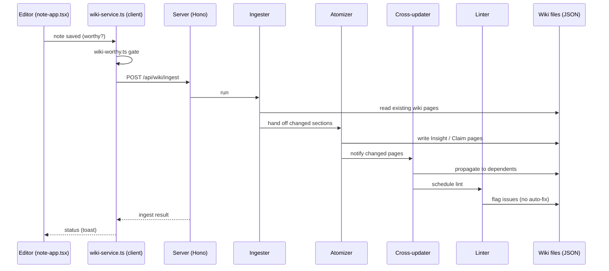
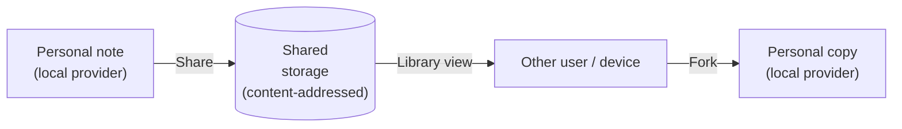

# Graphium — Architecture

This document maps the moving parts: how the editor, the provenance layer,
the AI Knowledge Layer, and the storage layer fit together, and where to
find each of them in the source tree. It is written for contributors and
for anyone who wants to know the shape of the system before reading code.

For the *why*, see [CONCEPT.md](./CONCEPT.md).
For the on-disk file formats, see [DATA_MODEL.md](./DATA_MODEL.md).

---

## 1. At a glance

Graphium is a TypeScript single-page app built on top of
[BlockNote.js](https://www.blocknotejs.org/), shipped as three
distributions that share the same source tree:

- **Web (PWA).** Runs entirely in the browser. Notes live in IndexedDB.
- **Desktop (Tauri v2).** Wraps the web app with a Rust shell so notes
  live as JSON files on the user's filesystem.
- **Self-hosted (Docker).** Runs the same web app plus a Node.js
  companion server that handles AI features (LLM proxy, embedding,
  ingest pipeline).

The companion server (`src/server/`) is built on
[Hono](https://hono.dev/) — a small, web-standard request/response
framework. Hono was chosen over Express because the same app can be
served from `@hono/node-server` (Tauri sidecar / Docker) or, in
principle, from edge runtimes; it is also lighter and better-typed. An
adapter for Vercel Serverless exists in the code (`api/[[...route]].ts`)
but Vercel is not an actively maintained deploy target today.

The server is required for the Knowledge Layer (ingest, embed, chat) and
optional for the editor itself; the editor works without it.

## 2. Layered view

Reading top to bottom: UI talks to feature modules, which read and write
through `src/lib/document-types.ts` and the `StorageProvider` abstraction.
AI features (Knowledge ingest, chat) talk to the Node server. The Node server
talks to LLM and embedding backends.

## 3. The four layers in detail

### 3.1 Editor layer (BlockNote + Graphium blocks)

- BlockNote.js gives Graphium its block model, slash menu, and rich-text
  rendering.
- Custom blocks live under `src/blocks/` (today: `bookmark`,
  `callout`, `example-hello`, `pdf-viewer`). Inline content (entity / agent
  highlights) lives under `src/features/inline-label/`.
- Editor configuration is composed in `src/note-app.tsx`.

### 3.2 Provenance layer (PROV-DM)

Two distinct concerns share the word *provenance* in this codebase. They
are kept separate on purpose:

| Subsystem | Concern | Lives in |
|---|---|---|
| **World provenance** (`prov-generator`) | Provenance of *the things the note describes* — experiments, sources, decisions. Output: a PROV-DM graph. | `src/features/prov-generator/` |
| **Document provenance** (`document-provenance`) | Provenance of *the note itself* — who edited what, when, with which agent (*human* / *ai*). Output: an edit log. | `src/features/document-provenance/` |

If you read code that mentions "provenance," check which of these two is
meant. There is no shared abstraction between them today.

#### Labels feeding the world-provenance graph

Labels come in two passes that operate on the same blocks:

1. **Block-level (`#` context labels).** Tags a heading block as `[Step]`
   (PROV-DM *Activity*; internal key `procedure`) or as a phase
   `[Plan]` / `[Result]` (internal keys `plan` / `result`). A **table
   block** may instead be tagged `[Input]` / `[Tool]` / `[Output]` to mark
   it as a *structured table* (header row = attribute keys, each data row =
   one Entity), or `[Parameter]` to mark it as a *parameter table* (header
   row = keys, first data row = values) whose `key=value` pairs are merged
   into the enclosing Step's `params` (see [DATA_MODEL.md §2.3](./DATA_MODEL.md)).
   Implemented in `src/features/context-label/`.
2. **Inline labels.** Highlights spans inside block text as `[Input]` /
   `[Tool]` / `[Parameter]` / `[Output]` (internal keys `material` /
   `tool` / `attribute` / `output`). The first three feed PROV-DM
   *Entity* nodes (with `material` / `tool` subtypes); `[Parameter]`
   becomes a *Property* on the parent Activity or Entity. Inline labels do
   not apply inside table cells (cells are atomic values — use a
   structured-table block label instead). Implemented in
   `src/features/inline-label/`.

The two passes are independent: a note can have only block-level labels,
only inline labels, both, or neither. The PROV generator merges both
sources when building the graph.

The generator (`src/features/prov-generator/generator.ts`) uses a
`scopeStack` that infers *Activity* containment from heading structure,
so users do not have to nest blocks manually.

Inside a Step (Activity), `[Plan]` / `[Result]` phase headings do **not**
create separate Activities — they only switch a *phase context* over the
inline Entities they contain. Each Entity gets a `graphium:phase`
attribute (`"plan"` or `"execution"`); plan-phase Entities are emitted
as separate nodes with an `_plan` suffix so they coexist with their
execution counterparts. When the same `(label, entityId)` pair appears
in both phases, the generator emits a `prov:wasDerivedFrom` edge from
the execution Entity to the plan Entity, expressing that the actual
outcome was derived from the planned intent. The shared Step Activity
that both Entities are `prov:used` by acts as the implicit activity of
the PROV-DM derivation’s full form.

#### Wiki Knowledge Layer in the PROV-JSON-LD export

Export is a **per-note** action (it lives in the note's overflow menu),
so the bundle is scoped to that note: the note's own content-provenance
graph and edit-log, plus the Wiki Knowledge Layer entities **directly
derived from that note** (the Claims/Summaries whose `derivedFromNotes`
includes the note id, resolved via the always-loaded note index in
`features/prov-export/note-scope.ts`). Cross-note abstractions (Insights
/ Ideas, which derive from Claims across many notes) are intentionally
not pulled into a single note's export — otherwise the same Insight
would appear in every source note's bundle. A whole-workspace
provenance export, if needed, is a separate workspace-level action.

Each in-scope Wiki entity is added as an `Entity` node with a
`prov:wasAttributedTo` edge to the generating AI agent, plus a
`prov:wasDerivedFrom` edge for every recorded upstream source. Three
lineage lanes are emitted as derivations: `derivedFromNotes` (source
notes), `citedKnowledgeIds` (knowledge cited/examined via the Cmd-K
verb intake), and `derivedFromClaims` (the Claims an Insight abstracts —
the *atomize* lane). A Wiki entity with no recorded sources is emitted
with only the attribution edge.

Every node referenced by these relations is also **declared** so the
export contains no dangling references: the AI agent is emitted as a
typed `prov:Agent` node (deduplicated per model), and each source id is
emitted as a typed `Entity` node. Source ids carrying an external-source
prefix (`pdf:` / `url:` / `document:` / `chat:`, see
[`network-graph/external-source.ts`](../src/features/network-graph/external-source.ts))
are resolved to a typed external-source Entity (`@id`
`graphium:<kind>/<key>`, with `graphium:sourceKind`) rather than being
concatenated into a malformed `graphium:note/<prefixed>` reference — so
the export stays consistent with the in-app lineage/graph views.

The document edit-log is attached as a named `prov:Bundle`. The
`@context` inlines the PROV term definitions locally (with the
openprovenance `prov-jsonld` context kept as the authoritative
resolver), so relation typing does not depend solely on a remote fetch.

Each Wiki entity carries the *semantic types* from §3.3 so that external
PROV tools can see the hourglass structure of the knowledge layer.
(Besides the semantic types below, every Wiki entity always carries the
housekeeping attributes `graphium:wikiStatus`, `graphium:generatedAt`,
and `graphium:generatedBy`.)

| Attribute (`graphium:*`) | Meaning | Present when |
|---|---|---|
| `wikiKind` | `summary` / `claim` / `atom` / `synthesis` | always |
| `claimRole` | research-process role(s) of the Claim | `wikiKind = claim` |
| `claimLevel` | abstraction level (`principle` / `finding` / `bridge`) | `wikiKind = claim` |
| `procedureContext` | reproducibility scaffold (parameters, tools, validity range) | `wikiKind = claim` (procedure-bearing Claims only) |
| `atomType` | inferential character of the Insight (causal / mechanistic / observational / …) | `wikiKind = atom` |
| `synthesisMode` | reasoning mode of the Idea (deductive / abductive / analogical / dialectic) | `wikiKind = synthesis` |
| `hypothesisStatus` | verification status (speculative / tested / confirmed / refuted) | `wikiKind = synthesis` |
| `confidence` | self-rated confidence at generation (0.0–1.0) | optional |

This export contract is the closest external observers get to the
hourglass: the source note's PROV graph plus the Wiki entities derived
from it, with semantic types attached so the data is interpretable
without Graphium's internal vocabulary.

#### URL / PDF → PROV ingestion (the *prov-ingester*)

A complementary pipeline runs in the other direction: external papers /
recipes / lab protocols come *in* as a URL or PDF and are turned into a
draft note with PROV labels already on it. The pipeline is intentionally
small.

| Step | File | What it does |
|---|---|---|
| Fetch | `src/server/services/url-fetcher.ts` | Downloads a URL, extracts plain text (HTML / readable subset) |
| Prompt | `src/server/services/prov-ingester.ts` | Single open-set prompt for any procedural domain (cooking / lab / manufacturing / ML / …) — builds the system + user prompt for the LLM |
| Parse | same module | Validates the LLM JSON and strips invalid spans / roles |
| Translate | `src/features/url-to-prov/prov-note-builder.ts` | Lifts the parsed output into a `GraphiumDocument` with labels / inline highlights / `provLinks` already attached |

The prompt asks the LLM to emit *prose with inline-highlighted spans*
(Phase F format, 2026-05): paragraphs whose `content` is a list of spans,
where role-bearing spans (`material` / `tool` / `attribute` / `output`)
get inline highlights and plain narrative spans carry the connectors.
The vocabulary is open — there is no fixed list of allowed parameter
names. The prompt only enforces a few lightweight conventions
(`<key>: <value>` attribute spans, `snake_case` keys, "same concept →
same key inside one document").

When the LLM returns multiple procedures from one source (e.g., a paper
with several composition variants), `plan-execution-builder.ts` splits
the output into a **plan note** that groups them plus N **execution
notes** that each carry the actual PROV graph. The execution notes
back-reference the plan via `partOfPlanNoteId`
([DATA_MODEL.md §2](./DATA_MODEL.md#2-the-note-graphiumdocument)). The
current prompt returns one `ProvIngesterOutput` per call so the builder
typically runs with N = 1; the infrastructure is ready for a future
`procedureGroup` extension that returns multiple outputs at once.

Quality is tracked by a benchmark harness at
`tests/benchmark/material-science/`. It loads `(input.txt, gold.json)`
fixture pairs (gold is in MatPROV PROV-DM JSON-LD format), normalizes
both predicted spans and gold `@graph` items into five comparable sets
(Activities / Materials / Tools / Edges / Parameters), and reports
normalized exact-match precision / recall / F1 plus a token-F1
sub-metric. Parameter keys are normalized through a synonym map
(`temperature` ⇔ `temp` ⇔ `T`, `duration` ⇔ `time` ⇔ …) so open-set
output stays comparable to MatPROV-style canonical keys. The first
runner is the さくら AI engine OpenAI-compatible API. Run with
`pnpm test:benchmark`.

#### PDF → translated note (the *pdf-translator*)

A separate, simpler PDF path produces a **faithful full translation** of a
PDF into the UI display language, keeping the original structure — this is
*not* a summary and *not* the PROV/Knowledge re-structuring above. It is a
straight document translation.

| Step | File | What it does |
|---|---|---|
| Extract text | `src/features/wiki/pdf-text-extractor.ts` (`extractPdfPages`) | Client-side pdfjs extraction, returned **per page** (the unit of translation and figure placement) |
| Extract figures | `src/features/asset-browser/pdf-image-extractor.ts` (`extractEmbeddedPdfImages`) | Pulls embedded raster images grouped by page number, uploaded as media derived from the source PDF |
| Glossary | `POST /api/translate/glossary` | One pass over a text sample extracts key domain terms + target-language translations, so parallel page translations stay consistent |
| Translate | `src/server/services/translate.ts` + `POST /api/translate` | Per-page prompt (glossary injected): reconstruct structure from the flattened text, translate prose into the target language, keep math / code / citations / references verbatim, output Markdown |
| Build | `src/features/pdf-translate/translate-service.ts` | Per page: Markdown → BlockNote blocks (`tryParseMarkdownToBlocks`) followed by that page's figure blocks; assembles a `GraphiumDocument` linked to the source PDF |

Pages are translated **in parallel** (bounded concurrency) and reassembled
in page order; each page's extracted figures are inserted right after its
translated text. The note is saved via the normal
`handleCreateNoteFromDocument` path (recorded as an AI derivation). Known
limits: math-heavy / multi-column papers degrade because pdfjs flattens
their layout; figure placement is page-granular (end of each page, not at
the exact caption); and very long PDFs are truncated at a character cap.

### 3.3 Knowledge layer

The Knowledge layer is a set of editable JSON documents that an LLM keeps
in sync with your notes. Each Knowledge document is a real
`GraphiumDocument` with `source: "ai"` set, so it opens in the same
editor. On disk the documents are still grouped under `data/wiki/` and the
TypeScript types use the historical `Wiki*` prefix (`WikiKind`,
`WikiMeta`) — UI labels and prose use "Knowledge / Claims / Insights /
Ideas" instead.

The pipeline (running on the Node server) has five stages:

| Stage | File | What it does |
|---|---|---|
| **Ingester** | `src/server/services/wiki-ingester.ts` | Reads new / changed notes, decides which Wiki pages to touch |
| **Atomizer** | `src/server/services/wiki-atomizer.ts` | Strips context, produces *Insight* pages with citations back to source notes |
| **Cross-updater** | `src/server/services/wiki-cross-updater.ts` | When one Wiki page changes, propagates to dependent pages |
| **Linter** | `src/server/services/wiki-linter.ts` | Detects orphan Insights, broken citations, redundant Claims |

Trigger flow (client-pushed, not server-polled):

Notes:

- **Trigger:** the client pushes a save event into `wiki-service.ingestNote()`,
  which posts to the server. There is no server-side file watcher.
- **Worthiness gate:** `src/features/wiki/wiki-worthy.ts` decides whether a
  note is ingest-worthy at all (e.g., empty drafts are skipped).
- **Note mode vs document mode.** For a short personal note the ingester emits
  a Summary plus 0-3 Claims (the "1 note ≈ 1 idea" assumption). When the source
  is an **imported external document** — its `noteId` carries a `pdf:` /
  `document:` / `url:` / `chat:` prefix (the external-source convention) — the
  ingester switches to *document mode*: it harvests every distinct transferable
  insight the document argues as its own Claim, with no fixed cap, so a dense
  article is not collapsed into a single headline Claim. The switch is decided
  in `src/server/routes/wiki.ts` and changes only the Claim guidance inside
  `buildIngesterSystemPrompt`.
- **Failure handling:** retries are not centralized today. Each stage
  surfaces its own errors back through the response.
- **Embeddings** (per Wiki section) are stored via
  `src/lib/embedding-store.ts` and used as the retrieval substrate for AI
  chat. The retriever is `src/features/wiki/retriever.ts`.
- **Auto-merge of redundant Claims.** When the linter / startup-merge
  flow detects two Claims that overlap, one is rewritten into the
  other and the absorbed Claim is **archived, not deleted**. Its file
  stays on disk and its index entry gains an `archivedAt` flag, so any
  note that cited it (or any Idea whose `derivedFromNotes` lists
  it) keeps resolving through `loadDoc`. The archived page is hidden
  from lists / search and is editable only after restore. See
  [DATA_MODEL.md §5.2](./DATA_MODEL.md#52-trash-and-archive-semantics)
  for the tri-state semantics.
- **Insights are structural abstractions, not tidied Claims.** A Claim is a
  domain finding; the Insight (Atom) is the *transferable structure* behind it,
  produced by the atomizer (`buildAtomizerSystemPrompt`) in four steps:
  **decompose** the relationship (control → outcome), **classify the shape** from
  a fixed vocabulary (`monotonic-increase` / `monotonic-decrease` /
  `optimal-middle` / `threshold` / `trade-off` / `enabling-condition` /
  `composition-structure` / `other`), **abstract** the roles to their general
  category while keeping the shape, and optionally name a **transfer** (a
  different field where the same shape + role-structure holds). The fixed shape
  vocabulary is the key: the LLM *classifies* into it rather than inventing an
  axis, which is what keeps the abstraction from going vacuous (the failure mode
  of the retired meta-atom layer). A single Claim that instances a real shape is
  enough; the source-Claim count is a support signal, not a gate. The `shape`
  and the verified `transfer` are stored on the Atom's `WikiMeta`.
- **Transfer judge — adversarial verification of the analogy.** The transfer the
  atomizer proposes is a *candidate*. The `/atomize` route runs a skeptical judge
  (`buildTransferJudgeSystemPrompt`) asking whether the example genuinely
  instances the same shape + role-structure or is only topically similar; forced
  ("こじつけ") transfers are dropped while the principle itself is always kept. On
  a 24-Claim check this kept ~88% of transfers and correctly dropped the rest;
  the principle stays valid even when its transfer is discarded.
- **Readability re-lift (Claim → Insight pipeline, stages C+D).** The Atomizer
  reliably *generalizes* (finds the rule) but, asked to also strip jargon in the
  same pass, often leaves raw chemical formulas / acronyms in the wording. After
  generation the `/atomize` route runs a clarity pass (`buildReliftSystemPrompt`,
  domain-general — works for any field, not just materials):
  - **D — pass 1 (always):** an LLM edits *every* Insight to read naturally for a
    non-specialist — removing genuinely obscure terms, but **preferring a brief
    gloss of an established term over stacking several paraphrases** (which is
    what made early rewrites feel forced). It polishes *wording only* — the
    structural abstraction is already done by B. An already-natural Insight is
    returned unchanged.
  - **C — pass 2 (conditional):** `detectRung1Tokens` (code, no LLM) catches any
    chemical formula / acronym D left behind; only those Insights get a second D
    pass. The regex is a cheap residual check, not the primary gate.

  Nothing is silently dropped; a relift failure leaves the original Insight
  intact. Full path: **cluster (A) → decompose→shape→abstract→transfer (B) →
  transfer judge → readability rewrite (D, all) → residual check (C) → fix
  residuals (D)** — each an explicit, nameable step.

**World-model grounding retriever (Phase 2 / PR 2B + 2C).** A separate
lane that scores a knowledge piece against external world knowledge.
**User-triggered by default** (banner button or list-view bulk action),
never on file open; an opt-in setting ("Auto-ground new knowledge",
default OFF) adds a serialized, debounced background sweep that reacts to
new insights (`wikiMetas` changes) and grounds un-checked ones one at a
time (`useAutoGrounding`). PR 2C dropped both domain partitioning and
subject tagging — Graphium is a general-purpose note editor, so a
single KB covers claims from any field (cooking, economics, software,
materials, etc.), and asking the LLM to pick a subject label per entry
hit the same boundary-case problem as domain selection without giving
the retriever or any UI filter something useful to operate on.

Two-layer retrieval:

| Layer | Source | Cost | Updated by |
|---|---|---|---|
| seed KB | `public/grounding-kb/seed.v1.json` (build-bundled, single file) | free | manual curation, PR review |
| cache KB | `appdata` key `grounding-kb-cache` (per-user, single key) | free on hit | LLM-judged results sediment here automatically |
| LLM judge | `POST /api/world-grounding/check` → `groundingModel` (Settings → AI) | one model call | called only on KB miss |

`src/features/world-grounding/index.ts → checkValidity` is the facade:
KB lookup first (cheap), miss → LLM judge → sediment back into the
cache layer if the result passes the sedimentation rules
(`kb-cache.ts → isValidForCaching`: 4-value verdict + non-empty
`generatedByModel` + non-empty `claim` / `keywords`). The next check
on a similar claim is served from the cache layer at no LLM cost.

Source URLs returned by the LLM judge are hallucination-guarded in two
stages (`server/services/world-grounding.ts`): (1) a hostname whitelist
(`sanitizeSourceUrl` — only Wikipedia / DOI / arXiv survive), then (2) a
network existence check (`verifySourceUrl` — Wikipedia REST summary 404 ⇒
no article; arXiv / DOI HEAD). Stage 2 runs only on the LLM-judge path
(never on KB hits), so it adds one fast request next to an already-slow
model call. A URL that fails verification is dropped while its `ref`
text is kept — a missing link is preferred over a fabricated one, so
hallucinated citations never sediment into the cache KB.

The lane is strictly separate from `epistemicStatus` /
`hypothesisStatus` — `attachValidity` never writes those fields. See
[DATA_MODEL.md §3.7](./DATA_MODEL.md) for the contract and
sedimentation rules.

Settings → Grounding KB tab lists the merged seed + cache, filters by
verdict and free-text search, and lets the user delete individual
sedimented entries that the model produced (seed entries are read-only
from the UI; editing them requires changing `seed.v1.json` through a
PR).

**Idea authoring (Cmd-K Composer).** Ideas are produced through the
Cmd-K Composer flow rather than a server-side pipeline. The user
selects the Insights they want to weave, builds a citation note, and
invokes the LLM with that as the search-space constraint. The neck of
the hourglass is human-driven; the server-side pipeline handles only
Notes → Claims → Insights.

The relationship between Notes, Claims, Insights, and Ideas is described
philosophically in [CONCEPT.md §5](./CONCEPT.md#5-the-hourglass-where-portable-knowledge-is-born).

**Epistemic provenance (Phase η).** Every Claim and every Insight carries an
`epistemicStatus` (`speculation` / `interpretation` / `observation` /
`established`, low → high). The Ingester sets the Claim's status from the
note's linguistic surface (hedge markers → `speculation`, measurement language
without mechanism → `observation`, textbook framing → `established`). The
Atomizer then propagates the **lowest** status from a candidate Insight's
source Claims to the Insight itself — a structural rule, not a judgment call,
so a single `speculation` Claim cannot launder itself into an `established`
Insight by sharing a pattern with two `observation` Claims. Together these
rules let the knowledge layer absorb casual musings (the "maybe this is
true" half of a notebook) without contaminating the layers above.

**Toulmin extension (Phase γ).** The Knowledge Layer adds the three Toulmin
(1958) elements that were previously absent: **Rebuttal**, **Backing**, and
**Modal qualifier**.

- **Rebuttal** (`rebuttalConditions[]`) names the boundary conditions under
  which a Claim breaks down ("works except when temperature exceeds the
  decomposition point", "only holds while the user count stays below the
  inflection"). It is extracted at the Claim layer by the Ingester from the
  note's own "ただし〜" / "except when" phrasing, and the Atomizer **only**
  propagates it to the Insight layer when 2+ source Claims share a rebuttal
  on the same axis — a single Claim's boundary stays at the Claim layer.
- **Backing** (`backing[]`) grounds the Warrant (the inferential rule the
  Claim is leaning on) in a textbook principle, external paper, or another
  internal Claim. It stays at the Claim layer only — Insights are
  context-stripped, so the original Claim's Warrant no longer applies.
- **Modal qualifier** (`modalQualifier`) records the user's expressed
  certainty about a Claim (`necessarily` / `probably` / `possibly` /
  `rarely`), distinct from the system's `confidence` score and from
  `epistemicStatus`. Like backing, it is Claim-only — once the Insight
  factors out a recurring pattern, the original speaker's hedging no longer
  attaches.

The schema mirror is on `NoteIndexEntry.{rebuttalConditions, backing,
modalQualifier}` and the on-disk version is now
`INDEX_SCHEMA_VERSION = 16`.

**Empirical quality control.** The Wiki pipeline's discovery quality is
regression-tested by `bench/` (corpus + ground-truth + adversarial probes +
metrics). Each roadmap phase declares which metrics it must improve;
`pnpm bench:compare main` is required on every PR that touches the
ingester / atomizer / cross-updater / linter. See the README's "Knowledge
Layer benchmark" section and `docs/internal/benchmark.md` for the metric
definitions, corpus rationale, and merge rules.

### 3.4 Storage layer

A single interface (`src/lib/storage/types.ts`) abstracts where notes
live. Three providers ship today:

| Provider | Where notes live | Used in |
|---|---|---|
| **`local`** | Browser IndexedDB | Web (PWA) |
| **`filesystem`** | OPFS (browser) or native FS via Tauri | Desktop |
| **`server-fs`** | Filesystem on the Node server | Self-hosted (Docker) |

The provider is selected at runtime by `src/lib/storage/registry.ts` and
exposed via the `useStorage()` React hook.

A separate **shared storage** subsystem (`src/lib/storage/shared/`)
handles content addressed by hash for the Library / Fork features
(see §5).

## 4. Distribution targets

The same `src/` tree is built three different ways.

### 4.1 Web (PWA)

- Entry: `index.html` → `src/main.tsx`
- Storage: `local` provider (IndexedDB)
- AI features: optional, point at any reachable server URL
- Hosting: GitHub Pages today, Docker self-host for richer setups

### 4.2 Desktop (Tauri v2)

- Entry: `src-tauri/src/lib.rs` boots a webview that loads the same `src/`
  bundle
- Storage: `filesystem` provider, default path `~/Documents/Graphium/`
- Tauri commands (`list_note_files`, etc.) are defined in `lib.rs` and
  matched by TypeScript wrappers
- AI / Knowledge features run inside the app via a Node sidecar:
  `scripts/fetch-node.mjs` downloads Node 22 and renames it to
  `binaries/graphium-server-<triple>[.exe]` so Tauri can spawn it as a
  sidecar. `src/lib/sidecar.ts` resolves `sidecar/server.mjs` via
  `resolveResource()` and passes it as the first argument.
- LLM API keys are stored in the macOS Keychain (service
  `com.graphium.app`, account `<model-id>`) rather than on disk. The
  sidecar is started with `GRAPHIUM_USE_KEYCHAIN=1` on macOS, and the
  first read of an existing `models.json` migrates any plaintext
  `apiKey` field into the Keychain and rewrites the file without it.
  On non-Tauri deployments (Docker / dev), keys continue to live in
  `data/models.json` as before.
- Sidecar stdout/stderr is appended to `~/Library/Logs/Graphium/sidecar.log`
  on macOS (`<data_local_dir>/com.graphium.app/logs/sidecar.log` on other
  platforms). The file is rotated to `sidecar.log.1` once it exceeds
  5 MB, so old entries do not grow without bound.
- The sidecar carries an identity so a stale process is never reused. The
  app injects `GRAPHIUM_APP_VERSION` (its own build version) and
  `GRAPHIUM_PARENT_PID` (the app process id) when it spawns the sidecar, and
  `/api/health` echoes `version`, `pid` and `dataDir`. On startup
  `src/lib/sidecar.ts` reuses an already-running sidecar only when both
  `dataDir` and `version` match; a foreign `dataDir` (a stale worktree) or a
  mismatched `version` (a sidecar left over from before an auto-update) is
  sent `SIGTERM` and replaced. The sidecar additionally runs a watchdog that
  exits as soon as `GRAPHIUM_PARENT_PID` is gone, so it can never outlive the
  app and orphan port 3001 — an orphan would otherwise let a newer app reuse
  old code and return 404 for routes added after that build.
- Shipped targets: macOS Apple Silicon (`aarch64-apple-darwin`) and
  Windows x64 (`x86_64-pc-windows-msvc`). Other targets are unverified.

### 4.3 Self-hosted (Docker)

- Entry: `docker-compose.yml` (or `docker-compose.standalone.yml` for the
  editor-only flavor)
- Server: `src/server/index.ts`, a Hono app on `@hono/node-server`
- Storage: `server-fs` provider; notes live on the host filesystem
- AI: ships with LLM and embedding endpoints wired up

## 5. Sharing and Library

Graphium has an opt-in sharing model that does **not** require a central
service. It is built on top of a content-addressed shared storage layer.

Key pieces:

- **`src/features/sharing/`** — Library view, Share / Unshare actions, Fork
- **`src/lib/storage/shared/`** — content-addressed blob layer (hashing in
  `hash.ts`, ID assignment in `id.ts`, local-folder backend in
  `local-folder.ts`)
- **Blob materialization** — when sharing a note that embeds media, the
  media is uploaded as `shared-blob:` references; on Fork, those blobs are
  re-materialized into the personal copy

Today the shared backend is a local folder. Other backends (cloud
buckets, S3, IPFS-style) can be added by implementing the same blob
interface.

## 6. The Node server (when present)

The server is built on [Hono](https://hono.dev/) and is intentionally
thin. It does four jobs:

1. **Run the Wiki pipeline** (`src/server/services/wiki-*`).
2. **Proxy LLM and embedding calls** so API keys never reach the browser.
   See `src/server/services/llm.ts`, `embedding.ts`.
3. **Expose REST endpoints** under `src/server/routes/` (`agent`, `wiki`,
   `prov`, `tools`, `models`, `profiles`, `storage`, `usage`, `health`).
4. **Record AI usage** for every LLM / embedding call so users can see
   per-feature token consumption and estimated cost. The recording layer
   is `src/server/services/llm-usage.ts`. Every call goes through either
   `runAgentLoop()` (which tags the event with a `feature` identifier
   like `"wiki.ingest"` or `"agent.chat"`) or `generateEmbeddings()`
   (feature `"embedding"`). The raw event log lives at
   `data/ai-usage-log.json`; events older than 90 days are folded into a
   monthly summary at `data/ai-usage-summary.json` on server start. The
   dashboard at Settings → Usage reads from `GET /api/usage`.

   Per-model pricing (`USD / 1M tokens`) is stored as `rate` on each
   registered model (`ModelConfig.rate` in `src/server/config/models.ts`).
   The rate at call time is snapshotted into the event so historical
   costs stay consistent when prices change. If a price was entered
   incorrectly, `POST /api/usage/recalculate` rewrites the last 90 days
   of raw events with the current per-model `rate`. Each event is matched
   to a registered model first by `modelConfigId`, then by
   `provider`+`modelId` (header-injected calls record a placeholder
   `modelConfigId`, so model name is the reliable key). Events with no
   matching priced model are left untouched, and the monthly summary is
   not affected. The Usage tab exposes this as a "Recalculate cost"
   button.

When running as PWA only, all of this is absent and the editor still
works.

### 6.1 Authentication and trust model (current state)

Today the server's trust model is **deliberately minimal**. The expected
deployment is one of:

- The Tauri sidecar — server talks only to `tauri://localhost` origins
  (CORS-enforced) and lives in the user's process tree.
- A self-hosted Docker behind the user's own boundary (VPN, LAN, or
  reverse proxy).

Tokens you may see in headers (`X-Graphium-Token`, `X-LLM-API-Key`,
`X-MCP-Servers`, `X-Registry-URL`/`X-Registry-Key`) are passthrough to
upstream LLM / MCP / Registry APIs, not authentication for the Graphium
server itself. `X-MCP-Servers` carries the user's directly-registered MCP servers; the
`agent` route resolves each into a connection. Two transports:

- **stdio (local)** — the server spawns the configured `command`/`args`
  as a child process and speaks MCP over its stdio, the same model as
  Claude Desktop. Only works where the backend can spawn processes
  (Tauri sidecar, Docker, dev) — not in a pure browser.
- **remote (HTTP/SSE)** — connects to an already-running server by URL,
  with an optional per-server bearer token.

Crucible is a **discovery source, not a connection**. The settings UI
calls `/api/tools` (with `X-Registry-URL`/`X-Registry-Key`) to list a
registry's MCP servers — each carrying a resolved `mcp_url`/`transport`
— and the user picks individual servers, which are stored as ordinary
remote entries with concrete URLs. The registry URL is remembered in
`savedRegistries` for re-browsing only; it is never auto-connected. The
legacy client `registryUrl` migrates into `savedRegistries` on load. One
exception stays server-side: an env default (`CRUCIBLE_API_URL`) is still
auto-expanded by the `agent` route via `fetchRegistryServers()` so a
self-hosted/Docker deployment gets its registry tools (and skills) with
zero per-user setup.

Clients are kept in a per-`id` connection pool and reused across
requests; editing a server's config re-signs the entry and transparently
reconnects. **Security note:** stdio servers run arbitrary local commands
the user configured — the same trust model as Claude Desktop. On a
self-hosted/Docker backend, anyone who can reach the API and set
`X-MCP-Servers` can run commands inside that backend; keep it behind the
user's own boundary. There is no built-in user
auth, multi-tenant isolation, or audit log on the server today.

Operators exposing the server to the public internet should put it
behind their own auth proxy. A first-class auth model is on the roadmap
once team-shared storage stabilizes.

## 7. Build and runtime stack

| Concern | Choice |
|---|---|
| Bundler | Vite 6 (`vite.config.ts`) |
| Type checking | TypeScript via `tsc --noEmit` |
| Tests | Vitest (`pnpm vitest run`) |
| Component dev | Storybook (port 6006) |
| Package manager | pnpm (npm/yarn are not used) |
| State management | React Context + feature-local stores; no global state library |
| Server runtime | Node ≥ 20 via `@hono/node-server` |
| Native shell | Tauri v2 (Rust) for desktop |

## 8. Source map

Where to look first when you want to change X. This is a **curated map of
the high-traffic areas**, not an exhaustive listing — `src/features/`
holds many more directories than appear here. For the complete picture,
just `ls src/features/` and `ls src/lib/`. The table below covers what
people most often need to find.

| Want to change | Look in |
|---|---|
| Block types or editor behavior | `src/blocks/`, `src/note-app.tsx` |
| Slash menu / inline `@`-link / `#`-label UI | `src/features/block-link/`, `src/features/context-label/`, `src/features/inline-label/` |
| PROV-DM graph generation | `src/features/prov-generator/` |
| Per-note edit history | `src/features/document-provenance/` |
| AI chat & note derivation | `src/features/ai-assistant/` |
| ⌘K palette (note search + ask) | `src/features/composer/` |
| ⌘F in-document find (highlight matches) | `src/features/document-search/` |
| Knowledge UI and service | `src/features/wiki/` |
| Knowledge pipeline (ingest / atomize / synthesize) | `src/server/services/wiki-*.ts` |
| Inter-note network graph (Cytoscape) | `src/features/network-graph/` |
| Storage provider | `src/lib/storage/providers/`, `src/lib/storage/registry.ts` |
| Note JSON shape and migrations | `src/lib/document-types.ts`, `src/lib/document-migration.ts` |
| Index file (note list, schema version) | `src/features/navigation/index-file.ts` |
| Sharing / Library / Fork | `src/features/sharing/`, `src/lib/storage/shared/` |
| Settings UI (model, profile, fonts) | `src/features/settings/` |
| Slash-template commands (Plan / Run) | `src/features/template/` |
| Skill (prompt template) documents | `src/features/skill/` |
| Reference table (related notes) | `src/features/index-table/` |
| Export (PROV-JSON-LD, PDF, DOCX import) | `src/features/prov-export/`, `src/features/pdf-export/`, `src/features/docx-import/` |
| Onboarding flow | `src/features/onboarding/` |
| URL-to-PROV / PDF-to-PROV ingestion | `src/features/url-to-prov/`, `src/server/services/prov-ingester.ts` |
| Material-science benchmark harness | `tests/benchmark/material-science/` |
| Release notes UI | `src/features/release-notes/` |
| Tauri integration | `src-tauri/src/lib.rs`, `src/lib/menu-events.ts` |
| Landing page | `src/landing/` |

## 9. Compatibility and migrations

Graphium is OSS and shipped to real users, so a few invariants are
treated as load-bearing.

- **Note JSON (`GraphiumDocument`).** New fields go in as `optional`. Renames
  and removals require a migration in `src/lib/document-migration.ts`,
  applied at load time.
- **Index file.** `INDEX_SCHEMA_VERSION` in
  `src/features/navigation/index-file.ts` must be bumped on any
  `NoteIndexEntry` / `GraphiumIndex` shape change. The index is rebuilt
  on version mismatch.
- **Storage providers.** Changes to the `StorageProvider` interface
  (`src/lib/storage/types.ts`) require updates in all three providers
  (`local`, `filesystem`, `server-fs`). Optional methods are preferred
  for additive changes.
- **IndexedDB stores.** Schema changes require bumping the DB version
  and writing a `onupgradeneeded` migration in `local.ts`.
- **Tauri commands.** Commands added or renamed in `src-tauri/src/lib.rs`
  must be matched in TypeScript callers; the desktop and web builds share
  the same TS code.

The detailed expectations are written into the project's `CLAUDE.md`
"破壊的変更チェック" section. The data shapes themselves are documented
in [DATA_MODEL.md](./DATA_MODEL.md).

## 10. Known seams (technical debt I am tracking)

Areas where the current architecture works but has visible seams. Listed
so contributors do not mistake these for finished design.

- **Two "provenance" subsystems with no shared abstraction.** See §3.2.
  `prov-generator` (world model) and `document-provenance` (edit log)
  share a name and a directory neighborhood but no common interface. A
  third "provenance" concept (e.g. Wiki ingest provenance) would make
  this worse. A unifying domain layer is on the roadmap.
- **Wiki pipeline lacks an explicit orchestrator.** See §3.3. The five
  stages are independent services that read and write Wiki files
  directly. There is no event bus, no queue, and no centralized retry
  policy. This is fine at single-user scale but will need an orchestrator
  before adding more stages or supporting larger workloads.
- **Personal storage and shared storage are two separate abstractions.**
  `StorageProvider` (notes) and the content-addressed blob layer (`shared/`)
  have different shapes. Mostly intentional, but it means every feature
  that crosses the boundary (Share, Fork, materialize) has to bridge
  them by hand.
- **Tauri command signatures and TypeScript callers are synced manually.**
  No codegen between `src-tauri/src/lib.rs` and the TS wrappers. Mismatches
  surface only at runtime in the desktop build.
- **No first-class auth on the server.** See §6.1. Acceptable for the
  current deployment shapes (Tauri sidecar, self-hosted behind a proxy)
  but a known gap if the server is ever exposed publicly.

---

## See also

- [CONCEPT.md](./CONCEPT.md): the design philosophy
- [DATA_MODEL.md](./DATA_MODEL.md): on-disk file formats and schemas
- [README](../README.md): install and run
