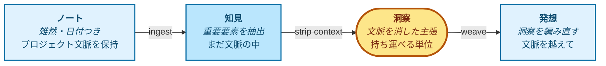

# Graphium（コンセプト）

> **情報を、いつでも再利用可能な「知識」へと変えるノートエディタ。**

このドキュメントは、Graphium がなぜ存在するのか、そして何を考えて作られているのかを説明します。エディタ、ラベル、AI 知識層の背景にある設計思想が中心です。実装の詳細は [ARCHITECTURE.md](./ARCHITECTURE.md) と [DATA_MODEL.md](./DATA_MODEL.md) を参照してください。

> *Last synced with [CONCEPT.md](./CONCEPT.md): 2026-07-06*

---

## 1. 約束したいこと

ほとんどのツールは、情報を「書く」ことを助けてくれます。Graphium は、あなた（そしてあなたが信頼する AI）が数ヶ月後・数年後にも使える形で、情報を「保つ」ために作っています。

私がこのプロダクトに守らせたい一行は、これです。

> **情報を、いつでも再利用可能な「知識」へと変えるノートエディタ。**

このドキュメントにあるすべて（ラベル、ナレッジ層、ファイル形式）は、この一行を実現するための手段です。

## 2. なぜ作っているのか

思考を進める仕事において、ノートを取ること自体は「安い」作業になりがちです。一方で本当に「**高くつく**」のは、数ヶ月後・数年後に自分のページを読み返したときに、こう問われて答えられない瞬間です。

- その数字は、自分が測ったものか、それとも仮定したものか？
- その段落は、自分の言葉か、それとも疲れた午後に LLM が手渡してくれたものか？
- このアイデアに、自分はどんな道のりで辿り着いたのか？

研究者、デザイナー、起業家、書き手、エンジニア、学生など、**試行錯誤を重ねて何かを発見しようとするすべての人** が、同じ壁にぶつかります。安く済んだ記録は積み上がり続ける一方で、**答えを取り戻すコスト** は時間とともに膨らんでいくのです。

私自身、この問いにしっくり答えてくれるツールに出会えていませんでした。試した範囲ではどれも自分の使い方とは噛み合わず、自分の手で組み立てるしかないと感じました。

そのときに **最初に置きたいと考えた一手** が、「来歴（provenance）」です。来歴は、後から付け足すような機能ではありません。エディタがテキストを保存するときの「**背骨**」に組み込む必要があります。だからこそ、背骨に W3C [PROV-DM](https://www.w3.org/TR/prov-dm/) を据え、AI 機能にも同じ来歴の道を辿ることを義務づけたエディタを作り始めました。

これは Graphium で **最初に手をつけた軸** であり、§3 で説明する「三つの柱」の一本でもあります。

## 3. 三つの柱

Graphium は、3 つの軸の上に立っています。これらは個別のツールとしては存在しますが、一つのツールに同居している例を、私はあまり見たことがありません。

| 柱 | 意味すること |
|---|---|
| **標準としての来歴** | ブロックレベルのラベル（`[ステップ]` / `[計画]` / `[結果]`）は PROV-DM の *Activity* に、インラインハイライト（`[インプット]` / `[ツール]` / `[パラメータ]` / `[アウトプット]`）は *Entity* と *Property* に対応します。*Agent*（書き手）は編集メタデータから合流します。結果として、ノートが単なる検索インデックスではなく、機械が検証可能な「グラフ」を形成するのです |
| **AI が育てるナレッジ層** | ノートを取り込み、編集可能な「ナレッジ層」（*知見*・*洞察*・*発想*）を組み立てます。今後の AI との対話はこの層を文脈として読むため、AI の主張は学習データではなく、**あなたのノート** を引用します |
| **「考え途中」のためのブロックエディタ** | [BlockNote.js](https://www.blocknotejs.org/) ベースのエディタを、最初は散らかった状態で書き、後から構造化することを前提に調整しています。自由な記述、`@` リンク、準備ができたときの `#` ラベル付与を、自然な流れで行えます |

> これらの柱の上に乗る便利機能（モバイル収集、同期、チーム共有など）はロードマップ上にあり、現在は停止または一部実装の状態です。本ドキュメントが扱うのは、安定している「基盤」のほうです。

## 4. 二つの脳

考えながら生きている人の中には、二つの脳が共存しています。

一つは、頭の中にある「**ワーキング・ブレイン（活動する脳）**」です。雑然としていて、日付に縛られ、半端な思考や脇道の会話で満ちています。多くのノートツールは、この脳を捉えるところまでは比較的うまくやれます。これは簡単な部分なのです。

もう一つは、「**クリスタライズド・ブレイン（結晶化した脳）**」です。蒸留され、一般化され、持ち運び可能になったもの。教科書が手渡してくれる脳であり、ベテランの同僚が十年かけて築いてきた脳でもあります。プロジェクトをまたぐとき、新しい共同作業に入るとき、AI と話すとき。本当に **備えておきたい** のは、こちらの脳なのです。

多くのノートツールは「活動する脳」を保存しながら、それが「結晶化した脳」であるかのように振る舞います。Graphium は、この二つを別の層として保ち、意図的に橋を架けます。

- **Notes** = 活動する脳。原材料。
- **ナレッジ層**（および将来的な Knowledge Pack 出力）= 結晶化した脳。再利用可能。

このプロダクトの要点は、二つの脳のあいだに「**橋**」を架けることです。そして、その橋がどちら側からも辿れる（誰がいつ、どのノートからこの知識を引き出したのか追える）状態を保つことです。

### AI がどちらの脳で考えるかを選ぶ

二つの脳という区分は、保存のしかたの話にとどまりません。AI と話すたびに、あなたが選ぶものでもあります。Graphium の AI との会話には、入力欄の隣に「**渡す範囲**」という 3 段階の小さな切り替えが付いています。

| 範囲 | AI が読むもの | 使いどころ |
|---|---|---|
| **外部参照** | 内部参照が読むものすべてに加えて、Web をその場で検索した結果。検索結果に実際に現れた出典だけを引くよう指示されます | 新しいことを調べるとき |
| **内部参照**（既定） | `@` で引用したものに加えて、蓄積したものの横断検索（結晶化した脳（ナレッジ層）を先に、質問と語が重なる自分のノート本文・素材の短い断片も） | 手持ちの知識をつなぎ、構成を練るとき |
| **ノート内参照** | そのノートで引用したものだけ。AI 由来の要約より原文を優先します | 正確に書き、忠実に引用するとき |

この設計を支えている細部が二つあります。まず「内部参照」の横断検索は、結晶化した層を先に読みます。それに加えて、生のノートや素材（画像の OCR、URL の抜粋、PDF の本文）からも短い断片をいくつか拾います。ただし拾うのは、質問と語が重なる断片だけです（この端末の中に作る語彙の索引で探すので、埋め込みモデルは要りません）。そして AI には「これは結晶化した知見ではなく生の材料だ」と分かる形で渡します。ノートを丸ごと会話に入れる方法は今までどおりで、`@` で引用したときです。そして「ノート内参照」は、AI 由来の層を意図的に **外します**。引用や数値が、要約ではなく原文から来るようにするためです。多くの AI ツールは文脈を「多いほど良い」量として扱いますが、ここでは範囲を絞ることこそが目的です。**AI がどちらの脳で考えるか** を、あなたが指定するのです。

この表には、意図的な非対称が一つあります。範囲が決めるのは AI が「読むもの」までで、「**発想する**」ことを自動化する範囲はありません。発想のとき私が選ぶのは内部参照で、材料はそこから手渡されます。それでも、洞察を編んで発想にする工程は人間の手に残すと決めているのです（§5）。

## 5. 砂時計（持ち運び可能な知識が生まれる場所）

Graphium における知識は、横に倒した「砂時計」のような形をしています。流れは **ノート → 知見 → 洞察 → 発想**。それぞれの段階で、単位は元のプロジェクトの文脈をだんだん落としていきます。洞察がそのくびれです。文脈がゼロになり、主張が「持ち運べる」かたちに変わる場所なのです。

砂時計のメタファーは、生のノートから持ち運べる知識が**組み上がる**過程を描いています。これは中央の構造であって、システム全体ではありません。Graphium の他のしくみ — 来歴のエクスポート、世界知識との照合、関連ページの更新、整合性のリント — はこのコアの周りで、それぞれ別の仕事をしています。これらは砂時計の出力を読みますが、その形は変えません。

砂時計の上で人間と AI の役割分担は意図的に非対称です。**ノート → 知見 → 洞察** までは自動（Ingester + Atomizer）。**洞察 → 発想** は人間主導の **Cmd-K Composer** フローで作ります — 編みたい洞察を選択 → 引用ノートを作成 → その文脈で LLM に問う。砂時計の「くびれ」は、ユーザーの意図が結晶化する場所であり、それは人間が担うべき仕事です。

> 黄色い **洞察** が砂時計のくびれです。青い箱（ノート / 知見 / 発想）は文脈を運びますが、洞察は運びません。

- **ノート** は文脈ごと運ばれます。日付、失敗、脇道の会話、なぜ火曜の午後にそれをやったのか、まで。
- **知見** ページは、文脈を維持したまま重要な要素を抽出します。プロジェクトの一部として人間が読める状態です。
- **洞察** は砂時計の「くびれ」です。各洞察は、それを正当化するノートへの引用が付いた、一つの「文脈に依存しない主張」です。これが、文脈をまたいで **持ち運べる**（= 他のプロジェクト・人・AI のもとで再利用される）単位になります。
- **発想** は、プロジェクトを跨いで洞察を編み、再利用可能な形にします。未来のあなた、または未来の AI が、文脈を知らずに手に取れる形です。

この狭い「くびれ」こそが要点なのです。これがないと、片側にプライベートなノートがあり、もう片側に汎用 LLM があるだけで、両者のあいだで知識を移す術がありません。洞察こそが、情報を「再利用可能な知識」へと変えるのです。

### 層を貫く認識論的来歴

砂時計には、それぞれの欠片がどれだけ確かなのかについて嘘をつかないという役目もあります。すべての知見は *認識論的ステータス（epistemic status）* を持ちます — 何気ない思いつきには `speculation`、観察データへの暫定的な読み取りには `interpretation`、「これは実測値である」には `observation`、複数のソースで裏付けられたものには `established`。洞察が知見を横断して抽象化されるとき、洞察はソースのなかで **最も低い** ステータスを継承します（平均ではありません）。発想が洞察を編み合わせるとき、`speculation` を含む洞察に基づく発想は、どれだけ自信ありげに書かれていても `speculative` としてマークされます。

このルールは意図的に非対称です。ノートに走り書きされた「もしかしてこうかもしれない」が、抽象的な洞察を経由して、共有された知識の層に紛れ込むようなことはあってはいけません。代償はときに「結果的には確立されていたものを過小評価する」ことになります — ですが、この代償は取り戻せて、書いた本人があとから評価を直せます。逆方向の代償 — ソースの含みを失った推測が、知識層を静かに汚染する — は取り戻せません。

この非対称性はコードのうえでも具体的です。**構造として強制されている区別は、`speculation` とそれ以外との間** にあります。ソースが `interpretation` 以上であれば、層はそれらを同じように扱います — 4 段階のはしごはラベルとして伝わっていきますが、下流の挙動を変える分岐は「`speculation` が含まれているか」だけです。それ以外の区別は、ページを読む人間のために残されていて、生成器自身の判断には使われていません。

### 砂時計を Zettelkasten として読む

[Zettelkasten](https://ja.wikipedia.org/wiki/%E3%83%84%E3%82%A7%E3%83%83%E3%83%86%E3%83%AB%E3%82%AB%E3%82%B9%E3%83%86%E3%83%B3) を実践している方には、この砂時計は見覚えのある形のはずです。それは偶然ではありません。私が組み上げようとしている対応関係は、こうです。

| Zettelkasten | Graphium |
|---|---|
| Fleeting notes（走り書き） | メモ。すばやく捕まえて、原材料として残すもの |
| Literature notes（文献ノート） | ソースについてのノート。素材として取り込んだ URL・PDF・論文 |
| （対応なし） | プロジェクトのノート。自分の試行錯誤の記録。紙の運用では中心になかった入力です |
| Permanent notes（永久ノート） | 洞察。1 ページに 1 つの「文脈に依存しない主張」と、それを裏づけるノートへの引用 |
| Structure notes（構造ノート、[LYT](https://notes.linkingyourthinking.com/Cards/MOCs+%28defn%29) の MOC） | Cmd-K Composer で編む引用ノート。選び抜いた洞察の「地図」 |

この表には、紙の上では起こり得なかったことが二つあります。

一つ目。Zettelkasten の実践が静かに挫折しがちな工程、つまり原材料を permanent notes に変える工程が、支援されています。AI が知見と洞察を「候補」として差し出し、残すかどうかはあなたが決めます。この委任を誠実に保つ仕組みは、既定で二つ働きます。すべての候補がソースまでの PROV-DM 来歴を持つこと、そして推測を紛れ込ませない認識論的ステータス（前節）です。三つ目は、望んだときに使えます。どの候補にも実行できる「世界照合」が、その主張と既知の知識との位置づけ（確立した知識と整合・支持されている・裏付けが弱い・反例がある）をラベルにするのです。照合先に見つからなければ「マッチなし」と示すだけで、新しさの証明はしません。

二つ目。「地図」が実行可能になりました。Zettelkasten の伝統では、構造ノートは人間が読むためのものです。ここでは、Composer で編む引用ノートがそのまま AI の探索空間になります。地図を描くことと、AI の視野を絞ることが、同じ一つの動作なのです（§4）。

真剣に受け止めている反論があります。古典的な方法では、permanent notes を自分の言葉で書き直すことこそが思考であり、下書きを委ねればそれが空洞化しかねない、というものです。私はこれを解決できたとは考えていません（§8 の仮説の一つです）。確信があるのは、もう半分のほうです。洞察を編んで発想にする工程を人間に残したのは、一度自動化を試し、その結果を見て、引き戻したからなのです。

## 6. 段階的な開示（必要な分だけ使う）

私が何度も立ち戻る設計判断があります。それは「**ラベル付けは任意である**」ということです。しかも、ラベル付けは独立した二つの層から成ります。

| レベル | 行うこと | 得られるもの |
|---|---|---|
| **ノートのみ** | `@` リンクで書いてつなぐ | ファイルシステム上のリンクされたノート群 |
| **ブロックレベルの構造** | 見出しブロックに `[ステップ]`（または Phase の `[計画]` / `[結果]`）を付ける | 来歴グラフの骨格。何が、どの順で起きたか |
| **インラインの詳細** | ブロック内のテキスト範囲を `[インプット]` / `[ツール]` / `[パラメータ]` / `[アウトプット]` でハイライト | 完全な来歴グラフ。何を使い、どんな条件で、何ができたか |

ブロックレベル層 (`#`) とインライン層は、独立に採用できます。ラベルなしで書き始め、後から `#` だけ付け、必要な箇所にだけインラインの詳細を載せる、という使い方ができます。**全か無かではないのです**。

ラベル付けを強制したくなる誘惑に、私は抗います。この「グラデーション」こそが設計です。多くの人は、重要な実験や決定にはマークを付け、日常の書き物は放っておく、という中間層で過ごすことになるでしょう。それで構わないのです。

ナレッジ層にも同じグラデーションが当てはまります。無視することも、ときどき眺めることも、積極的にキュレーションすることも可能で、それぞれの関与の度合いに応じた価値が返ってきます。

## 7. Graphium が「ではない」もの

何で「ある」かを語るために、何で「ない」かも明確にしておきます。

- **汎用 LLM の競合ではない。** モデルを訓練したりホストしたりはしません。あらゆる LLM を、*あなたにとって* 有用にする「基盤」を作っています。
- **クラウドファーストの SaaS ではない。** ローカルファイルが優先です。同期（Google Drive / iCloud / Dropbox の同期フォルダ等）はユーザーの選択であり、必須ではありません。
- **グラフデータベースではない。** 来歴は、書くことの「副産物」として立ち上がるものであり、手で埋めるスキーマではありません。
- **クローズドな形式ではない。** ノートもナレッジ層も JSON 形式です。私を介さずに読み・差分を取り・grep し・バックアップできます。
- **完成された製品ではない。** 共有・パッケージ化・モバイルなど、いくつかの柱はまだ部分的または停止中です。一度にすべてを約束するよりも、安定した「背骨」を出してそこから育てる道を選びました。

## 8. スタンス（姿勢）

このようなプロジェクトは「長い賭け」です。私はその賭けの中身を、率直にしておきたいと思っています。

- 今後数年で、ノートの価値は「**AI にとっての読みやすさ**」に大きく寄っていく、と私は予想しています。来歴は、ノートが **AI から読まれるときの「誠実さ」** を保つための仕組みです。自分のノートが、出どころを辿れない、もっともらしい文章で埋め尽くされていく事態を防ぐ手段でもあります。
- Graphium は、より大きな構想（**特定のツールに縛られない「知識基盤」**）のための「**スカウト（先遣隊）**」だと考えています。Graphium はあり得る実装の一つに過ぎず、その謙虚さを設計に残しておきたいと思っています。
- 数年つき合えるものを作りたいと思っています。今四半期に出しやすいものを作るつもりはありません。間違いに気づいたら、その都度認めるつもりです。
- いちばん自信を持てていない仮説も書いておきます。知見や洞察の「抽出」を AI に委ねても、手で書き直すことが強いてくれていた思考は空洞化しない、という仮説です。そうなるように設計はしています（結論ではなく候補を出す、受け入れではなくキュレーションする）。それでも私はこれを検証中の仮説として扱っていて、来歴の層は、仮説が崩れたときに気づけるようにするためのものでもあるのです。

これは個人で開発しているオープンソース・プロジェクトです。Pull Request、Issue、反対意見をお待ちしています。

これが、私が守ろうとしている一線なのです。このリポジトリにあるすべては、その下流にあります。

---

## 次に読むもの

- [ARCHITECTURE.md](./ARCHITECTURE.md): レイヤー、コンポーネント、配布形態
- [DATA_MODEL.md](./DATA_MODEL.md): ファイル形式、スキーマ、互換性ルール
- [README](../README.md): インストールと起動
