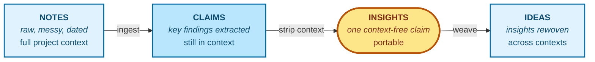

# Graphium — Concept

> **A note editor that turns information into knowledge you can reuse, anytime.**

This document explains *why* Graphium exists and *how it thinks* — the design
philosophy behind the editor, the labels, and the AI knowledge layer. For
implementation details see [ARCHITECTURE.md](./ARCHITECTURE.md) and
[DATA_MODEL.md](./DATA_MODEL.md).

---

## 1. The promise

Most tools help you *write* information. Graphium is built to help you *keep*
it — in a form you, and any AI you trust, can still use months and years
later.

The line I want the product to live up to:

> **A note editor that turns information into knowledge you can reuse, anytime.**

Everything in this document — the labels, the Knowledge layer, the file formats — is in
service of that one line.

## 2. Why I built it

Notes tend to be the cheap part of any thinking work. The expensive part
is what happens months or years later, when you re-read your own page and
cannot tell:

- Was that number something you measured, or something you assumed?
- Was that paragraph yours, or did an LLM hand it to you on a tired afternoon?
- How did I arrive at this idea in the first place?

Researchers, designers, founders, writers, engineers, students — anyone whose
work is **trial and error toward a discovery** — runs into the same wall. The
cheap part keeps piling up; the expensive part rots.

I never found a tool that fit the way I wanted to keep notes. The ones I
tried were good at their own jobs, just not at mine, so eventually I
decided to build my own.

The first move I wanted to commit to was **provenance**. Provenance is not
a feature you can bolt on later. It has to live in the spine of how the
editor stores text. So I started by giving Graphium a spine of W3C
[PROV-DM](https://www.w3.org/TR/prov-dm/) and obligating its AI features
to travel the same trail.

This is the first axis I committed to, and it is also one of the three
pillars described in §3.

## 3. Three pillars

Graphium sits on three axes that, separately, exist elsewhere — but I have
not seen them together in one tool.

| Pillar | What it means |
|---|---|
| **Provenance, by standard** | Block-level labels (`[Step]`, `[Plan]`, `[Result]`) map to PROV-DM *Activities*; inline highlights (`[Input]`, `[Tool]`, `[Parameter]`, `[Output]`) map to *Entities* and *Properties*; *Agents* come in from authorship metadata. The result is a graph a machine can verify, not just a search index. |
| **A wiki the AI keeps for you** | Graphium ingests your notes into an editable Knowledge layer — *Claims*, *Insights*, *Ideas*. Future AI conversations read from this layer, so their claims cite your notes, not their training data. |
| **A block editor for thinking-in-progress** | A [BlockNote.js](https://www.blocknotejs.org/)-based editor tuned for messy-now, structured-later: free writing, `@`-linking between notes, `#`-labeling when you are ready. |

> Surface conveniences that sit on top of these pillars (mobile capture, sync,
> team sharing) are on the roadmap and are paused or partial today. This
> document describes the substrate, which is stable.

## 4. The two brains

Two brains live inside any thinking life.

The one in your head is **working** — messy, dated, full of half-finished
thoughts and side conversations. Most notes capture this brain reasonably
well; that is the easy part.

The other brain is **crystallized** — distilled, generalized, portable. It is
the brain a textbook hands you, or the brain a senior colleague has built
over a decade. It is what you actually want to *carry* between projects, into
new collaborations, and into conversations with an AI.

Most note tools store the working brain and pretend it is the crystallized
one. Graphium keeps them as separate layers and connects them on purpose.

- **Notes** = the working brain. Raw material.
- **Knowledge layer** (and future Knowledge Pack export) = the crystallized
  brain. Reusable.

The point of the product is the **bridge** between the two — and keeping that
bridge auditable in both directions.

### Choosing which brain the AI reads from

The two-brains split is not just a storage layout — it is a choice you make
every time you talk to the AI. Every AI conversation in Graphium carries a
**grounding scope**, a small three-way switch next to the input:

| Scope | What the AI reads | When I reach for it |
|---|---|---|
| **External** | Everything Internal reads, plus the web searched fresh — with instructions to cite only sources that actually appeared in the results | Investigating something new |
| **Internal** | Everything you cited, plus a cross-search of the crystallized brain — the Knowledge layer, not raw notes | Connecting and structuring what you have |
| **This note** (default) | Only what the note cites, with the original documents taking priority over anything AI-derived | Writing accurately, quoting faithfully |

Two details carry the design. The cross-search in **Internal** reads the
crystallized layer only; raw notes enter a conversation when you cite them
with `@`, not by ambient similarity. And **This note** deliberately
*excludes* the AI-derived layer, so quotes and numbers come from the
original text rather than from a summary of it. Most AI tools treat context
as a quantity — more is better. Here, narrowing the scope is the point: it
is how you tell the AI **which brain to think with**.

One asymmetry in that table is deliberate. A scope controls what the AI
reads; none of them automates ideation. **Internal** is the scope I reach
for when ideating — it hands you the material — but weaving Insights into
new Ideas is the step I keep in human hands (§5). No scope automates that.

## 5. The hourglass: where portable knowledge is born

Knowledge in Graphium is shaped like an hourglass on its side. The flow goes
**Notes → Claims → Insights → Ideas**, and the unit at each stage carries
less and less of the original project's context — until the Insight, which
is the narrow waist where context drops to zero and the claim becomes
portable.

The hourglass describes how portable knowledge is **built** from raw notes.
It is the central structure, not the whole system. Other parts of Graphium —
provenance export, world-knowledge checks, cross-page updates, lint warnings —
sit around this core with their own jobs. They read from the hourglass output
but do not change its shape.

The division of labour across the hourglass is asymmetric on purpose. The
Notes → Claims → Insights side is automatic (Ingester + Atomizer). The
Ideas side — the move from Insights to Ideas — is human-driven through the
**Cmd-K Composer** flow: you select the Insights you want to weave, build a
citation note, and invoke the LLM with that as the search-space constraint.
The neck of the hourglass is where the user's intent crystallises, and that
is exactly the work the user should keep.

> The yellow **Insight** is the waist of the hourglass. Blue boxes (Notes,
> Claims, Ideas) carry context; the Insight does not.

- **Notes** carry full context — dates, mistakes, side conversations, the
  reason you did something on a Tuesday afternoon.
- **Claims** pages extract the load-bearing elements while keeping context,
  so a human can still read them as part of the project they came from.
- **Insights** are the waist. Each Insight is a single context-free claim
  with citations back to the notes that justify it. This is the unit that
  *travels*.
- **Ideas** weave Insights across projects into a portable, reusable shape
  — the form a future you, or a future AI, can pick up cold.

The narrow waist is the whole point. Without it, you have a private notebook
on one side and a generic LLM on the other, but no way to move knowledge
between them. The Insight is what makes information **into** knowledge you
can reuse.

### Epistemic provenance through the layers

The hourglass also has to refuse to lie about how solid each piece is.
Every Claim carries an *epistemic status* — `speculation` for a casual
musing, `interpretation` for a tentative reading of observed data,
`observation` for "this is what was measured," `established` for
multi-source confirmation. As Insights factor out across Claims, the
Insight inherits the **lowest** status among its sources, not an average
of them. As Ideas weave Insights together, an Idea built on any
`speculation` Insight is marked speculative regardless of how confident
the wording feels.

The rule is asymmetric on purpose. A casual "maybe this is true" sketched
in a notebook should never be able to launder itself, through a couple of
abstract Insights, into community knowledge. The cost is occasionally
under-rating something that turned out to be established — and that cost
is recoverable, the notebook author can re-rate later. The cost of the
other direction — silent contamination of the knowledge layer with
speculation that has lost its source's hedge — is not recoverable.

The asymmetry is also concrete in the code: the structurally-enforced
distinction is **between `speculation` and everything else**. Once a
source is `interpretation` or higher, the layer treats it the same way —
the four-level ladder propagates as a label, but the only branch that
changes downstream behavior is whether `speculation` is present. The
other distinctions are kept for humans reading the page, not for the
generator's own decisions.

### The hourglass, read as a Zettelkasten

If you keep a [Zettelkasten](https://en.wikipedia.org/wiki/Zettelkasten), the
hourglass will look familiar — deliberately so. The correspondence I am
building toward:

| Zettelkasten | Graphium |
|---|---|
| Fleeting notes | Memos — quick captures, kept as raw material |
| Literature notes | Notes on sources — the URLs, PDFs, and papers you ingest |
| *(no equivalent)* | Project notes — your own trial-and-error log, an input the classic paper workflow didn't center on |
| Permanent notes | Insights — one context-free claim per page, cited back to the notes that justify it |
| Structure notes (MOCs, in [LYT](https://notes.linkingyourthinking.com/Cards/MOCs+%28defn%29) terms) | The citation note you weave in Cmd-K Composer — a curated map of Insights |

Two things in this table could not have happened on paper.

First, the step where Zettelkasten practice often quietly stalls — turning
raw material into permanent notes — is assisted. The AI proposes Claims and
Insights as candidates; you decide what stays. Two things keep the
delegation honest by default: every candidate carries PROV-DM lineage back
to its sources, and an epistemic status that refuses to launder speculation
(above). A third is there when you ask for it: a world-knowledge check you
can run on any candidate, labeling how it sits against what is already
known — aligned with established or supported knowledge, weakly grounded,
or facing counter-evidence. When it finds no match, it says so rather than
claiming novelty.

Second, the map became executable. In the Zettelkasten tradition a
structure note is something you read. Here, the citation note you weave in
the Composer *is* the AI's search space: drawing the map and scoping the
AI's attention are the same act (see §4).

There is an objection I take seriously: in the classic method, writing
permanent notes in your own words *is* the thinking, and delegating the
draft could hollow that out. I have not resolved this, and I do not claim
to — it is one of the bets in §8. The half I am sure of is the other one:
the weaving of Insights into Ideas stayed human because I tried automating
it, watched the results, and took it back.

## 6. Progressive disclosure: use as much, or as little, as you need

A core design choice I keep returning to: **the labels are optional, and
they come in two layers you can adopt independently.**

| Level | What you do | What you get |
|---|---|---|
| **Just notes** | Write and link with `@` | A linked notebook on your filesystem |
| **Block-level structure** | Tag heading blocks as `[Step]` (or as a phase: `[Plan]` / `[Result]`) | The skeleton of a provenance graph — what happened, in what order |
| **Inline detail** | Highlight spans inside a block as `[Input]` / `[Tool]` / `[Parameter]` / `[Output]` | A full provenance graph — what was used, with what conditions, what came out |

The block-level layer (`#`) and the inline layer are two passes over the
same content, not a single all-or-nothing label. You can write a note with
no labels at all, give it a step structure later, and add inline detail
only on the parts that matter.

I resist the temptation to make any of it mandatory. The gradient *is* the
design. I expect most people to live in the middle — marking the
experiments and decisions that matter, leaving everyday writing alone — and
I think that is fine.

The same gradient applies to the Knowledge layer. You can ignore it, browse it
occasionally, or curate it actively. Each level returns proportional value.

## 7. What Graphium is not

Saying what Graphium is *not* is part of saying what it is.

- **Not a competitor to general-purpose LLMs.** I do not train or host a
  model. I am building the substrate that makes any LLM more useful for
  *you*.
- **Not a cloud-first SaaS.** Local files first. Sync is a user choice
  (Google Drive, iCloud, Dropbox folders), not a requirement.
- **Not a graph database.** PROV-DM is a side-effect of how you write, not a
  schema you fill in by hand.
- **Not a closed format.** Notes are JSON; the Knowledge layer is JSON; you can read,
  diff, grep, and back them up without me.
- **Not a finished product.** Several pillars in this document — sharing,
  packs, mobile — are partial or paused. I would rather ship a stable spine
  and grow from it than promise everything at once.

## 8. Stance

A project like this is a long bet, and I try to be explicit about the bets I
am making.

- I expect the value of notes to **shift toward AI-readability** over the
  next few years. Provenance is how I keep that surface honest — how I
  prevent my own notebook from filling up with confident-sounding text whose
  origin I can no longer audit.
- I treat Graphium as a **scout** for a larger idea: a knowledge substrate
  that **isn't locked into any single tool**. Graphium is one
  implementation among possible others, and I want to keep that humility in
  the design.
- I want to **build** something I can live with for years, not something
  that ships easily this quarter. When I get something wrong, I will admit
  it as I notice it.
- The bet I am least sure of: that extracting Claims and Insights can be
  delegated to an AI without hollowing out the thinking that writing them
  by hand used to force. I have designed for it — candidates rather than
  conclusions, curation rather than acceptance — but I treat it as a
  hypothesis under test, and the provenance layer exists partly so I will
  notice if it fails.

This is a personal open-source project, built in the open. Pull requests,
issues, and disagreements are welcome — especially the disagreements.

That is the line I hold to. Everything in this repository is downstream of
it.

---

## Where to go next

- [ARCHITECTURE.md](./ARCHITECTURE.md) — layers, components, distribution
- [DATA_MODEL.md](./DATA_MODEL.md) — file formats, schemas, compatibility rules
- [README](../README.md) — install and run
